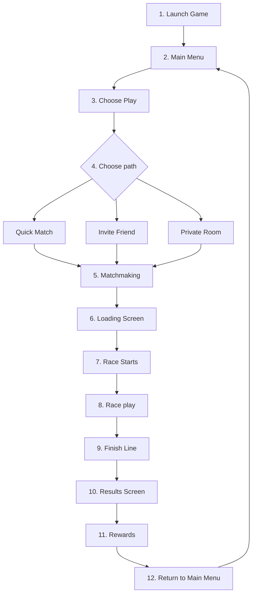

# P002 — Core Gameplay Loop Specification

| Field | Value |
|-------|--------|
| Document ID | P002 |
| Title | Core Gameplay Loop Specification |
| Version | **1.0** |
| Status | Approved (loop scope only) |
| Project | Project GulfRun |
| Authority | Official source of truth for the **core player journey** from launch through return to Main Menu after a completed race |
| Depends on | [P001 — Game Vision Document](P001-GAME-VISION-v1.0.md) |
| Last updated | 2026-07-31 |

**Rules:** No gameplay invented beyond facts in this brief and P001. Systems listed under §7 are **not defined** here; they are future dependencies only.

**Next milestone:** Sprint 1 — do not start until explicitly instructed.

---

## 1. Purpose

Describe the player’s journey from **opening the game** until **returning to the Main Menu** after a **completed race**.

This is **documentation only**. No implementation.

---

## 2. Known Gameplay Context

| Field | Value | Source |
|-------|--------|--------|
| Game type | Real-time online multiplayer | This brief / P001 |
| Players per race | 4 | This brief / P001 |
| Camera | Side scrolling | This brief / P001 |
| Orientation | Landscape | This brief / P001 |
| Platforms | iOS, Android | This brief / P001 |
| Match type | Real-time competitive race | This brief |

---

## 3. Player Flow Diagram

### Stage 8 (race play) — actions in scope for this loop

During the race, the player may:

- Run  
- Jump  
- Avoid obstacles  
- Collect item boxes  
- Use obtained items  

*(Item types are **not** defined in P002. Maps: **P006**. Characters: **P005**. Obstacles: **P007** — types/collision effects still undefined.)*

---

## 4. Detailed Stage Specifications

### Stage 1 — Launch Game

| Field | Content |
|-------|---------|
| Description | Player opens the application on a supported device. |
| Player intent | Enter the game. |
| Inputs | Player launches the app on **iOS** or **Android**. |
| Outputs | Game reaches a state where **Main Menu** can be shown. |
| Notes | Boot, auth, and patch details are **TODO** / future systems — not defined here. |

---

### Stage 2 — Main Menu

| Field | Content |
|-------|---------|
| Description | Primary hub after launch / login. **UI SoT:** [P004](P004-MAIN-MENU-v1.0.md). |
| Player intent | Navigate toward starting a race or other hub destinations. |
| Inputs | Player is at Main Menu after **login** (P004); may select **Play** or other P004 buttons. |
| Outputs | Transition toward **Choose Play** (Play screen) or other destinations per P004. |
| Notes | Main Menu buttons and Play options are defined in P004 — not reinvented here. |

---

### Stage 3 — Choose Play

| Field | Content |
|-------|---------|
| Description | Player chooses to play, leading to match entry options. |
| Player intent | Begin the path to a race. |
| Inputs | Player confirms **Play** from Main Menu flow. |
| Outputs | Player is presented with Stage 4 options. |

---

### Stage 4 — Choose Quick Match OR Invite Friend OR Private Room

| Field | Content |
|-------|---------|
| Description | Player selects exactly one entry path on the **Play screen** (P004): **Quick Match**, **Invite Friend**, or **Private Room**. |
| Player intent | Decide how to enter a match. |
| Inputs | Player selection of one of: Quick Match · Invite Friend · Private Room. |
| Outputs | Selected path is used to proceed to **Matchmaking** (Stage 5). |
| Detail authority | [P004 §5](P004-MAIN-MENU-v1.0.md); friends already added per **[P014](P014-FRIENDS-SYSTEM-v1.0.md)**; Private Room path detail **[P018](P018-PRIVATE-ROOM-SYSTEM-v1.0.md)**. |
| Notes | Friends/Clans/Voice systems remain future specs where applicable. |

---

### Stage 5 — Matchmaking

| Field | Content |
|-------|---------|
| Description | Automatic online matchmaking per **[P017](P017-MATCHMAKING-SYSTEM-v1.0.md)**. Forms a **4-player** race. |
| Player intent | Wait to be placed into a race. |
| Inputs | Match type from Stage 4 / P017 (Quick Match, Friend Party, Private Room). Private Room lobby: **[P018](P018-PRIVATE-ROOM-SYSTEM-v1.0.md)**. |
| Outputs | Found Match → Loading Screen (search states per P017). |
| Notes | Cancel before confirm allowed; post-confirm cancel / reconnect / MMR **not defined** (P017). |

---

### Stage 6 — Loading Screen

| Field | Content |
|-------|---------|
| Description | Intermediate screen while the race session prepares. |
| Player intent | Wait for the race to become ready. |
| Inputs | Match ready from Stage 5. |
| Outputs | Transition to **Race Starts**. |
| Notes | What is shown on the loading screen (tips, art, player list) is **TODO**. |

---

### Stage 7 — Race Starts

| Field | Content |
|-------|---------|
| Description | Real-time competitive race begins per **[P010](P010-RACE-RULES-v1.0.md)**: equal start; countdown; simultaneous begin. Side-scrolling; landscape. |
| Player intent | Compete in the race. |
| Inputs | Loaded race session; **4** players; starting area → countdown. |
| Outputs | Active race state (Stage 8). |
| Notes | Countdown details **TODO** (P010). |

---

### Stage 8 — Race Play (Run / Jump / Avoid / Collect / Use)

| Field | Content |
|-------|---------|
| Description | Core in-race activity until the finish line. |
| Player intent | Progress through the race using allowed actions. |
| Allowed actions (P002 journey list) | **Run**; **Jump**; **Avoid obstacles**; **Collect item boxes**; **Use obtained items**. |
| Controls authority | In-race **controls and movement rules** are governed by **[P003](P003-CORE-GAMEPLAY-DESIGN-v1.0.md)** (auto-run; Jump; Double Jump; Use collected item). |
| Inputs | Player touch controls (**TODO** layout); race world; item boxes per **[P008](P008-ITEM-BOX-SYSTEM-v1.0.md)**. |
| Outputs | Race progress toward **Finish Line**; obtained items may be used later (activation **not** defined; item types **not** defined). |
| Notes | Item types **not** defined. Item boxes: P008. **Obstacles:** P007. |

---

### Stage 9 — Finish Line

| Field | Content |
|-------|---------|
| Description | Player reaches the finish line; ranking by finish order (**P010**: 1st–4th). |
| Player intent | Complete the race course. |
| Inputs | Active race; player reaches finish line. |
| Outputs | Placement toward **Results Screen**. |
| Notes | Race ends when **all** reach finish **or** future rule (P010). Disconnect/AFK rules **not defined**. |

---

### Stage 10 — Results Screen

| Field | Content |
|-------|---------|
| Description | Results Screen appears **immediately after every race**. **SoT:** [P011](P011-POST-RACE-RESULTS-v1.0.md). |
| Player intent | Review race results. |
| Inputs | Official server-generated race result (P011 RES-*). |
| Outputs | Player may **Continue** (**TODO** destination) or **Return to Main Menu**; rewards shown as **placeholder** only. |
| Displayed | All four players by final position: Final Position, Player Name, Selected Character, Race Time. |

---

### Stage 11 — Rewards

| Field | Content |
|-------|---------|
| Description | Rewards **exist**; system **defined later**. On Results flow: **placeholder for future rewards** only ([P011](P011-POST-RACE-RESULTS-v1.0.md)). |
| Player intent | See future rewards placeholder. |
| Inputs | Completed race / results. |
| Outputs | **TODO** — whether placeholder is on Results Screen or a separate stage (Q-P011-005). |
| Notes | Coins, XP, etc. **not** defined (P011 §8). |

---

### Stage 12 — Return to Main Menu

| Field | Content |
|-------|---------|
| Description | Player returns to Main Menu (P011 action **Return to Main Menu**, or after Continue if that leads to menu — Continue **TODO**). |
| Player intent | Re-enter the hub; may start another play path. |
| Inputs | Player selects Return to Main Menu (or future Continue path). |
| Outputs | Player is at **Main Menu** (Stage 2 / P004). |

---

## 5. Inputs & Outputs Summary

| Stage | Inputs (this spec) | Outputs (this spec) |
|-------|--------------------|---------------------|
| 1 Launch | App launch (iOS/Android) | Ready for Main Menu |
| 2 Main Menu | Player at hub | Enter Choose Play |
| 3 Choose Play | Play selected | Stage 4 options |
| 4 Path choose | Quick Match **or** Invite Friend **or** Private Room | Enter Matchmaking |
| 5 Matchmaking | Selected path; 4-player race need | Match ready to load |
| 6 Loading | Match ready | Race ready to start |
| 7 Race Starts | Loaded 4-player race | Active race |
| 8 Race play | Controls; race; obstacles; item boxes | Progress; item use |
| 9 Finish Line | Reach finish | Toward results |
| 10 Results | Completed race | Toward rewards |
| 11 Rewards | Results complete | Rewards step done (contents TBD) |
| 12 Return | Rewards done | Main Menu |

---

## 6. Future Dependencies

Referenced only as **future systems** or later specifications. **Not defined** by P002.

| Dependency | Why referenced | Status |
|------------|----------------|--------|
| Characters | Present in race fantasy (P001); not specified here | Future system |
| Maps | Race needs a course; not specified here | Future system |
| Item boxes / items | Named in Stage 8 actions; identities/rules not specified | Future system |
| Obstacles | Every map; avoid while racing; Jump/Double Jump; collision exists | **[P007](P007-OBSTACLE-SYSTEM-v1.0.md)** | Types/effects still undefined in P007 |
| Weapons | Out of scope | Future system |
| Economy | Out of scope | Future system |
| Rewards (contents) | Stage 11 exists; contents out of scope | Future system |
| XP | Out of scope | Future system |
| Levels | Out of scope | Future system |
| Progression | Out of scope | Future system |
| Store | Out of scope | Future system |
| Battle Pass | Out of scope | Future system |
| Voice Chat | Out of scope for this loop spec (intent in P001 pillar only) | Future system |
| Networking | Out of scope (real-time online stated; design not here) | Future system / engineering |
| UI screen specs | Main Menu and other screens beyond flow names | Future system |
| Touch control scheme | Mobile First; detailed scheme not in this brief | Future system / later spec |

---

## 7. Explicitly Do Not Define (P002)

P002 does **not** define:

- Weapons  
- Maps  
- Characters  
- Economy  
- Rewards (contents)  
- XP  
- Levels  
- Store  
- Battle Pass  
- Voice Chat  
- Networking  
- Progression  

---

## 8. Open Questions

| ID | Question | Blocking for |
|----|----------|--------------|
| Q-P002-001 | What appears on the Loading Screen? | UI spec |
| Q-P002-002 | Race start countdown / start sequence? | Race feel / P002 expansion |
| Q-P002-003 | Results Screen fields (placement, time, etc.)? | Results UI |
| Q-P002-004 | Disconnect / DNF / forfeit behavior? | Session rules |
| Q-P002-005 | Does Invite Friend or Private Room skip or alter Matchmaking vs Quick Match? | Match entry |
| Q-P002-006 | Detailed touch controls for Run / Jump / items? | Controls spec |
| Q-P002-007 | Numeric match duration target within “a few minutes” (P001)? | Fast Gameplay validation |
| Q-P002-008 | Which future spec defines item boxes and items? | Items system |

---

## 9. Acceptance Criteria

P002 v1.0 is satisfied when all of the following are true:

1. The official loop documents stages **1 → 12** exactly as listed in this specification.  
2. Match context is recorded as: **real-time online multiplayer**, **4 players**, **side-scrolling**, **landscape**, **iOS/Android**, **real-time competitive race**.  
3. Stage 8 lists only the provided actions: Run, Jump, Avoid obstacles, Collect item boxes, Use obtained items.  
4. No definitions are introduced for Weapons, Maps, Characters, Economy, Rewards contents, XP, Levels, Store, Battle Pass, Voice Chat, Networking, or Progression beyond “future system” references.  
5. A player flow diagram is present and matches the stage order.  
6. Each stage has Description, Inputs, and Outputs (with **TODO** only where the brief was silent).  
7. Future dependencies and open questions are listed.  
8. Document version is **P002 v1.0**.

---

## 10. Document Queue

| Order | Document ID | Title | Status |
|-------|-------------|-------|--------|
| 1 | P001 | Game Vision Document | v1.1 Approved |
| 2 | P002 | Core Gameplay Loop | **v1.0 Approved** |
| 3 | P003 | Core Gameplay Design | v1.0 Approved (+ P003A) |
| 4 | P004 | Main Menu Specification | v1.0 Approved |
| 5 | P005 | Character System Specification | v1.0 Approved |
| 6 | P006 | Map System Specification | v1.0 Approved |
| 7 | P007 | Obstacle System Specification | v1.0 Approved |
| 8 | P008 | Item Box System Specification | v1.0 Approved |
| 9 | P009 | Item & Weapon System Specification | v1.0 Approved |
| 10 | P010 | Race Rules Specification | v1.0 Approved |
| 11 | P011 | Post Race Results Specification | v1.0 Approved |
| 12 | P012 | Economy System Specification | v1.0 Approved |
| 13 | P013 | Shop System Specification | v1.0 Approved |
| 14 | P014 | Friends System Specification | v1.0 Approved |
| 15 | P015 | Clan System Specification | v1.0 Approved |
| 16 | P016 | Voice Chat System Specification | v1.0 Approved |
| 17 | P017 | Matchmaking System Specification | v1.0 Approved |
| 18 | P018 | Private Room System Specification | v1.0 Approved |
| 19 | P019 | Leaderboard System Specification | v1.0 Approved |
| 20 | P020 | Player Profile System Specification | v1.0 Approved |
| 21 | P021 | Inventory System Specification | v1.0 Approved |
| 22 | P022 | Cosmetics System Specification | v1.0 Approved |
| 23 | P023 | Player Progression System Specification | v1.0 Approved |
| 24 | P024 | Level System Specification | v1.0 Approved |
| 25 | P025 | Rank System Specification | v1.0 Approved |
| 26 | P026 | Daily Challenges System Specification | v1.0 Approved |
| 27 | P027 | Weekly Challenges System Specification | v1.0 Approved |
| 28 | P028 | Achievement System Specification | v1.0 Approved |
| 29 | P029 | Battle Pass System Specification | v1.0 Approved |
| 30 | P030 | Season System Specification | v1.0 Approved |
| 31 | P031 | Live Events System Specification | v1.0 Approved |
| 32 | P032 | Notification System Specification | v1.0 Approved |
| 33 | P033 | Inbox (Mail) System Specification | **v1.0 Approved** — [P033](P033-INBOX-MAIL-SYSTEM-v1.0.md) |
| 34 | P034 | Settings System Specification | **v1.0 Approved** — [P034](P034-SETTINGS-SYSTEM-v1.0.md) |
| 35 | P035 | Audio System Specification | **v1.0 Approved** — [P035](P035-AUDIO-SYSTEM-v1.0.md) |
| 36 | P036 | Music System Specification | **v1.0 Approved** — [P036](P036-MUSIC-SYSTEM-v1.0.md) |
| 37 | P037 | Localization System Specification | **v1.0 Approved** — [P037](P037-LOCALIZATION-SYSTEM-v1.0.md) |
| 38 | P038 | Tutorial System Specification | **v1.0 Approved** — [P038](P038-TUTORIAL-SYSTEM-v1.0.md) |
| 39 | P039 | Backend Architecture Specification (engineering doc — docs/02-architecture/) | **v1.0 Approved** |
| 40 | P040 | Database Architecture Specification (engineering doc — docs/02-architecture/) | **v1.0 Approved** |
| 41 | P041 | Authentication System Specification (engineering doc — docs/02-architecture/) | **v1.0 Approved** |
| 42 | P042 | Player Profile System Specification [CONFLICT with P020] | **v1.0 Approved-per-brief** |
| 43 | P043 | Anti-Cheat System Specification (engineering doc — docs/05-security/) | **v1.0 Approved** |
| 44 | P044 | Analytics System Specification (engineering doc — docs/02-architecture/) | **v1.0 Approved** |
| 45 | P045 | Monetization System Specification | **v1.0 Approved** |
| 46 | P046 | Performance Optimization Specification | **v1.0 Approved** |
| 47 | P047 | UI / UX Design System Specification | **v1.0 Approved** |
| 48 | P048 | Art Direction & Visual Style Specification | **v1.0 Approved** |
| 49 | P049 | Technical Architecture Specification | **v1.0 Approved** |
| 50 | P050 | Master Design Bible Specification | **v1.0 Approved** |
| — | Sprint 1 | _(await instructions)_ | Not started |

---

## 11. Change Log

| Version | Date | Summary | Author |
|---------|------|---------|--------|
| **1.0** | 2026-07-31 | Initial Core Gameplay Loop Specification | Documentation Engineer (from Design Owner brief) |

---

*End of document.*
