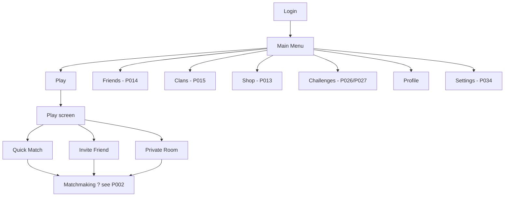

# P004 ? Main Menu Specification

| Field | Value |
|-------|--------|
| Document ID | P004 |
| Title | Main Menu Specification |
| Version | **1.0** |
| Status | Approved (Main Menu scope only) |
| Project | Project GulfRun |
| Authority | Official source of truth for the **Main Menu** screen, its **buttons**, the **Play** sub-screen options, and the **Profile** fields listed herein |
| Depends on | [P001](P001-GAME-VISION-v1.0.md), [P002](P002-CORE-GAMEPLAY-LOOP-v1.0.md) |
| Last updated | 2026-07-31 |

**Rules:** Documentation only. No implementation. Do not invent gameplay or UI beyond this brief. Missing detail ? **TODO**.

**Next milestone:** Sprint 1 — do not start until explicitly instructed.

---

## 1. Purpose

Define the Main Menu as the hub after login, including allowed buttons, Play navigation, and Profile contents.

---

## 2. Main Menu Overview

| Field | Value |
|-------|--------|
| When shown | The **first screen after login** |
| Orientation | **Landscape** |
| Interface intent | **Simple**, **modern**, and **optimized for mobile** |
| Platforms | iOS, Android (per P001) |

### TODO ? Overview (not provided)

- [ ] Login **screen UI/UX** (backend authentication flow now specified in engineering doc **[docs/02-architecture/AUTHENTICATION_SYSTEM.md](../../docs/02-architecture/AUTHENTICATION_SYSTEM.md)** — P041; screen-level UI/UX still not defined here)
- [ ] Visual art direction / exact layout coordinates
- [ ] Audio / music on Main Menu
- [ ] What happens on first launch before login

---

## 3. Screen Layout Description

### 3.1 Main Menu

- Landscape orientation.
- Presents **only** the buttons listed in ?4.
- Layout must support simple, modern, mobile-optimized presentation.

### TODO ? Layout (not provided)

- [ ] Button arrangement (grid, list, dock, etc.)
- [ ] Logo / title placement
- [ ] Background treatment
- [ ] Safe-area / notch guidelines beyond landscape

### 3.2 Play screen (opened from Play)

- Opened when the player presses **Play**.
- Contains **exactly three options**: Quick Match, Invite Friend, Private Room.
- **Nothing else** on this screen.

### TODO ? Play screen layout (not provided)

- [ ] Visual arrangement of the three options
- [ ] Back / return control to Main Menu (existence **TODO** ? not stated in brief)

---

## 4. Button Definitions

The Main Menu contains the following buttons **only**:

| Button | On press | Detail level in P004 |
|--------|----------|----------------------|
| **Play** | Opens Play screen (?5) | Defined |
| **Friends** | Opens Friends | **[P014](P014-FRIENDS-SYSTEM-v1.0.md)** |
| **Clans** | Opens Clans | **[P015](P015-CLAN-SYSTEM-v1.0.md)** |
| **Shop** | Opens Shop | **[P013](P013-SHOP-SYSTEM-v1.0.md)** ? categories & rules; prices TBD |
| **Challenges** | Opens Challenges | **[P026](P026-DAILY-CHALLENGES-SYSTEM-v1.0.md)** Daily + **[P027](P027-WEEKLY-CHALLENGES-SYSTEM-v1.0.md)** Weekly (hub layout **TODO**) |
| **Profile** | Opens Profile | Fields defined in ?6 |
| **Settings** | Opens Settings | **[P034](P034-SETTINGS-SYSTEM-v1.0.md)** |

No other Main Menu buttons are defined.

---

## 5. Play Button & Play Screen

### 5.1 Play

Pressing **Play** opens another screen with **exactly three options**:

1. **Quick Match**  
2. **Invite Friend**  
3. **Private Room**  

Nothing else.

### 5.2 Quick Match

| Field | Value |
|-------|--------|
| Behavior | **Automatically searches for players** |
| Maximum players | **4** |
| Matchmaking | **[P017](P017-MATCHMAKING-SYSTEM-v1.0.md)** |

### TODO ? Quick Match (not provided)

- [ ] Search timeout / cancel behavior ? cancel before confirm: **P017**
- [ ] Region / skill criteria (not defined ? P017)

### 5.3 Invite Friend

| Field | Value |
|-------|--------|
| Behavior | Allows **inviting friends already added in the game** |
| Friends system | **[P014](P014-FRIENDS-SYSTEM-v1.0.md)** |

### TODO ? Invite Friend (not provided)

- [ ] Invite UI details
- [ ] What happens if fewer than 4 players join
- [ ] Friend list rules ? see **P014**

### 5.4 Private Room

| Field | Value |
|-------|--------|
| Create | Player **creates a private room** |
| Join | Other players join using a **Room Code** (also **Friend Invitation** ? **[P018](P018-PRIVATE-ROOM-SYSTEM-v1.0.md)**) |
| Spec | **[P018 ? Private Room System Specification](P018-PRIVATE-ROOM-SYSTEM-v1.0.md)** |

### TODO ? Private Room (deferred to P018)

- [ ] Room Code format / length ? **TODO in P018**
- [ ] Host controls ? **defined in P018**
- [ ] Max players ? **exactly 4 (P018)**

---

## 6. Profile

| Field | Value |
|-------|--------|
| Spec | **[P020 ? Player Profile System Specification](P020-PLAYER-PROFILE-SYSTEM-v1.0.md)** |
| Entry | **Profile** button on Main Menu |

P004 historically listed hub display fields as **only**:

| Field | Notes |
|-------|--------|
| **Player Name** | Display; edit rules ? **P020** |
| **Player Level** | Displayed; progression ? **[P023](P023-PLAYER-PROGRESSION-SYSTEM-v1.0.md)** / **[P024](P024-LEVEL-SYSTEM-v1.0.md)** |
| **Player Rank** | Displayed; progression ? **[P023](P023-PLAYER-PROGRESSION-SYSTEM-v1.0.md)** / **[P025](P025-RANK-SYSTEM-v1.0.md)** |
| **Player Avatar** | Displayed; customization ? **P020** |
| Selected Character | Displayed; **[P005](P005-CHARACTER-SYSTEM-v1.0.md)** |

Full profile information, statistics, actions, and rules: **P020** (includes Player ID, Clan, Online Status, stats, Edit Profile, Copy Player ID, etc.).

⚠ **[CONFLICT]** A later brief, **[P042](P042-PLAYER-PROFILE-SYSTEM-v1.0.md)**, also specifies "Player Profile System" with differing content (e.g., Display Name editability, Profile Frame/Background status). Unresolved; this Main Menu Profile entry continues pointing to **P020** until the Design Owner decides. See P042 §0.

### TODO ? Profile (hub vs full)

- [ ] Whether Main Menu Profile shows full P020 screen or a subset (Q-P020-001)
- [ ] How Selected Character is changed (see P005; pre-race select wiring **TODO**)

---

## 7. Other Main Menu Destinations (existence only)

| Destination | Official statement | Spec status |
|-------------|--------------------|-------------|
| **Shop** | Store / Shop system | Main Menu | **[P013](P013-SHOP-SYSTEM-v1.0.md)** | Categories & fairness rules; prices TBD |
| **Friends** | Friend system | Main Menu | **[P014](P014-FRIENDS-SYSTEM-v1.0.md)** |
| **Clans** | Clan system | Main Menu | **[P015](P015-CLAN-SYSTEM-v1.0.md)** |
| **Challenges** | Challenge system exists. Daily **[P026](P026-DAILY-CHALLENGES-SYSTEM-v1.0.md)**; Weekly **[P027](P027-WEEKLY-CHALLENGES-SYSTEM-v1.0.md)** |
| **Settings** | Settings screen exists. | **[P034](P034-SETTINGS-SYSTEM-v1.0.md)** |

---

## 8. Navigation Flow

### Alignment with P002

P002 Stages 2?5: Main Menu ? Choose Play ? Quick Match **or** Invite Friend **or** Private Room ? Matchmaking.  
P004 supplies Main Menu button set, Play screen constraint, and entry-path details above.  
P004 states Main Menu is **after login** (login screen itself **TODO**).

### TODO ? Navigation (not provided)

- [ ] Explicit Back from Play screen to Main Menu
- [ ] Return paths from Profile / future screens
- [ ] Deep links / resume-to-menu behavior

---

## 9. Dependencies

| Dependency | Relationship |
|------------|--------------|
| P001 | Landscape; mobile; platforms |
| P002 | Core loop uses Main Menu and the three play paths |
| P003 | Race rules after match start (not Main Menu) |
| Login | Required before Main Menu; backend flow specified in **[docs/02-architecture/AUTHENTICATION_SYSTEM.md](../../docs/02-architecture/AUTHENTICATION_SYSTEM.md)** (P041); screen UI/UX **not specified** in P004 |
| Matchmaking | Entered from Quick Match / Invite Friend / Private Room ? **[P017](P017-MATCHMAKING-SYSTEM-v1.0.md)** |

---

## 10. Future Specifications

| Topic | Status |
|-------|--------|
| Shop / Store details | **[P013](P013-SHOP-SYSTEM-v1.0.md)** ? prices/offers still TBD |
| Friends | **[P014](P014-FRIENDS-SYSTEM-v1.0.md)** |
| Clans | **[P015](P015-CLAN-SYSTEM-v1.0.md)** |
| Challenges | **[P026](P026-DAILY-CHALLENGES-SYSTEM-v1.0.md)** / **[P027](P027-WEEKLY-CHALLENGES-SYSTEM-v1.0.md)** (objectives/rewards TBD) |
| Settings | **[P034](P034-SETTINGS-SYSTEM-v1.0.md)** |
| Login screen | Backend flow: **[docs/02-architecture/AUTHENTICATION_SYSTEM.md](../../docs/02-architecture/AUTHENTICATION_SYSTEM.md)** (P041); screen UI/UX **TODO** / future |
| Character select / roster | Future (characters not defined) |
| Avatar system | **TODO** / future |
| Level / Rank systems | Level **[P024](P024-LEVEL-SYSTEM-v1.0.md)**; Competitive Rank **[P025](P025-RANK-SYSTEM-v1.0.md)**; Progression **[P023](P023-PLAYER-PROGRESSION-SYSTEM-v1.0.md)**; leaderboards **[P019](P019-LEADERBOARD-SYSTEM-v1.0.md)** |

### Explicitly not defined in P004

- Currencies  
- Inventory ? **[P021](P021-INVENTORY-SYSTEM-v1.0.md)**  
- Battle Pass ? **[P029](P029-BATTLE-PASS-SYSTEM-v1.0.md)**  
- Events ? **[P031](P031-LIVE-EVENTS-SYSTEM-v1.0.md)**  
- Mail ? **[P033](P033-INBOX-MAIL-SYSTEM-v1.0.md)**  
- Notifications ? **[P032](P032-NOTIFICATION-SYSTEM-v1.0.md)**  
- Voice Chat ? **[P016](P016-VOICE-CHAT-SYSTEM-v1.0.md)**  
- Leaderboard ? **[P019](P019-LEADERBOARD-SYSTEM-v1.0.md)**  
- Offers  
- Daily Rewards  

---

## 11. Open Questions

| ID | Question |
|----|----------|
| Q-P004-001 | Login screen specification? | **Partial (P041):** backend auth flow defined; screen UI/UX still TODO |
| Q-P004-002 | Main Menu button layout arrangement? |
| Q-P004-003 | Back control from Play screen to Main Menu? |
| Q-P004-004 | Private Room max players and Room Code format? | **Partial (P018):** max **4**; code format TODO |
| Q-P004-005 | Document IDs for Friends / Clans / Shop / Challenges / Settings specs? | **Resolved:** Friends P014; Clans P015; Shop P013; Daily P026; Weekly P027; Settings **P034** |
| Q-P004-006 | Are Profile fields read-only on this screen? |

---

## 12. Acceptance Criteria

P004 v1.0 is satisfied when all of the following are true:

1. Main Menu is documented as the first screen after login; landscape; simple, modern, mobile-optimized.  
2. Main Menu buttons are exactly: Play, Friends, Clans, Shop, Challenges, Profile, Settings.  
3. Play opens a screen with exactly Quick Match, Invite Friend, Private Room.  
4. Quick Match auto-searches; max players 4.  
5. Invite Friend invites friends already added in the game.  
6. Private Room: create room; join via Room Code or Friend Invitation (**P018**).  
7. Profile button opens Profile; hub fields historically listed as Name, Level, Rank, Avatar, Selected Character ? full system **[P020](P020-PLAYER-PROFILE-SYSTEM-v1.0.md)**.  
8. Challenges ? **[P026](P026-DAILY-CHALLENGES-SYSTEM-v1.0.md)** / **[P027](P027-WEEKLY-CHALLENGES-SYSTEM-v1.0.md)**; Settings **[P034](P034-SETTINGS-SYSTEM-v1.0.md)**; **Shop** = P013; **Friends** = P014; **Clans** = P015.     
9. Listed ?Not Defined? topics have no invented UI or systems.  
10. Navigation flow, dependencies, future specs, and acceptance criteria are present.  
11. Document version is **P004 v1.0**.

---

## 13. Document Queue

| Order | Document ID | Title | Status |
|-------|-------------|-------|--------|
| 1 | P001 | Game Vision Document | v1.1 Approved |
| 2 | P002 | Core Gameplay Loop | v1.0 Approved |
| 3 | P003 | Core Gameplay Design | v1.0 + P003A |
| 4 | P004 | Main Menu Specification | **v1.0 Approved** |
| 5 | P005 | Character System Specification | v1.0 Approved |
| 6 | P006 | Map System Specification | v1.0 Approved |
| 7 | P007 | Obstacle System Specification | v1.0 Approved |
| 8 | P008 | Item Box System Specification | v1.0 Approved |
| 9 | P009 | Item & Weapon System Specification | v1.0 Approved |
| 10 | P010 | Race Rules Specification | v1.0 Approved |
| 11 | P011 | Post Race Results Specification | v1.0 Approved |
| 12 | P012 | Economy System Specification | v1.0 Approved |
| 13 | P013 | Shop System Specification | v1.0 Approved |
| 14 | P014 | Friends System Specification | v1.0 Approved |
| 15 | P015 | Clan System Specification | v1.0 Approved |
| 16 | P016 | Voice Chat System Specification | v1.0 Approved |
| 17 | P017 | Matchmaking System Specification | v1.0 Approved |
| 18 | P018 | Private Room System Specification | v1.0 Approved |
| 19 | P019 | Leaderboard System Specification | v1.0 Approved |
| 20 | P020 | Player Profile System Specification | v1.0 Approved |
| 21 | P021 | Inventory System Specification | v1.0 Approved |
| 22 | P022 | Cosmetics System Specification | v1.0 Approved |
| 23 | P023 | Player Progression System Specification | v1.0 Approved |
| 24 | P024 | Level System Specification | v1.0 Approved |
| 25 | P025 | Rank System Specification | v1.0 Approved |
| 26 | P026 | Daily Challenges System Specification | v1.0 Approved |
| 27 | P027 | Weekly Challenges System Specification | v1.0 Approved |
| 28 | P028 | Achievement System Specification | v1.0 Approved |
| 29 | P029 | Battle Pass System Specification | v1.0 Approved |
| 30 | P030 | Season System Specification | v1.0 Approved |
| 31 | P031 | Live Events System Specification | v1.0 Approved |
| 32 | P032 | Notification System Specification | v1.0 Approved |
| 33 | P033 | Inbox (Mail) System Specification | **v1.0 Approved** — [P033](P033-INBOX-MAIL-SYSTEM-v1.0.md) |
| 34 | P034 | Settings System Specification | **v1.0 Approved** — [P034](P034-SETTINGS-SYSTEM-v1.0.md) |
| 35 | P035 | Audio System Specification | **v1.0 Approved** — [P035](P035-AUDIO-SYSTEM-v1.0.md) |
| 36 | P036 | Music System Specification | **v1.0 Approved** — [P036](P036-MUSIC-SYSTEM-v1.0.md) |
| 37 | P037 | Localization System Specification | **v1.0 Approved** — [P037](P037-LOCALIZATION-SYSTEM-v1.0.md) |
| 38 | P038 | Tutorial System Specification | **v1.0 Approved** — [P038](P038-TUTORIAL-SYSTEM-v1.0.md) |
| 39 | P039 | Backend Architecture Specification (engineering doc — docs/02-architecture/) | **v1.0 Approved** |
| 40 | P040 | Database Architecture Specification (engineering doc — docs/02-architecture/) | **v1.0 Approved** |
| 41 | P041 | Authentication System Specification (engineering doc — docs/02-architecture/) | **v1.0 Approved** |
| 42 | P042 | Player Profile System Specification [CONFLICT with P020] | **v1.0 Approved-per-brief** |
| 43 | P043 | Anti-Cheat System Specification (engineering doc — docs/05-security/) | **v1.0 Approved** |
| 44 | P044 | Analytics System Specification (engineering doc — docs/02-architecture/) | **v1.0 Approved** |
| 45 | P045 | Monetization System Specification | **v1.0 Approved** |
| 46 | P046 | Performance Optimization Specification | **v1.0 Approved** |
| 47 | P047 | UI / UX Design System Specification | **v1.0 Approved** |
| 48 | P048 | Art Direction & Visual Style Specification | **v1.0 Approved** |
| 49 | P049 | Technical Architecture Specification | **v1.0 Approved** |
| 50 | P050 | Master Design Bible Specification | **v1.0 Approved** |
| — | Sprint 1 | _(await instructions)_ | Not started |

---

## 14. Change Log

| Version | Date | Summary | Author |
|---------|------|---------|--------|
| **1.0** | 2026-07-31 | Initial Main Menu Specification | Documentation Engineer (from Design Owner brief) |

---

*End of document.*
