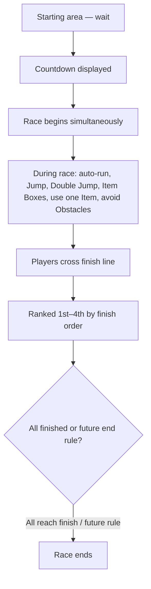

# P010 — Race Rules Specification

| Field | Value |
|-------|--------|
| Document ID | P010 |
| Title | Race Rules Specification |
| Version | **1.0** |
| Status | Approved (race rules scope only) |
| Project | Project GulfRun |
| Authority | Official source of truth for **race format**, **start**, **in-race allowed actions**, **finish ranking**, and **existence-only** notes for Disconnection / AFK |
| Depends on | [P001](P001-GAME-VISION-v1.0.md), [P002](P002-CORE-GAMEPLAY-LOOP-v1.0.md), [P003](P003-CORE-GAMEPLAY-DESIGN-v1.0.md), [P007](P007-OBSTACLE-SYSTEM-v1.0.md), [P008](P008-ITEM-BOX-SYSTEM-v1.0.md), [P009](P009-ITEM-WEAPON-SYSTEM-v1.0.md) |
| Last updated | 2026-07-31 |

**Rules:** Documentation only. No implementation. Do not invent race rules beyond this brief. Missing detail → **TODO**.

**Next milestone:** Sprint 1 — do not start until explicitly instructed.

---

## 1. Purpose

Define official race format, start sequence, during-race actions, finish ranking, and note that Disconnection and AFK systems exist without defining their rules.

---

## 2. Race Rules Overview

| Field | Value |
|-------|--------|
| Players per race | Exactly **four** |
| Start timing | All players start **at the same time** |
| Start fairness | Every player starts from an **equal position** |
| Race end | The race ends when **all players reach the finish line** **or** another **future rule** defines otherwise |

### Alignment

- P001 / P002 / P003: 4 players; first to finish wins / finish order — **expanded** here with full placement labels and start/end rules.  
- P003 RAC-002/003 remain consistent with §6–§7.

---

## 3. Race Flow

### Stages (summary)

| Phase | Summary |
|-------|---------|
| Pre-start | Wait in starting area; countdown displayed |
| Start | Simultaneous begin for every player |
| During | Actions listed in §5 |
| Finish | Rank by finish order (1st–4th) |
| End | All players reach finish **or** future rule otherwise |

---

## 4. Start Rules

| Rule ID | Rule |
|---------|------|
| STR-001 | All players **wait in the starting area**. |
| STR-002 | A **countdown is displayed**. |
| STR-003 | The race **begins simultaneously** for every player. |
| STR-004 | Every player starts from an **equal position**. |
| STR-005 | All players start **at the same time**. |

### TODO — Start (not provided)

- [ ] Countdown duration / values shown  
- [ ] Definition of “equal position” (lane layout, spacing)  
- [ ] False start / early input handling  

---

## 5. During the Race

Players may / do the following (only what is listed):

| Action | Status |
|--------|--------|
| Continuously run automatically | Defined (P003 MOV-*; restated) |
| Jump | Defined |
| Double Jump | Defined |
| Collect Item Boxes | Defined |
| Use **one** collected Item | Defined (aligns with P009 one-item activation) |
| Avoid Obstacles | Defined |

Nothing else is added by P010 beyond this list.

### Cross-document authority

| Topic | Spec |
|-------|------|
| Movement / Jump / Double Jump | P003 |
| Obstacles | P007 |
| Item Boxes | P008 |
| Item use / consume | P009 |
| Loop journey | P002 |

### TODO — During (not provided)

- [ ] Activation input for items (still open elsewhere)  

---

## 6. Finish Rules

| Rule ID | Rule |
|---------|------|
| FIN-001 | Players are ranked according to the **order they cross the finish line**. |
| FIN-002 | The race ends when **all players reach the finish line**, **or** another **future rule** defines otherwise. |

### TODO — Finish (not provided)

- [ ] Behavior if not all players finish (beyond future rule placeholder)  
- [ ] Exact finish-line crossing detection details  

---

## 7. Ranking Rules

| Place | Meaning |
|-------|---------|
| **First Place** | First to cross the finish line |
| **Second Place** | Second to cross the finish line |
| **Third Place** | Third to cross the finish line |
| **Fourth Place** | Fourth to cross the finish line |

Ranking is **finish order only** as stated. Tie-break **TODO** (also open in P003).

### Alignment

- P003: first player reaching finish wins; remaining ranked by finish order — **confirmed** with explicit 1st–4th labels.

---

## 8. Disconnection

| Field | Value |
|-------|--------|
| System | Disconnection system **exists** |
| Rules | **Not defined** |

---

## 9. AFK

| Field | Value |
|-------|--------|
| System | AFK system **exists** |
| Rules | **Not defined** |

---

## 10. Future Dependencies

| Dependency | Note |
|------------|------|
| Disconnection rules | Future specification |
| AFK rules | Future specification |
| Future race-end rules | May end race other than “all reach finish” |
| P002 Results / Rewards | Post-race flow |
| Tie-break | Still TODO |

---

## 11. Explicitly Not Defined (P010)

- Race Timer  
- Sudden Death  
- Reconnect Rules  
- Match Cancellation  
- Penalty System  
- Spectator Mode  
- Rematch  
- Bots  
- Disconnection **rules** (system exists only)  
- AFK **rules** (system exists only)  

---

## 12. Open Questions

| ID | Question |
|----|----------|
| Q-P010-001 | Countdown length / display details? |
| Q-P010-002 | What ends the race if not all players finish (until future rule exists)? |
| Q-P010-003 | Finish-line tie-break? |
| Q-P010-004 | Document IDs for Disconnection and AFK rule specs? |
| Q-P010-005 | Definition of equal starting positions? |

---

## 13. Acceptance Criteria

P010 v1.0 is satisfied when all of the following are true:

1. Race format: exactly four players; simultaneous start; equal start positions; end when all reach finish or future rule otherwise.  
2. Start: wait in starting area; countdown displayed; simultaneous begin.  
3. During: auto-run, Jump, Double Jump, collect Item Boxes, use one collected Item, avoid Obstacles — nothing else invented.  
4. Finish ranking: 1st–4th by finish order. Countdown / Race Start / Race End / Finish Line audio existence confirmed in **[P035](P035-AUDIO-SYSTEM-v1.0.md)**.  
5. Disconnection and AFK: systems exist; rules not defined.  
6. Race Timer, Sudden Death, Reconnect, Cancellation, Penalties, Spectator, Rematch, and Bots are not invented.  
7. Future dependencies, open questions, and acceptance criteria are present.  
8. Document version is **P010 v1.0**.

---

## 14. Document Queue

| Order | Document ID | Title | Status |
|-------|-------------|-------|--------|
| 1–9 | P001–P009 | (prior specs) | Approved as previously recorded |
| 10 | P010 | Race Rules Specification | **v1.0 Approved** |
| 11 | P011 | Post Race Results Specification | v1.0 Approved |
| 12 | P012 | Economy System Specification | v1.0 Approved |
| 13 | P013 | Shop System Specification | v1.0 Approved |
| 14 | P014 | Friends System Specification | v1.0 Approved |
| 15 | P015 | Clan System Specification | v1.0 Approved |
| 16 | P016 | Voice Chat System Specification | v1.0 Approved |
| 17 | P017 | Matchmaking System Specification | v1.0 Approved |
| 18 | P018 | Private Room System Specification | v1.0 Approved |
| 19 | P019 | Leaderboard System Specification | v1.0 Approved |
| 20 | P020 | Player Profile System Specification | v1.0 Approved |
| 21 | P021 | Inventory System Specification | v1.0 Approved |
| 22 | P022 | Cosmetics System Specification | v1.0 Approved |
| 23 | P023 | Player Progression System Specification | v1.0 Approved |
| 24 | P024 | Level System Specification | v1.0 Approved |
| 25 | P025 | Rank System Specification | v1.0 Approved |
| 26 | P026 | Daily Challenges System Specification | v1.0 Approved |
| 27 | P027 | Weekly Challenges System Specification | v1.0 Approved |
| 28 | P028 | Achievement System Specification | v1.0 Approved |
| 29 | P029 | Battle Pass System Specification | v1.0 Approved |
| 30 | P030 | Season System Specification | v1.0 Approved |
| 31 | P031 | Live Events System Specification | v1.0 Approved |
| 32 | P032 | Notification System Specification | v1.0 Approved |
| 33 | P033 | Inbox (Mail) System Specification | **v1.0 Approved** — [P033](P033-INBOX-MAIL-SYSTEM-v1.0.md) |
| 34 | P034 | Settings System Specification | **v1.0 Approved** — [P034](P034-SETTINGS-SYSTEM-v1.0.md) |
| 35 | P035 | Audio System Specification | **v1.0 Approved** — [P035](P035-AUDIO-SYSTEM-v1.0.md) |
| 36 | P036 | Music System Specification | **v1.0 Approved** — [P036](P036-MUSIC-SYSTEM-v1.0.md) |
| 37 | P037 | Localization System Specification | **v1.0 Approved** — [P037](P037-LOCALIZATION-SYSTEM-v1.0.md) |
| 38 | P038 | Tutorial System Specification | **v1.0 Approved** — [P038](P038-TUTORIAL-SYSTEM-v1.0.md) |
| 39 | P039 | Backend Architecture Specification (engineering doc — docs/02-architecture/) | **v1.0 Approved** |
| 40 | P040 | Database Architecture Specification (engineering doc — docs/02-architecture/) | **v1.0 Approved** |
| 41 | P041 | Authentication System Specification (engineering doc — docs/02-architecture/) | **v1.0 Approved** |
| 42 | P042 | Player Profile System Specification [CONFLICT with P020] | **v1.0 Approved-per-brief** |
| 43 | P043 | Anti-Cheat System Specification (engineering doc — docs/05-security/) | **v1.0 Approved** |
| 44 | P044 | Analytics System Specification (engineering doc — docs/02-architecture/) | **v1.0 Approved** |
| 45 | P045 | Monetization System Specification | **v1.0 Approved** |
| 46 | P046 | Performance Optimization Specification | **v1.0 Approved** |
| 47 | P047 | UI / UX Design System Specification | **v1.0 Approved** |
| 48 | P048 | Art Direction & Visual Style Specification | **v1.0 Approved** |
| 49 | P049 | Technical Architecture Specification | **v1.0 Approved** |
| 50 | P050 | Master Design Bible Specification | **v1.0 Approved** |
| — | Sprint 1 | _(await instructions)_ | Not started |

---

## 15. Change Log

| Version | Date | Summary | Author |
|---------|------|---------|--------|
| **1.0** | 2026-07-31 | Initial Race Rules Specification | Documentation Engineer (from Design Owner brief) |

---

*End of document.*
