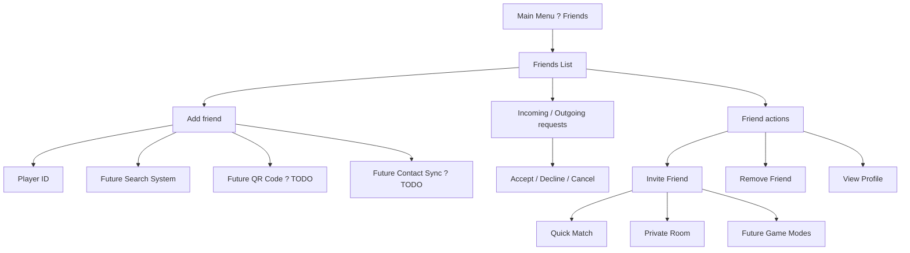
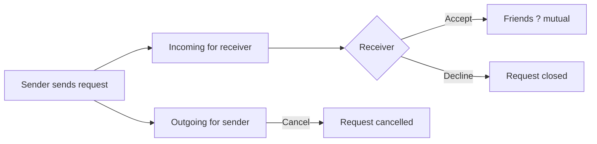

# P014 ? Friends System Specification

| Field | Value |
|-------|--------|
| Document ID | P014 |
| Title | Friends System Specification |
| Version | **1.0** |
| Status | Approved (friends system scope only) |
| Project | Project GulfRun |
| Authority | Official source of truth for **Friends List**, **friend requests**, **add methods**, **status types**, **invite targets**, and **mutual-acceptance security** stated herein |
| Depends on | [P001](P001-GAME-VISION-v1.0.md), [P004](P004-MAIN-MENU-v1.0.md), [P002](P002-CORE-GAMEPLAY-LOOP-v1.0.md) |
| Last updated | 2026-07-31 |

**Rules:** Documentation only. No implementation. Do not invent features beyond this brief. Missing detail ? **TODO**.

**Next milestone:** Sprint 1 — do not start until explicitly instructed.

---

## 1. Purpose

Define how players connect with friends in Project GulfRun: list ownership, adding friends, requests, list display, actions, online status, invites into play modes, backend sync existence, and mutual-acceptance security.

---

## 2. System Overview

| Field | Value |
|-------|--------|
| System | The game supports a **Friends System** |
| List | Every player owns a personal **Friends List** |
| Binding | Friends are linked to the **player's account** |
| Access | The Friends System is available from the **Main Menu** |

### Alignment

- P004: Friends button / friend system exists ? **this document** is the Friends system SoT.  
- P001 Social Multiplayer pillar: playing with friends is core ? **supported** by this system. Voice: **[P016](P016-VOICE-CHAT-SYSTEM-v1.0.md)**.

### TODO ? Friend Limit

| Topic | Status |
|-------|--------|
| Maximum number of friends | **Not defined** ? **TODO** |

---

## 3. Player Flow (high level)

---

## 4. Adding Friends

Players can add another player using:

| Method | Status |
|--------|--------|
| **Player ID** | Defined |
| **Future Search System** | Future |
| **Future QR Code** | **TODO** / Future |
| **Future Contact Sync** | **TODO** / Future |

### TODO ? Adding (not provided)

- [ ] Player ID format  
- [ ] Search System specification  
- [ ] QR Code specification  
- [ ] Contact Sync specification  

---

## 5. Friend Request Flow

Supported request concepts / actions:

| Element | Status |
|---------|--------|
| **Incoming Requests** | Defined |
| **Outgoing Requests** | Defined |
| **Accept Request** | Defined |
| **Decline Request** | Defined |
| **Cancel Request** | Defined |

### Security (see also ?10)

Friendship requires **mutual acceptance**. Players **cannot force friendship**.

### TODO ? Requests (not provided)

- [ ] UI layout for request queues  
- [ ] Expiration of pending requests  

---

## 6. Friends List

### 6.1 Displayed information

| Field | Status |
|-------|--------|
| **Player Name** | Defined |
| **Avatar** | Defined |
| **Current Status** | Defined (see ?8) |
| **Last Seen** | **Future** |

### 6.2 Current Status values (on list)

| Status | Status |
|--------|--------|
| **Online** | Defined |
| **Offline** | Defined |
| **In Match** | Defined |

---

## 7. Player Actions

| Action | Status |
|--------|--------|
| **Invite Friend** | Defined |
| **Remove Friend** | Defined |
| **View Profile** | Defined ? **[P020](P020-PLAYER-PROFILE-SYSTEM-v1.0.md)** |
| **Report Player** | **Future** |
| **Block Player** | **Future** |

### TODO ? Actions (not provided)

- [ ] Confirmations for Remove Friend  
- [ ] What View Profile shows ? **P020**; hub vs full screen **TODO** (Q-P020-001)  

---

## 8. Online Status

Status types:

| Status | Status |
|--------|--------|
| **Online** | Defined |
| **Offline** | Defined |
| **In Match** | Defined |
| **Do Not Disturb** | **Future** |

### TODO ? Status (not provided)

- [ ] Transitions / when In Match is set  
- [ ] Do Not Disturb rules  

---

## 9. Invite Flow

Players can invite friends into:

| Destination | Status |
|-------------|--------|
| **Quick Match** | Defined |
| **Private Room** | Defined ? **[P018](P018-PRIVATE-ROOM-SYSTEM-v1.0.md)** |
| **Future Game Modes** | Future |

### Alignment

- P004 Play paths: Invite Friend; Private Room ? invites from Friends List may feed these paths (**TODO** exact UI wiring).  
- P018: Host invite friends; join via Friend Invitation.  
- P002 Stage 4 Invite Friend ? friends already added ? **supported** by this system.

### TODO ? Invites (not provided)

- [ ] Invite accept/decline UX during matchmaking  
- [ ] Party size vs 4-player race cap  

---

## 10. Sync

| Field | Value |
|-------|--------|
| Sync | Friends are **synchronized using the backend** |
| Details | Synchronization details are **not defined** |

---

## 11. Security

| Rule ID | Rule |
|---------|------|
| FR-SEC-001 | Friendship requires **mutual acceptance**. |
| FR-SEC-002 | Players **cannot force friendship**. |

---

## 12. Dependencies

| Dependency | Note |
|------------|------|
| P004 Main Menu | Friends entry |
| P002 / P004 Play | Quick Match / Private Room invite targets |
| Backend | Sync required; details TBD |
| Account / identity | Friends linked to account; Player ID |

---

## 13. Future Specifications

| Topic | Status |
|-------|--------|
| Friend Limit | **TODO** / not defined |
| Search System | Future |
| QR Code | Future / TODO |
| Contact Sync | Future / TODO |
| Last Seen | Future |
| Report Player | Future |
| Block Player | Future |
| Do Not Disturb | Future |
| Future Game Modes (invite) | Future |

---

## 14. Explicitly Not Defined (P014)

- Friend Limit  
- Search Algorithm  
- Recommendations  
- Social Feed  
- Messaging  
- Gift System  
- Voice Calls (as a Friends feature) ? session/party/clan voice: **P016**  
- Cross Platform Rules  
- Backend sync details  

---

## 15. Open Questions

| ID | Question |
|----|----------|
| Q-P014-001 | Maximum friends (Friend Limit)? |
| Q-P014-002 | Player ID format? |
| Q-P014-003 | Document IDs for Search / QR / Contact Sync / Report / Block? |
| Q-P014-004 | Invite flow when friend is Offline or In Match? |
| Q-P014-005 | View Profile vs P004 Profile ? same screen? | **Partial:** SoT **P020**; hub vs full **TODO** |
| Q-P014-006 | Cross-platform friendship rules? |

---

## 16. Acceptance Criteria

P014 v1.0 is satisfied when all of the following are true:

1. Friends System exists; personal Friends List; linked to account; available from Main Menu.  
2. Friend Limit is explicitly TODO / not defined.  
3. Add methods: Player ID; Future Search; Future QR (TODO); Future Contact Sync (TODO).  
4. Requests: Incoming, Outgoing, Accept, Decline, Cancel; mutual acceptance required; no forced friendship.  
5. List displays: Player Name, Avatar, Current Status (Online / Offline / In Match); Last Seen future.  
6. Actions: Invite, Remove, View Profile; Report/Block future.  
7. Status types: Online, Offline, In Match; DND future.  
8. Invites to Quick Match, Private Room, Future Game Modes.  
9. Backend sync exists; details not defined.  
10. Search algorithm, recommendations, social feed, messaging, gifts, voice calls, and cross-platform rules are not invented.  
11. Document version is **P014 v1.0**.

---

## 17. Document Queue

| Order | Document ID | Title | Status |
|-------|-------------|-------|--------|
| 1?13 | P001?P013 | (prior specs) | Approved as previously recorded |
| 14 | P014 | Friends System Specification | **v1.0 Approved** |
| 15 | P015 | Clan System Specification | v1.0 Approved |
| 16 | P016 | Voice Chat System Specification | v1.0 Approved |
| 17 | P017 | Matchmaking System Specification | v1.0 Approved |
| 18 | P018 | Private Room System Specification | v1.0 Approved |
| 19 | P019 | Leaderboard System Specification | v1.0 Approved |
| 20 | P020 | Player Profile System Specification | v1.0 Approved |
| 21 | P021 | Inventory System Specification | v1.0 Approved |
| 22 | P022 | Cosmetics System Specification | v1.0 Approved |
| 23 | P023 | Player Progression System Specification | v1.0 Approved |
| 24 | P024 | Level System Specification | v1.0 Approved |
| 25 | P025 | Rank System Specification | v1.0 Approved |
| 26 | P026 | Daily Challenges System Specification | v1.0 Approved |
| 27 | P027 | Weekly Challenges System Specification | v1.0 Approved |
| 28 | P028 | Achievement System Specification | v1.0 Approved |
| 29 | P029 | Battle Pass System Specification | v1.0 Approved |
| 30 | P030 | Season System Specification | v1.0 Approved |
| 31 | P031 | Live Events System Specification | v1.0 Approved |
| 32 | P032 | Notification System Specification | v1.0 Approved |
| 33 | P033 | Inbox (Mail) System Specification | **v1.0 Approved** — [P033](P033-INBOX-MAIL-SYSTEM-v1.0.md) |
| 34 | P034 | Settings System Specification | **v1.0 Approved** — [P034](P034-SETTINGS-SYSTEM-v1.0.md) |
| 35 | P035 | Audio System Specification | **v1.0 Approved** — [P035](P035-AUDIO-SYSTEM-v1.0.md) |
| 36 | P036 | Music System Specification | **v1.0 Approved** — [P036](P036-MUSIC-SYSTEM-v1.0.md) |
| 37 | P037 | Localization System Specification | **v1.0 Approved** — [P037](P037-LOCALIZATION-SYSTEM-v1.0.md) |
| 38 | P038 | Tutorial System Specification | **v1.0 Approved** — [P038](P038-TUTORIAL-SYSTEM-v1.0.md) |
| 39 | P039 | Backend Architecture Specification (engineering doc — docs/02-architecture/) | **v1.0 Approved** |
| 40 | P040 | Database Architecture Specification (engineering doc — docs/02-architecture/) | **v1.0 Approved** |
| 41 | P041 | Authentication System Specification (engineering doc — docs/02-architecture/) | **v1.0 Approved** |
| 42 | P042 | Player Profile System Specification [CONFLICT with P020] | **v1.0 Approved-per-brief** |
| 43 | P043 | Anti-Cheat System Specification (engineering doc — docs/05-security/) | **v1.0 Approved** |
| 44 | P044 | Analytics System Specification (engineering doc — docs/02-architecture/) | **v1.0 Approved** |
| 45 | P045 | Monetization System Specification | **v1.0 Approved** |
| 46 | P046 | Performance Optimization Specification | **v1.0 Approved** |
| 47 | P047 | UI / UX Design System Specification | **v1.0 Approved** |
| 48 | P048 | Art Direction & Visual Style Specification | **v1.0 Approved** |
| 49 | P049 | Technical Architecture Specification | **v1.0 Approved** |
| 50 | P050 | Master Design Bible Specification | **v1.0 Approved** |
| — | Sprint 1 | _(await instructions)_ | Not started |

---

## 18. Change Log

| Version | Date | Summary | Author |
|---------|------|---------|--------|
| **1.0** | 2026-07-31 | Initial Friends System Specification | Documentation Engineer (from Design Owner brief) |

---

*End of document.*
