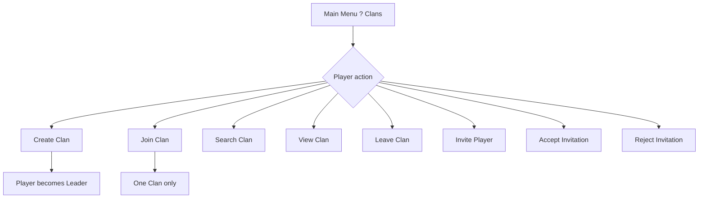
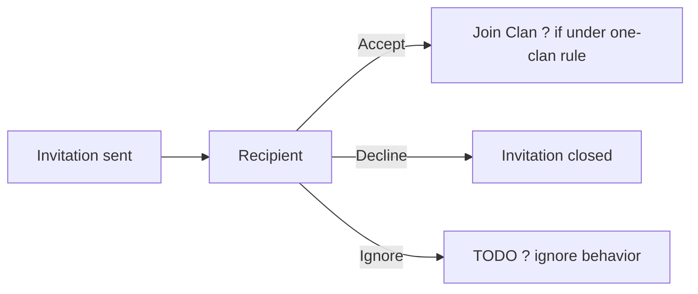

# P015 ? Clan System Specification

| Field | Value |
|-------|--------|
| Document ID | P015 |
| Title | Clan System Specification |
| Version | **1.0** |
| Status | Approved (clan system scope only) |
| Project | Project GulfRun |
| Authority | Official source of truth for **Clans**, **clan information fields**, **roles**, **player/leader actions**, **clan text chat existence**, and **invitation actions** stated herein |
| Depends on | [P001](P001-GAME-VISION-v1.0.md), [P004](P004-MAIN-MENU-v1.0.md), [P014](P014-FRIENDS-SYSTEM-v1.0.md) |
| Last updated | 2026-07-31 |

**Rules:** Documentation only. No implementation. Do not invent features beyond this brief. Missing detail ? **TODO**.

**Next milestone:** Sprint 1 — do not start until explicitly instructed.

---

## 1. Purpose

Define the Clan System for Project GulfRun: joining/creating clans, clan data fields, member roles, player and leader actions, invitations, clan text chat existence, and management security boundaries.

---

## 2. System Overview

| Field | Value |
|-------|--------|
| System | The game supports **Clans** |
| Membership | Every player may join **one Clan** |
| Creation | Players may also **create a Clan** |
| Ownership | Clan ownership belongs to the **Clan Leader** |

### Alignment

- P004: Clans button / clan system exists ? **this document** is the Clan system SoT.  
- P001 Social Multiplayer / community ? clans support social play; Voice Chat remains a **separate specification** (?7).

---

## 3. Clan Structure

### 3.1 Clan information

Each Clan contains:

| Field | Status |
|-------|--------|
| **Clan Name** | Defined |
| **Clan Tag** | Defined ? also displayed on leaderboards when available (**[P019](P019-LEADERBOARD-SYSTEM-v1.0.md)**) |
| **Clan Logo** | Defined |
| **Clan Description** | Defined |
| **Leader** | Defined |
| **Member Count** | Defined |
| **Clan Level** | **Future** |

### TODO ? Clan information (not provided)

- [ ] Name / tag length and character rules  
- [ ] Logo upload / selection rules  
- [ ] Description length limits  

### 3.2 Member roles

| Role |
|------|
| **Leader** |
| **Co-Leader** |
| **Member** |

### TODO ? Members

| Topic | Status |
|-------|--------|
| Maximum member count | **Not defined** ? **TODO** |

---

## 4. Player Flow

### Player actions

| Action | Status |
|--------|--------|
| **Create Clan** | Defined |
| **Join Clan** | Defined |
| **Leave Clan** | Defined |
| **Invite Player** | Defined |
| **Accept Invitation** | Defined |
| **Reject Invitation** | Defined |
| **Search Clan** | Defined |
| **View Clan** | Defined |

### TODO ? Player flow (not provided)

- [ ] Join via search vs invite-only rules  
- [ ] Cooldown after Leave / Create  

---

## 5. Leader Permissions

### Leader actions

| Action | Status |
|--------|--------|
| **Invite Members** | Defined |
| **Remove Members** | Defined |
| **Promote Member** | Defined |
| **Demote Member** | Defined |
| **Transfer Leadership** | Defined |
| **Disband Clan** | Defined |

### Security

| Rule ID | Rule |
|---------|------|
| CLN-SEC-001 | **Only Leaders and Co-Leaders** may manage members. |
| CLN-SEC-002 | Leadership permissions are **not fully defined**. |

### TODO ? Permissions (not provided)

- [ ] Full matrix of Leader vs Co-Leader vs Member permissions  
- [ ] Whether Co-Leaders may Disband / Transfer Leadership  

---

## 6. Invitation Flow

| Field | Value |
|-------|--------|
| Receipt | Players receive **Clan Invitations** |
| Responses | Players may **Accept**, **Decline**, or **Ignore** |

### Alignment with player actions

Accept Invitation / Reject Invitation (?4) align with Accept / Decline here. **Ignore** is listed under Clan Invitations.

### TODO ? Invitations (not provided)

- [ ] Difference between Decline and Ignore  
- [ ] Invitation expiry  

---

## 7. Clan Chat

| Field | Value |
|-------|--------|
| Text | **Clan Text Chat exists** |
| Voice | **[P016 ? Voice Chat System Specification](P016-VOICE-CHAT-SYSTEM-v1.0.md)** |

### TODO ? Clan Text Chat (not provided)

- [ ] Chat moderation / retention  
- [ ] Dedicated Clan Text Chat specification (if separate from this doc)  

---

## 8. Dependencies

| Dependency | Note |
|------------|------|
| P004 Main Menu | Clans entry |
| P014 Friends | May invite players (**TODO** whether invites require friendship) |
| Account / identity | Membership bound to account |
| Voice Chat specification | **[P016](P016-VOICE-CHAT-SYSTEM-v1.0.md)** |
| Backend | Persistence / sync **TODO** (not stated beyond system existence) |

---

## 9. Future Specifications

| Topic | Status |
|-------|--------|
| Clan Level | Future (listed under Clan Information) |
| Maximum member count | **TODO** |
| Full leadership permission matrix | Not fully defined ? **TODO** / future |
| Voice Chat | Separate ? **[P016](P016-VOICE-CHAT-SYSTEM-v1.0.md)** |
| Clan Wars | Not defined |
| Clan Missions | Not defined |
| Clan Rewards | Not defined |
| Clan XP | Not defined |
| Clan Ranking | Not defined |
| Clan Store | Not defined |
| Clan Donations | Not defined |
| Clan Events | Not defined |
| Clan Achievements | Not defined |

---

## 10. Explicitly Not Defined (P015)

- Clan Wars  
- Clan Missions  
- Clan Rewards  
- Clan XP  
- Clan Ranking  
- Clan Store  
- Clan Donations  
- Clan Events  
- Clan Achievements  
- Maximum member count  
- Full leadership permission details  

---

## 11. Open Questions

| ID | Question |
|----|----------|
| Q-P015-001 | Maximum clan member count? |
| Q-P015-002 | Full Leader vs Co-Leader permission matrix? |
| Q-P015-003 | Decline vs Ignore for invitations? |
| Q-P015-004 | Must invitees be Friends (P014)? |
| Q-P015-005 | Clan Name / Tag validation rules? |
| Q-P015-006 | Document ID for Voice Chat specification? | **Resolved ? P016** |
| Q-P015-007 | Clan Text Chat moderation rules? |

---

## 12. Acceptance Criteria

P015 v1.0 is satisfied when all of the following are true:

1. Clans supported; player may join one clan; may create a clan; ownership with Clan Leader.  
2. Clan fields: Name, Tag, Logo, Description, Leader, Member Count; Clan Level future.  
3. Roles: Leader, Co-Leader, Member; max members TODO / not defined.  
4. Player actions listed exactly as provided.  
5. Leader actions listed exactly as provided.  
6. Clan Text Chat exists; Voice Chat separate spec.  
7. Invitations: Accept, Decline, Ignore.  
8. Only Leaders and Co-Leaders manage members; leadership permissions not fully defined.  
9. Clan Wars, Missions, Rewards, XP, Ranking, Store, Donations, Events, Achievements are not invented.  
10. Document version is **P015 v1.0**.

---

## 13. Document Queue

| Order | Document ID | Title | Status |
|-------|-------------|-------|--------|
| 1?14 | P001?P014 | (prior specs) | Approved as previously recorded |
| 15 | P015 | Clan System Specification | **v1.0 Approved** |
| 16 | P016 | Voice Chat System Specification | v1.0 Approved |
| 17 | P017 | Matchmaking System Specification | v1.0 Approved |
| 18 | P018 | Private Room System Specification | v1.0 Approved |
| 19 | P019 | Leaderboard System Specification | v1.0 Approved |
| 20 | P020 | Player Profile System Specification | v1.0 Approved |
| 21 | P021 | Inventory System Specification | v1.0 Approved |
| 22 | P022 | Cosmetics System Specification | v1.0 Approved |
| 23 | P023 | Player Progression System Specification | v1.0 Approved |
| 24 | P024 | Level System Specification | v1.0 Approved |
| 25 | P025 | Rank System Specification | v1.0 Approved |
| 26 | P026 | Daily Challenges System Specification | v1.0 Approved |
| 27 | P027 | Weekly Challenges System Specification | v1.0 Approved |
| 28 | P028 | Achievement System Specification | v1.0 Approved |
| 29 | P029 | Battle Pass System Specification | v1.0 Approved |
| 30 | P030 | Season System Specification | v1.0 Approved |
| 31 | P031 | Live Events System Specification | v1.0 Approved |
| 32 | P032 | Notification System Specification | v1.0 Approved |
| 33 | P033 | Inbox (Mail) System Specification | **v1.0 Approved** — [P033](P033-INBOX-MAIL-SYSTEM-v1.0.md) |
| 34 | P034 | Settings System Specification | **v1.0 Approved** — [P034](P034-SETTINGS-SYSTEM-v1.0.md) |
| 35 | P035 | Audio System Specification | **v1.0 Approved** — [P035](P035-AUDIO-SYSTEM-v1.0.md) |
| 36 | P036 | Music System Specification | **v1.0 Approved** — [P036](P036-MUSIC-SYSTEM-v1.0.md) |
| 37 | P037 | Localization System Specification | **v1.0 Approved** — [P037](P037-LOCALIZATION-SYSTEM-v1.0.md) |
| 38 | P038 | Tutorial System Specification | **v1.0 Approved** — [P038](P038-TUTORIAL-SYSTEM-v1.0.md) |
| 39 | P039 | Backend Architecture Specification (engineering doc — docs/02-architecture/) | **v1.0 Approved** |
| 40 | P040 | Database Architecture Specification (engineering doc — docs/02-architecture/) | **v1.0 Approved** |
| 41 | P041 | Authentication System Specification (engineering doc — docs/02-architecture/) | **v1.0 Approved** |
| 42 | P042 | Player Profile System Specification [CONFLICT with P020] | **v1.0 Approved-per-brief** |
| 43 | P043 | Anti-Cheat System Specification (engineering doc — docs/05-security/) | **v1.0 Approved** |
| 44 | P044 | Analytics System Specification (engineering doc — docs/02-architecture/) | **v1.0 Approved** |
| 45 | P045 | Monetization System Specification | **v1.0 Approved** |
| 46 | P046 | Performance Optimization Specification | **v1.0 Approved** |
| 47 | P047 | UI / UX Design System Specification | **v1.0 Approved** |
| 48 | P048 | Art Direction & Visual Style Specification | **v1.0 Approved** |
| 49 | P049 | Technical Architecture Specification | **v1.0 Approved** |
| 50 | P050 | Master Design Bible Specification | **v1.0 Approved** |
| — | Sprint 1 | _(await instructions)_ | Not started |

---

## 14. Change Log

| Version | Date | Summary | Author |
|---------|------|---------|--------|
| **1.0** | 2026-07-31 | Initial Clan System Specification | Documentation Engineer (from Design Owner brief) |

---

*End of document.*
