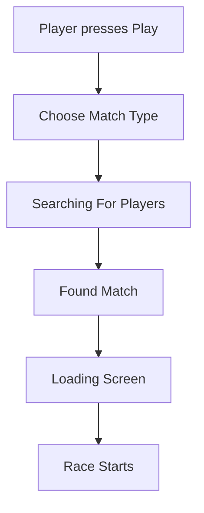

# P017 ? Matchmaking System Specification

| Field | Value |
|-------|--------|
| Document ID | P017 |
| Title | Matchmaking System Specification |
| Version | **1.0** |
| Status | Approved (matchmaking system scope only) |
| Project | Project GulfRun |
| Authority | Official source of truth for **match types**, **matchmaking flow**, **search status display**, **cancellation before confirm**, and **fair-race priority** stated herein |
| Depends on | [P001](P001-GAME-VISION-v1.0.md), [P002](P002-CORE-GAMEPLAY-LOOP-v1.0.md), [P004](P004-MAIN-MENU-v1.0.md), [P010](P010-RACE-RULES-v1.0.md), [P014](P014-FRIENDS-SYSTEM-v1.0.md) |
| Last updated | 2026-07-31 |

**Rules:** Documentation only. No implementation. Do not invent features beyond this brief. Missing detail ? **TODO**.

**Next milestone:** Sprint 1 — do not start until explicitly instructed.

---

## 1. Purpose

Define how players are matched together before every race: supported match types, Quick Match behavior, matchmaking flow, search status UI states, cancellation before confirmation, and fair-balancing priority without defining algorithms.

---

## 2. System Overview

| Field | Value |
|-------|--------|
| System | Project GulfRun supports **Automatic Online Matchmaking** |
| Goal | The Matchmaking System creates **balanced multiplayer races** |
| Race size | Every race contains exactly **4 players** |

### Alignment

- P001 / P002 / P010: 4 players per race ? **confirmed**.  
- P004 Play screen: Quick Match, Invite Friend, Private Room ? mapped to match types below (**Friend Party** names the invite/party path).  
- P001 Fair Competition ? fair races prioritized (�7).

---

## 3. Supported Match Types

| Match Type | Status |
|------------|--------|
| **Quick Match** | Defined |
| **Friend Party** | Defined |
| **Private Room** | Defined |
| **Future Ranked Match** | Future ? Competitive Rank system **[P025](P025-RANK-SYSTEM-v1.0.md)** (which modes count as competitive races **TODO**) |
| **Future Event Match** | Future |

### Alignment with P004 Play options

| P004 Play option | P017 Match Type |
|------------------|-----------------|
| Quick Match | Quick Match |
| Invite Friend | Friend Party (**TODO** exact naming/UI sync) |
| Private Room | Private Room |

### TODO ? Match types (not provided)

- [ ] Friend Party vs Invite Friend naming / party size rules  
- [ ] Ranked Match / Event Match specifications  

---

## 4. Quick Match

| Field | Value |
|-------|--------|
| Search | The system **automatically searches for available players** |
| Outcome | Players are matched into a race of **four** |
| Priority | The matchmaking process should be **as fast as possible** while maintaining **fair competition** |

---

## 5. Matchmaking Flow

```
Player presses Play
?
Choose Match Type
?
Searching For Players
?
Found Match
?
Loading Screen
?
Race Starts
```



### Alignment

- P002 Stages 3?7: Choose Play ? path ? Matchmaking ? Loading ? Race Starts ? **refined** here with explicit search/found steps and status labels (�6).

---

## 6. Search States (Search Status Display)

Display:

| Status |
|--------|
| **Searching...** |
| **Players Found** |
| **Connecting** |
| **Loading Match** |
| **Match Ready** |

### TODO ? Search status (not provided)

- [ ] Transitions / which states are mandatory vs optional  
- [ ] Player count display during Players Found  

---

## 7. Cancellation Rules

| Rule ID | Rule |
|---------|------|
| MM-CAN-001 | Players may **cancel matchmaking before a match is confirmed**. |
| MM-CAN-002 | Cancellation behavior **after confirmation is not defined**. |

### TODO ? Cancellation (not provided)

- [ ] Definition of ?confirmed?  
- [ ] Post-confirmation cancel / leave rules  

---

## 8. Disconnection

| Field | Value |
|-------|--------|
| Connection handling | **Exists** |
| Reconnect rules | **Not defined** |

### Alignment

- P010 Disconnection system exists; rules not defined ? **consistent**.  

---

## 9. Balancing Rules

| Rule ID | Rule |
|---------|------|
| MM-BAL-001 | The matchmaking system should prioritize **fair races**. |
| MM-BAL-002 | **Balancing algorithm is not defined**. |

---

## 10. Dependencies

| Dependency | Note |
|------------|------|
| P004 Play screen | Choose Match Type entry |
| P002 | Loop stages Loading / Race Starts |
| P010 | 4-player race; start after load |
| P014 | Friend Party / invites |
| Backend matchmaking | Implementation not defined here |

---

## 11. Future Specifications

| Topic | Status |
|-------|--------|
| Future Ranked Match | Future match type |
| Future Event Match | Future match type |
| Balancing algorithm | Not defined |
| Reconnect rules | Not defined |
| Skill Rating / MMR | Not defined |

---

## 12. Explicitly Not Defined (P017)

- Skill Rating  
- MMR  
- Ping Matching  
- Bot Filling  
- Regional Servers  
- Cross Platform Matching  
- Reconnect Rules  
- Rank Restrictions  
- Estimated Queue Time  
- Balancing algorithm  
- Post-confirmation cancellation  

---

## 13. Open Questions

| ID | Question |
|----|----------|
| Q-P017-001 | Is Friend Party the same as P004 Invite Friend? |
| Q-P017-002 | What constitutes match ?confirmed?? |
| Q-P017-003 | Cancel after confirmation ? document when defined? |
| Q-P017-004 | Search state transition diagram details? |
| Q-P017-005 | Document IDs for Ranked Match / Event Match? |
| Q-P017-006 | Cross-platform matching rules? |

---

## 14. Acceptance Criteria

P017 v1.0 is satisfied when all of the following are true:

1. Automatic online matchmaking; balanced multiplayer races; exactly 4 players.  
2. Match types: Quick Match, Friend Party, Private Room; Ranked and Event future.  
3. Quick Match: auto-search; race of four; fast while fair.  
4. Flow: Play ? Choose Match Type ? Searching ? Found Match ? Loading ? Race Starts.  
5. Search status displays: Searching..., Players Found, Connecting, Loading Match, Match Ready.  
6. Cancel allowed before confirmation; after confirmation not defined.  
7. Connection handling exists; reconnect rules not defined.  
8. Fair races prioritized; algorithm not defined.  
9. Skill Rating, MMR, ping matching, bots, regional servers, cross-platform, rank restrictions, and ETA are not invented.  
10. Document version is **P017 v1.0**.

---

## 15. Document Queue

| Order | Document ID | Title | Status |
|-------|-------------|-------|--------|
| 1?16 | P001?P016 | (prior specs) | Approved as previously recorded |
| 17 | P017 | Matchmaking System Specification | **v1.0 Approved** |
| 18 | P018 | Private Room System Specification | **v1.0 Approved** |
| 19 | P019 | Leaderboard System Specification | v1.0 Approved |
| 20 | P020 | Player Profile System Specification | v1.0 Approved |
| 21 | P021 | Inventory System Specification | v1.0 Approved |
| 22 | P022 | Cosmetics System Specification | v1.0 Approved |
| 23 | P023 | Player Progression System Specification | v1.0 Approved |
| 24 | P024 | Level System Specification | v1.0 Approved |
| 25 | P025 | Rank System Specification | v1.0 Approved |
| 26 | P026 | Daily Challenges System Specification | v1.0 Approved |
| 27 | P027 | Weekly Challenges System Specification | v1.0 Approved |
| 28 | P028 | Achievement System Specification | v1.0 Approved |
| 29 | P029 | Battle Pass System Specification | v1.0 Approved |
| 30 | P030 | Season System Specification | v1.0 Approved |
| 31 | P031 | Live Events System Specification | v1.0 Approved |
| 32 | P032 | Notification System Specification | v1.0 Approved |
| 33 | P033 | Inbox (Mail) System Specification | **v1.0 Approved** — [P033](P033-INBOX-MAIL-SYSTEM-v1.0.md) |
| 34 | P034 | Settings System Specification | **v1.0 Approved** — [P034](P034-SETTINGS-SYSTEM-v1.0.md) |
| 35 | P035 | Audio System Specification | **v1.0 Approved** — [P035](P035-AUDIO-SYSTEM-v1.0.md) |
| 36 | P036 | Music System Specification | **v1.0 Approved** — [P036](P036-MUSIC-SYSTEM-v1.0.md) |
| 37 | P037 | Localization System Specification | **v1.0 Approved** — [P037](P037-LOCALIZATION-SYSTEM-v1.0.md) |
| 38 | P038 | Tutorial System Specification | **v1.0 Approved** — [P038](P038-TUTORIAL-SYSTEM-v1.0.md) |
| 39 | P039 | Backend Architecture Specification (engineering doc — docs/02-architecture/) | **v1.0 Approved** |
| 40 | P040 | Database Architecture Specification (engineering doc — docs/02-architecture/) | **v1.0 Approved** |
| 41 | P041 | Authentication System Specification (engineering doc — docs/02-architecture/) | **v1.0 Approved** |
| 42 | P042 | Player Profile System Specification [CONFLICT with P020] | **v1.0 Approved-per-brief** |
| 43 | P043 | Anti-Cheat System Specification (engineering doc — docs/05-security/) | **v1.0 Approved** |
| 44 | P044 | Analytics System Specification (engineering doc — docs/02-architecture/) | **v1.0 Approved** |
| 45 | P045 | Monetization System Specification | **v1.0 Approved** |
| 46 | P046 | Performance Optimization Specification | **v1.0 Approved** |
| 47 | P047 | UI / UX Design System Specification | **v1.0 Approved** |
| 48 | P048 | Art Direction & Visual Style Specification | **v1.0 Approved** |
| 49 | P049 | Technical Architecture Specification | **v1.0 Approved** |
| 50 | P050 | Master Design Bible Specification | **v1.0 Approved** |
| — | Sprint 1 | _(await instructions)_ | Not started |

---

## 16. Change Log

| Version | Date | Summary | Author |
|---------|------|---------|--------|
| **1.0** | 2026-07-31 | Initial Matchmaking System Specification | Documentation Engineer (from Design Owner brief) |

---

*End of document.*
