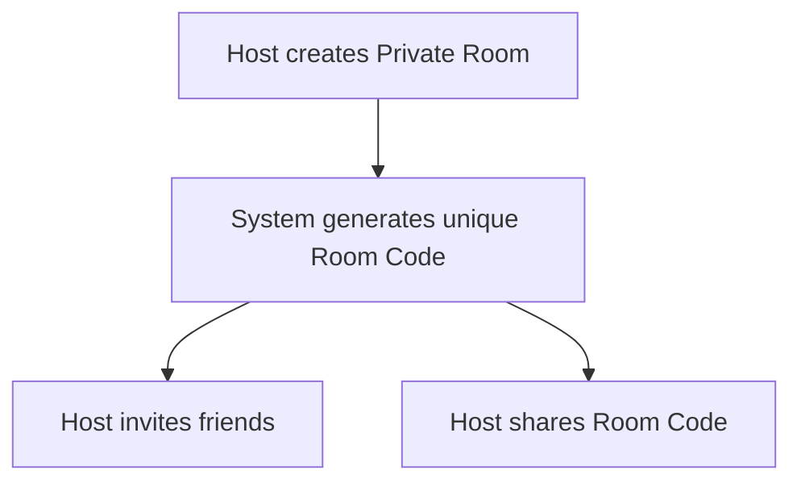
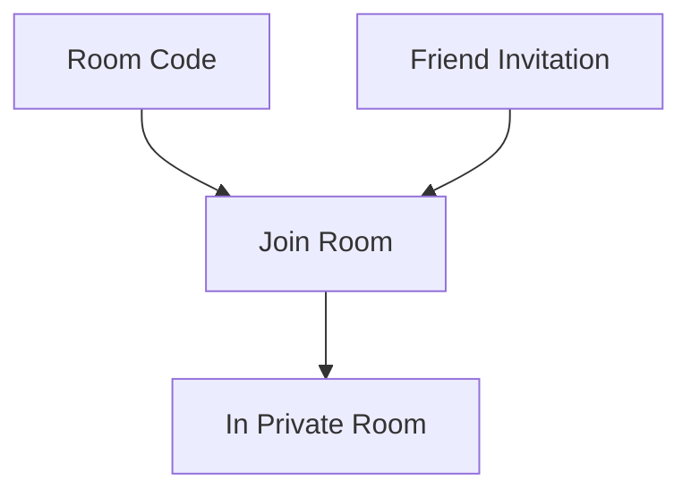

# P018 — Private Room System Specification

| Field | Value |
|-------|--------|
| Document ID | P018 |
| Title | Private Room System Specification |
| Version | **1.0** |
| Status | Approved (Private Room system scope only) |
| Project | Project GulfRun |
| Authority | Official source of truth for **Private Room** creation, join, host permissions, player actions, and room status stated herein |
| Depends on | [P001](P001-GAME-VISION-v1.0.md), [P002](P002-CORE-GAMEPLAY-LOOP-v1.0.md), [P004](P004-MAIN-MENU-v1.0.md), [P014](P014-FRIENDS-SYSTEM-v1.0.md), [P017](P017-MATCHMAKING-SYSTEM-v1.0.md) |
| Last updated | 2026-07-31 |

**Rules:** Documentation only. No implementation. Do not invent features beyond this brief. Missing detail → **TODO**.

**Next milestone:** Sprint 1 — do not start until explicitly instructed.

---

## 1. Purpose

Define the Private Room system for Project GulfRun: invitation-based rooms outside public matchmaking, creation and join flows, host permissions, player actions, and room states.

---

## 2. System Overview

| Field | Value |
|-------|--------|
| Create | Players can **create Private Rooms** |
| Access | Private Rooms are **invitation-based** |
| Visibility | Private Rooms are **not visible in public matchmaking** |
| Capacity | Every Private Room supports exactly **4 players** |

### Alignment

- P004 Play option **Private Room** — entry point.  
- P017 match type **Private Room** — confirmed.  
- P001 / P010 / P017: race size 4 — room capacity **aligned**.  
- P014: Host invite friends / Friend Invitation join — Friends System.

---

## 3. Room Creation Flow

| Step | Behavior |
|------|----------|
| 1 | The **Host** creates a Private Room |
| 2 | The system generates a **unique Room Code** |
| 3 | The Host can **invite friends** |
| 4 | The Host can **share the Room Code** |

```
Host creates Private Room
↓
System generates unique Room Code
↓
Host may invite friends and/or share Room Code
```



### TODO — Room creation (not provided)

- [ ] Room Code format / length / character set  
- [ ] How Room Code is shared (UI / OS share sheet — not defined)  

---

## 4. Room Join Flow

Players may join by:

| Method | Status |
|--------|--------|
| **Room Code** | Defined |
| **Friend Invitation** | Defined |

```
Player receives Room Code OR Friend Invitation
↓
Player joins Private Room
↓
Room occupancy updates (max 4)
```



### Alignment

- P004 §5.4: join via Room Code — **confirmed**; Friend Invitation join **added** by this spec.  
- P014 Invite Friend to Private Room — **supported**.

### TODO — Room join (not provided)

- [ ] Invalid / expired Room Code behavior  
- [ ] Full room (4/4) join rejection messaging  
- [ ] Friend Invitation acceptance UI details  

---

## 5. Host Permissions

The Host can:

| Permission | Status |
|------------|--------|
| **Start Match** | Defined |
| **Invite Players** | Defined |
| **Remove Players** | Defined |
| **Close Room** | Defined |
| **Transfer Host** | Defined |

### TODO — Host permissions (not provided)

- [ ] Conditions required before Start Match (see §7 minimum players)  
- [ ] Transfer Host: who may receive host; host leave without transfer  
- [ ] Remove Players: notification / rejoin rules  

---

## 6. Player Actions

| Action | Status |
|--------|--------|
| **Join Room** | Defined |
| **Leave Room** | Defined |
| **Ready** | Defined |
| **Not Ready** | Defined |
| **View Players** | Defined |

### TODO — Player actions (not provided)

- [ ] Whether all non-host players must be Ready before Start Match  
- [ ] Host Ready requirement  
- [ ] Leave Room while Starting Match / In Match  

---

## 7. Room States (Room Status)

| Status |
|--------|
| **Waiting For Players** |
| **Ready** |
| **Starting Match** |
| **In Match** |
| **Closed** |

### TODO — Room states (not provided)

- [ ] Exact transition rules between states  
- [ ] Who triggers Ready status (all Ready vs Host mark)  
- [ ] Post-match: return to Waiting For Players vs Closed  

---

## 8. Room Rules

| Rule ID | Rule |
|---------|------|
| PR-001 | **Maximum Players:** **4** |
| PR-002 | **Minimum Players required to start is not defined.** |

### TODO — Room rules (not provided)

- [ ] Minimum players required to start  
- [ ] Whether Start Match is blocked until capacity / Ready conditions  

---

## 9. Dependencies

| Dependency | Note |
|------------|------|
| P004 Play screen | Private Room entry |
| P002 | Loop path Private Room → Matchmaking / Loading / Race |
| P014 | Invite friends; Friend Invitation join |
| P017 | Private Room match type; not in public Quick Match search |
| P010 | Race of 4 after match start |
| P016 | Private Room Voice Chat channel exists; **Voice Chat Behavior** for rooms not defined here (§11) |

---

## 10. Future Specifications

| Topic | Status |
|-------|--------|
| Minimum players to start | Not defined — TODO |
| Room Password | Not defined |
| Spectators | Not defined |
| Bots | Not defined |
| Custom Rules | Not defined |
| Custom Maps | Not defined |
| Kick Vote | Not defined |
| Room Chat | Not defined |
| Voice Chat Behavior (room-specific) | Not defined |

---

## 11. Explicitly Not Defined (P018)

- Room Password  
- Spectators  
- Bots  
- Custom Rules  
- Custom Maps  
- Kick Vote  
- Room Chat  
- Voice Chat Behavior  
- Minimum players required to start  
- Room Code format  

---

## 12. Open Questions

| ID | Question |
|----|----------|
| Q-P018-001 | Minimum players required to start a Private Room match? |
| Q-P018-002 | Room Code format / length / expiry? |
| Q-P018-003 | Must all players be Ready before Host can Start Match? |
| Q-P018-004 | After race ends: return to room Waiting For Players or Closed? |
| Q-P018-005 | Host disconnect / leave without Transfer Host — room fate? |
| Q-P018-006 | Relationship of Friend Party (P017) vs Private Room vs P004 Invite Friend? |
| Q-P018-007 | Document Voice Chat Behavior for Private Rooms (extends P016)? |

---

## 13. Acceptance Criteria

P018 v1.0 is satisfied when all of the following are true:

1. Players can create Private Rooms; rooms are invitation-based; not visible in public matchmaking; exactly 4 players.  
2. Host creates room; unique Room Code generated; Host can invite friends and share Room Code.  
3. Join by Room Code or Friend Invitation.  
4. Host can: Start Match, Invite Players, Remove Players, Close Room, Transfer Host.  
5. Players can: Join Room, Leave Room, Ready, Not Ready, View Players.  
6. Room statuses: Waiting For Players, Ready, Starting Match, In Match, Closed.  
7. Max players 4; minimum to start not defined (TODO present).  
8. Room Password, Spectators, Bots, Custom Rules, Custom Maps, Kick Vote, Room Chat, and Voice Chat Behavior are not invented.  
9. Document version is **P018 v1.0**.

---

## 14. Document Queue

| Order | Document ID | Title | Status |
|-------|-------------|-------|--------|
| 1–17 | P001–P017 | (prior specs) | Approved as previously recorded |
| 18 | P018 | Private Room System Specification | **v1.0 Approved** |
| 19 | P019 | Leaderboard System Specification | **v1.0 Approved** |
| 20 | P020 | Player Profile System Specification | v1.0 Approved |
| 21 | P021 | Inventory System Specification | v1.0 Approved |
| 22 | P022 | Cosmetics System Specification | v1.0 Approved |
| 23 | P023 | Player Progression System Specification | v1.0 Approved |
| 24 | P024 | Level System Specification | v1.0 Approved |
| 25 | P025 | Rank System Specification | v1.0 Approved |
| 26 | P026 | Daily Challenges System Specification | v1.0 Approved |
| 27 | P027 | Weekly Challenges System Specification | v1.0 Approved |
| 28 | P028 | Achievement System Specification | v1.0 Approved |
| 29 | P029 | Battle Pass System Specification | v1.0 Approved |
| 30 | P030 | Season System Specification | v1.0 Approved |
| 31 | P031 | Live Events System Specification | v1.0 Approved |
| 32 | P032 | Notification System Specification | v1.0 Approved |
| 33 | P033 | Inbox (Mail) System Specification | **v1.0 Approved** — [P033](P033-INBOX-MAIL-SYSTEM-v1.0.md) |
| 34 | P034 | Settings System Specification | **v1.0 Approved** — [P034](P034-SETTINGS-SYSTEM-v1.0.md) |
| 35 | P035 | Audio System Specification | **v1.0 Approved** — [P035](P035-AUDIO-SYSTEM-v1.0.md) |
| 36 | P036 | Music System Specification | **v1.0 Approved** — [P036](P036-MUSIC-SYSTEM-v1.0.md) |
| 37 | P037 | Localization System Specification | **v1.0 Approved** — [P037](P037-LOCALIZATION-SYSTEM-v1.0.md) |
| 38 | P038 | Tutorial System Specification | **v1.0 Approved** — [P038](P038-TUTORIAL-SYSTEM-v1.0.md) |
| 39 | P039 | Backend Architecture Specification (engineering doc — docs/02-architecture/) | **v1.0 Approved** |
| 40 | P040 | Database Architecture Specification (engineering doc — docs/02-architecture/) | **v1.0 Approved** |
| 41 | P041 | Authentication System Specification (engineering doc — docs/02-architecture/) | **v1.0 Approved** |
| 42 | P042 | Player Profile System Specification [CONFLICT with P020] | **v1.0 Approved-per-brief** |
| 43 | P043 | Anti-Cheat System Specification (engineering doc — docs/05-security/) | **v1.0 Approved** |
| 44 | P044 | Analytics System Specification (engineering doc — docs/02-architecture/) | **v1.0 Approved** |
| 45 | P045 | Monetization System Specification | **v1.0 Approved** |
| 46 | P046 | Performance Optimization Specification | **v1.0 Approved** |
| 47 | P047 | UI / UX Design System Specification | **v1.0 Approved** |
| 48 | P048 | Art Direction & Visual Style Specification | **v1.0 Approved** |
| 49 | P049 | Technical Architecture Specification | **v1.0 Approved** |
| 50 | P050 | Master Design Bible Specification | **v1.0 Approved** |
| — | Sprint 1 | _(await instructions)_ | Not started |

---

## 15. Change Log

| Version | Date | Summary | Author |
|---------|------|---------|--------|
| **1.0** | 2026-07-31 | Initial Private Room System Specification | Documentation Engineer (from Design Owner brief) |

---

*End of document.*
