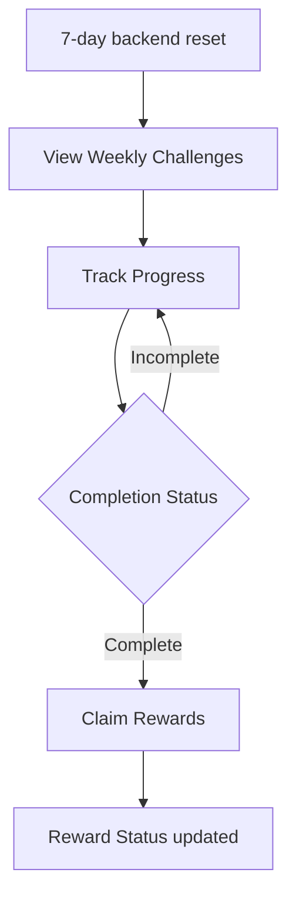

# P027 — Weekly Challenges System Specification

| Field | Value |
|-------|--------|
| Document ID | P027 |
| Title | Weekly Challenges System Specification |
| Version | **1.0** |
| Status | Approved (Weekly Challenges system scope only) |
| Project | Project GulfRun |
| Authority | Official source of truth for **Weekly Challenges** existence, **7-day reset**, **player actions**, **progress fields**, **reward existence**, and **completion rules** stated herein |
| Depends on | [P001](P001-GAME-VISION-v1.0.md), [P004](P004-MAIN-MENU-v1.0.md), [P012](P012-ECONOMY-SYSTEM-v1.0.md), [P023](P023-PLAYER-PROGRESSION-SYSTEM-v1.0.md), [P026](P026-DAILY-CHALLENGES-SYSTEM-v1.0.md) |
| Last updated | 2026-07-31 |

**Rules:** Documentation only. No implementation. Do not invent features beyond this brief. Missing detail → **TODO**.

**Next milestone:** Sprint 1 — do not start until explicitly instructed.

---

## 1. Purpose

Define the Weekly Challenges System for Project GulfRun: longer-term objectives than Daily Challenges, weekly reset cadence, player actions, progress tracking fields, reward flow existence, and reset/completion rules — without specific objectives, reward types, or challenge lists.

---

## 2. System Overview

| Field | Value |
|-------|--------|
| Support | The game supports **Weekly Challenges** |
| Intent | Weekly Challenges provide **longer-term objectives** than Daily Challenges |
| Reset cadence | Weekly Challenges **automatically reset every 7 days** |

### Alignment

- P026 Daily Challenges — shorter cadence (24 hours); Weekly Challenges are longer-term (**this document**).  
- P004 Main Menu **Challenges** — may surface Daily and/or Weekly; hub composition **TODO** (Q-P026-005).  
- P001 live service / engagement — weekly objectives **aligned** at principle level.

---

## 3. Challenge Types / Categories

| Field | Value |
|-------|--------|
| Weekly Challenge categories | **Exist** |
| Specific objectives | **Not defined** |
| Challenge Categories (list / names) | **Not defined** |

### TODO — Challenge types (not provided)

- [ ] Specific objectives  
- [ ] Challenge List  
- [ ] Challenge Categories (named list)  

---

## 4. Weekly Challenge Flow

```
Player opens Weekly Challenges
↓
View Weekly Challenges
↓
Play / participate in gameplay
↓
Track Progress
↓
Challenge reaches Completion Status
↓
Claim Rewards (if available)
↓
(After 7 days) Weekly Challenges reset
```



### Player Actions

| Action | Status |
|--------|--------|
| **View Weekly Challenges** | Defined |
| **Track Progress** | Defined |
| **Claim Rewards** | Defined |

### TODO — Weekly Challenge flow (not provided)

- [ ] Entry point UI (Challenges hub tabs: Daily vs Weekly)  
- [ ] How Track Progress is shown  

---

## 5. Progress Tracking

Each Weekly Challenge contains:

| Field | Status |
|-------|--------|
| **Progress** | Defined |
| **Completion Status** | Defined |
| **Reward Status** | Defined |

### TODO — Progress (not provided)

- [ ] Progress units / thresholds (objectives not defined)  
- [ ] Completion Status and Reward Status value sets  

---

## 6. Reward Flow

| Field | Value |
|-------|--------|
| Rewards | Weekly Challenges **grant rewards** |
| Reward types | **Not defined** |
| Claim | Players may **Claim Rewards** |

```
Weekly Challenge completed
↓
Reward available (Reward Status)
↓
Player Claims Rewards
↓
Reward granted (types not defined)
```

### Rules related to rewards

| Rule ID | Rule |
|---------|------|
| WC-RWD-001 | Weekly Challenges grant rewards. |
| WC-RWD-002 | Reward types are **not defined**. |
| WC-RWD-003 | **Unclaimed reward behavior is not defined**. |

### TODO — Rewards (not provided)

- [ ] Reward Types  
- [ ] Unclaimed reward behavior at weekly reset  
- [ ] Relationship to P012 / P023 / P026 reward patterns  

---

## 7. Reset Rules

| Rule ID | Rule |
|---------|------|
| WC-RST-001 | Weekly Challenges **automatically reset every week**. |
| WC-RST-002 | Reset cadence is **every 7 days**. |
| WC-RST-003 | Reset timing is **synchronized with the backend**. |
| WC-RST-004 | **Completed Weekly Challenges cannot be repeated** until the next weekly reset. |
| WC-RST-005 | **Unclaimed reward behavior is not defined**. |

### TODO — Reset (not provided)

- [ ] Exact weekly reset clock (day of week / UTC vs local)  
- [ ] Refresh Rules beyond automatic weekly reset  
- [ ] Behavior of in-progress Weekly Challenges at reset  

---

## 8. Dependencies

| Dependency | Note |
|------------|------|
| P026 Daily Challenges | Shorter-term counterpart; Challenges hub UX TBD |
| P004 Main Menu | Challenges entry |
| P002 / gameplay | Progress via participation (objectives TBD) |
| P012 Economy | Possible reward currencies — types TBD |
| P023 Progression | Possible XP / other rewards — TBD |
| Backend | Reset timing sync; progress / reward status |

---

## 9. Future Specifications

| Topic | Status |
|-------|--------|
| Challenge List / specific objectives | Not defined |
| Reward Types | Not defined |
| Difficulty Levels | Not defined |
| Premium Challenges | Not defined |
| Bonus Challenges | Not defined |
| Refresh Rules | Not defined |
| Challenge Categories (named list) | Not defined (categories exist as concept) |
| Challenge Chains | Not defined |
| Unclaimed reward behavior | Not defined |

---

## 10. Explicitly Not Defined (P027)

- Challenge List  
- Reward Types  
- Difficulty Levels  
- Premium Challenges  
- Bonus Challenges  
- Refresh Rules  
- Challenge Categories  
- Challenge Chains  
- Specific objectives  
- Unclaimed reward behavior  

---

## 11. Open Questions

| ID | Question |
|----|----------|
| Q-P027-001 | Specific Weekly Challenge objectives / Challenge List? |
| Q-P027-002 | Reward Types? |
| Q-P027-003 | Unclaimed rewards at weekly reset? |
| Q-P027-004 | Exact weekly reset day/time? |
| Q-P027-005 | Challenges hub: Daily + Weekly layout? |
| Q-P027-006 | Premium / Bonus / Chains — future or never? |
| Q-P027-007 | How many Weekly Challenges per week? |
| Q-P027-008 | Named Challenge Categories list? |

---

## 12. Acceptance Criteria

P027 v1.0 is satisfied when all of the following are true:

1. Weekly Challenges supported; longer-term than Daily Challenges; reset every 7 days.  
2. Weekly Challenge categories exist; specific objectives not defined (TODO present).  
3. Actions: View Weekly Challenges, Track Progress, Claim Rewards.  
4. Each Weekly Challenge has Progress, Completion Status, Reward Status.  
5. Challenges grant rewards; reward types not defined.  
6. Automatic weekly reset; backend-synced timing; completed challenges not repeatable until next weekly reset; unclaimed behavior not defined.  
7. Challenge List, Reward Types, Difficulty Levels, Premium/Bonus, Refresh Rules, Challenge Categories list, and Challenge Chains are not invented.  
8. Document version is **P027 v1.0**.

---

## 13. Document Queue

| Order | Document ID | Title | Status |
|-------|-------------|-------|--------|
| 1–26 | P001–P026 | (prior specs) | Approved as previously recorded |
| 27 | P027 | Weekly Challenges System Specification | **v1.0 Approved** |
| 28 | P028 | Achievement System Specification | **v1.0 Approved** |
| 29 | P029 | Battle Pass System Specification | v1.0 Approved |
| 30 | P030 | Season System Specification | v1.0 Approved |
| 31 | P031 | Live Events System Specification | v1.0 Approved |
| 32 | P032 | Notification System Specification | v1.0 Approved |
| 33 | P033 | Inbox (Mail) System Specification | **v1.0 Approved** — [P033](P033-INBOX-MAIL-SYSTEM-v1.0.md) |
| 34 | P034 | Settings System Specification | **v1.0 Approved** — [P034](P034-SETTINGS-SYSTEM-v1.0.md) |
| 35 | P035 | Audio System Specification | **v1.0 Approved** — [P035](P035-AUDIO-SYSTEM-v1.0.md) |
| 36 | P036 | Music System Specification | **v1.0 Approved** — [P036](P036-MUSIC-SYSTEM-v1.0.md) |
| 37 | P037 | Localization System Specification | **v1.0 Approved** — [P037](P037-LOCALIZATION-SYSTEM-v1.0.md) |
| 38 | P038 | Tutorial System Specification | **v1.0 Approved** — [P038](P038-TUTORIAL-SYSTEM-v1.0.md) |
| 39 | P039 | Backend Architecture Specification (engineering doc — docs/02-architecture/) | **v1.0 Approved** |
| 40 | P040 | Database Architecture Specification (engineering doc — docs/02-architecture/) | **v1.0 Approved** |
| 41 | P041 | Authentication System Specification (engineering doc — docs/02-architecture/) | **v1.0 Approved** |
| 42 | P042 | Player Profile System Specification [CONFLICT with P020] | **v1.0 Approved-per-brief** |
| 43 | P043 | Anti-Cheat System Specification (engineering doc — docs/05-security/) | **v1.0 Approved** |
| 44 | P044 | Analytics System Specification (engineering doc — docs/02-architecture/) | **v1.0 Approved** |
| 45 | P045 | Monetization System Specification | **v1.0 Approved** |
| 46 | P046 | Performance Optimization Specification | **v1.0 Approved** |
| 47 | P047 | UI / UX Design System Specification | **v1.0 Approved** |
| 48 | P048 | Art Direction & Visual Style Specification | **v1.0 Approved** |
| 49 | P049 | Technical Architecture Specification | **v1.0 Approved** |
| 50 | P050 | Master Design Bible Specification | **v1.0 Approved** |
| — | Sprint 1 | _(await instructions)_ | Not started |

---

## 14. Change Log

| Version | Date | Summary | Author |
|---------|------|---------|--------|
| **1.0** | 2026-07-31 | Initial Weekly Challenges System Specification | Documentation Engineer (from Design Owner brief) |

---

*End of document.*
