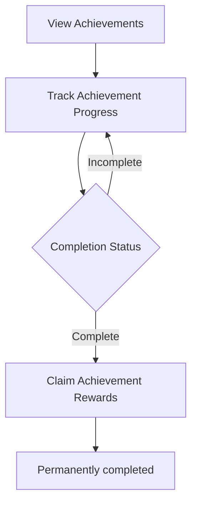

# P028 — Achievement System Specification

| Field | Value |
|-------|--------|
| Document ID | P028 |
| Title | Achievement System Specification |
| Version | **1.0** |
| Status | Approved (Achievement system scope only) |
| Project | Project GulfRun |
| Authority | Official source of truth for **Achievements** existence, **permanent account link**, **player actions**, **progress fields**, **display fields**, **one-time completion**, and **backend sync** stated herein |
| Depends on | [P001](P001-GAME-VISION-v1.0.md), [P020](P020-PLAYER-PROFILE-SYSTEM-v1.0.md), [P023](P023-PLAYER-PROGRESSION-SYSTEM-v1.0.md), [P012](P012-ECONOMY-SYSTEM-v1.0.md) |
| Last updated | 2026-07-31 |

**Rules:** Documentation only. No implementation. Do not invent features beyond this brief. Missing detail → **TODO**.

**Next milestone:** Sprint 1 — do not start until explicitly instructed.

---

## 1. Purpose

Define the Achievement System for Project GulfRun: long-term accomplishment rewards permanently linked to the account, player actions, progress tracking, reward flow existence, display information, and completion rules — without achievement lists, category names, or reward types.

---

## 2. System Overview

| Field | Value |
|-------|--------|
| Support | The game supports an **Achievement System** |
| Intent | Achievements reward **long-term player accomplishments** |
| Account | Achievements are **permanently linked** to the player's account |

### Alignment

- P023 Achievements progression component — **detailed** here.  
- P020 Achievements Display — was not defined on Profile; achievement **View** / display fields defined here; Profile placement **TODO**.  
- P001 Long-Term Progression — accomplishments **aligned** at principle level.  
- P026 / P027 Challenges — shorter/recurring objectives; Achievements are permanent one-time completions (**this document**).

---

## 3. Achievement Categories

| Field | Value |
|-------|--------|
| Achievement categories | **Exist** |
| Specific categories | **Not defined** |

### TODO — Categories (not provided)

- [ ] Specific Achievement Categories (named list)  
- [ ] Achievement List  

---

## 4. Achievement Flow

```
Player opens Achievements
↓
View Achievements
↓
Play / long-term participation
↓
Track Achievement Progress
↓
Achievement reaches Completion Status
↓
Claim Achievement Rewards (if available)
↓
Achievement remains permanently completed
```



### Player Actions

| Action | Status |
|--------|--------|
| **View Achievements** | Defined |
| **Track Achievement Progress** | Defined |
| **Claim Achievement Rewards** | Defined |

### TODO — Achievement flow (not provided)

- [ ] Entry point UI (Profile, Main Menu, dedicated screen)  
- [ ] Relationship to P020 Achievements Display  

---

## 5. Progress Tracking

Each Achievement contains:

| Field | Status |
|-------|--------|
| **Progress** | Defined |
| **Completion Status** | Defined |
| **Reward Status** | Defined |
| **Completion Date** | **Future** |

### TODO — Progress (not provided)

- [ ] Progress units / thresholds (Achievement List not defined)  
- [ ] Completion Status and Reward Status value sets  

---

## 6. Reward Flow

| Field | Value |
|-------|--------|
| Rewards | Achievements **provide rewards** |
| Reward types | **Not defined** |
| Claim | Players may **Claim Achievement Rewards** |

```
Achievement completed
↓
Reward available (Reward Status)
↓
Player Claims Achievement Rewards
↓
Reward granted (types not defined)
↓
Achievement remains permanently completed
```

### TODO — Rewards (not provided)

- [ ] Reward Types  
- [ ] Relationship to P012 Coins/Gems / P022 cosmetics / P023 XP  

---

## 7. Display Information

Display:

| Field | Status |
|-------|--------|
| **Achievement Name** | Defined |
| **Achievement Description** | Defined |
| **Progress** | Defined |
| **Completion Status** | Defined |
| **Reward Status** | Defined |

### TODO — Display (not provided)

- [ ] Screen layout / sorting / filters  
- [ ] Whether incomplete achievements show full Description  

---

## 8. Rules

| Rule ID | Rule |
|---------|------|
| ACH-001 | Achievements are completed **only once**. |
| ACH-002 | Completed Achievements remain **permanently completed**. |
| ACH-003 | Achievement progress is **synchronized with the backend**. |
| ACH-004 | Achievements are **permanently linked** to the player's account. |

### Alignment

- P023 progress permanent / backend sync / not manually modifiable — **consistent**.  
- Unlike P026/P027, Achievements do **not** reset on a daily/weekly cadence.

---

## 9. Dependencies

| Dependency | Note |
|------------|------|
| P023 Player Progression | Achievements component |
| P020 Player Profile | Achievements Display was TBD — View Achievements entry TBD |
| P012 Economy | Possible reward currencies — types TBD |
| P022 Cosmetics | Possible cosmetic rewards — TBD |
| P001 | Long-term engagement |
| Backend | Sync; permanent completion |

---

## 10. Future Specifications

| Topic | Status |
|-------|--------|
| Completion Date | Future progress field |
| Achievement List | Not defined |
| Achievement Categories (named list) | Not defined (categories exist as concept) |
| Reward Types | Not defined |
| Hidden Achievements | Not defined |
| Secret Achievements | Not defined |
| Achievement Points | Not defined |
| Collection Rewards | Not defined |
| Achievement Rarity | Not defined |

---

## 11. Explicitly Not Defined (P028)

- Achievement List  
- Achievement Categories  
- Reward Types  
- Hidden Achievements  
- Secret Achievements  
- Achievement Points  
- Collection Rewards  
- Achievement Rarity  
- Specific category names  

---

## 12. Open Questions

| ID | Question |
|----|----------|
| Q-P028-001 | Achievement List / specific objectives? |
| Q-P028-002 | Named Achievement Categories? |
| Q-P028-003 | Reward Types? |
| Q-P028-004 | Where is View Achievements opened (Profile)? |
| Q-P028-005 | Hidden / Secret Achievements — future or never? |
| Q-P028-006 | Achievement Points / Rarity — future or never? |
| Q-P028-007 | Completion Date display when future? |

---

## 13. Acceptance Criteria

P028 v1.0 is satisfied when all of the following are true:

1. Achievement System supported; rewards long-term accomplishments; permanently linked to account.  
2. Achievement categories exist; specific categories not defined (TODO present).  
3. Actions: View Achievements, Track Achievement Progress, Claim Achievement Rewards.  
4. Each Achievement has Progress, Completion Status, Reward Status; Completion Date future.  
5. Achievements provide rewards; reward types not defined.  
6. Completed only once; remain permanently completed; progress backend-synced.  
7. Display: Achievement Name, Description, Progress, Completion Status, Reward Status.  
8. Achievement List, Categories list, Reward Types, Hidden/Secret, Points, Collection Rewards, and Rarity are not invented.  
9. Document version is **P028 v1.0**.

---

## 14. Document Queue

| Order | Document ID | Title | Status |
|-------|-------------|-------|--------|
| 1–27 | P001–P027 | (prior specs) | Approved as previously recorded |
| 28 | P028 | Achievement System Specification | **v1.0 Approved** |
| 29 | P029 | Battle Pass System Specification | **v1.0 Approved** |
| 30 | P030 | Season System Specification | v1.0 Approved |
| 31 | P031 | Live Events System Specification | v1.0 Approved |
| 32 | P032 | Notification System Specification | v1.0 Approved |
| 33 | P033 | Inbox (Mail) System Specification | **v1.0 Approved** — [P033](P033-INBOX-MAIL-SYSTEM-v1.0.md) |
| 34 | P034 | Settings System Specification | **v1.0 Approved** — [P034](P034-SETTINGS-SYSTEM-v1.0.md) |
| 35 | P035 | Audio System Specification | **v1.0 Approved** — [P035](P035-AUDIO-SYSTEM-v1.0.md) |
| 36 | P036 | Music System Specification | **v1.0 Approved** — [P036](P036-MUSIC-SYSTEM-v1.0.md) |
| 37 | P037 | Localization System Specification | **v1.0 Approved** — [P037](P037-LOCALIZATION-SYSTEM-v1.0.md) |
| 38 | P038 | Tutorial System Specification | **v1.0 Approved** — [P038](P038-TUTORIAL-SYSTEM-v1.0.md) |
| 39 | P039 | Backend Architecture Specification (engineering doc — docs/02-architecture/) | **v1.0 Approved** |
| 40 | P040 | Database Architecture Specification (engineering doc — docs/02-architecture/) | **v1.0 Approved** |
| 41 | P041 | Authentication System Specification (engineering doc — docs/02-architecture/) | **v1.0 Approved** |
| 42 | P042 | Player Profile System Specification [CONFLICT with P020] | **v1.0 Approved-per-brief** |
| 43 | P043 | Anti-Cheat System Specification (engineering doc — docs/05-security/) | **v1.0 Approved** |
| 44 | P044 | Analytics System Specification (engineering doc — docs/02-architecture/) | **v1.0 Approved** |
| 45 | P045 | Monetization System Specification | **v1.0 Approved** |
| 46 | P046 | Performance Optimization Specification | **v1.0 Approved** |
| 47 | P047 | UI / UX Design System Specification | **v1.0 Approved** |
| 48 | P048 | Art Direction & Visual Style Specification | **v1.0 Approved** |
| 49 | P049 | Technical Architecture Specification | **v1.0 Approved** |
| 50 | P050 | Master Design Bible Specification | **v1.0 Approved** |
| — | Sprint 1 | _(await instructions)_ | Not started |

---

## 15. Change Log

| Version | Date | Summary | Author |
|---------|------|---------|--------|
| **1.0** | 2026-07-31 | Initial Achievement System Specification | Documentation Engineer (from Design Owner brief) |

---

*End of document.*
