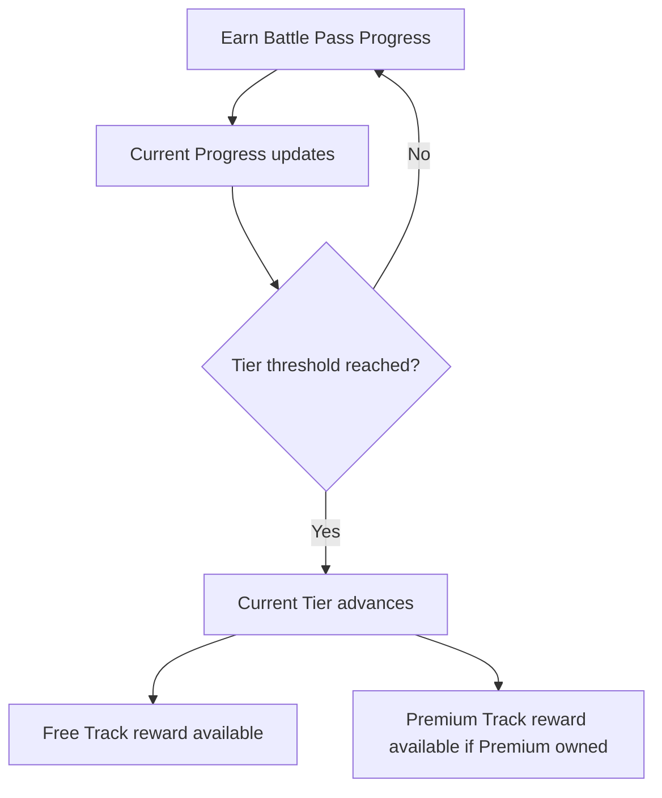

# P029 — Battle Pass System Specification

| Field | Value |
|-------|--------|
| Document ID | P029 |
| Title | Battle Pass System Specification |
| Version | **1.0** |
| Status | Approved (Battle Pass system scope only) |
| Project | Project GulfRun |
| Authority | Official source of truth for **Seasonal Battle Pass** structure (Free/Premium tracks), **Battle Pass Progress existence**, **player actions**, **display fields**, **season linkage**, and **no Pay-to-Win** rules stated herein |
| Depends on | [P001](P001-GAME-VISION-v1.0.md), [P012](P012-ECONOMY-SYSTEM-v1.0.md), [P013](P013-SHOP-SYSTEM-v1.0.md), [P023](P023-PLAYER-PROGRESSION-SYSTEM-v1.0.md), [P022](P022-COSMETICS-SYSTEM-v1.0.md) |
| Last updated | 2026-07-31 |

**Rules:** Documentation only. No implementation. Do not invent features beyond this brief. Missing detail → **TODO**.

**Next milestone:** Sprint 1 — do not start until explicitly instructed.

---

## 1. Purpose

Define the Battle Pass System for Project GulfRun: seasonal Free and Premium tracks, Battle Pass Progress existence, reward-tier structure, player actions, display information, season linkage, and fairness rules — without tier counts, progress formulas, prices, or reward lists.

---

## 2. System Overview

| Field | Value |
|-------|--------|
| Support | The game supports a **Seasonal Battle Pass** |
| Intent | The Battle Pass provides **long-term seasonal progression** |
| Season link | The Battle Pass is linked to the **current active Season** — Season SoT **[P030](P030-SEASON-SYSTEM-v1.0.md)** |

### Alignment

- P001 Long-Term Progression / seasonal content — **aligned**.  
- P023 Season Progress — related progression component; relationship to Battle Pass Progress **TODO**.  
- P025 seasonal Competitive Rank — separate seasonal ladder; Battle Pass is a distinct system.  
- P004 Battle Pass was listed among items not defined in Main Menu — **this document** defines the system.

---

## 3. Battle Pass Structure

The Battle Pass contains:

| Track | Status |
|-------|--------|
| **Free Track** | Defined |
| **Premium Track** | Defined |

| Rule ID | Rule |
|---------|------|
| BP-STR-001 | Both tracks **progress simultaneously**. |

### TODO — Structure (not provided)

- [ ] Tier Count  
- [ ] Visual layout of Free vs Premium tracks  

---

## 4. Progression Flow

| Field | Value |
|-------|--------|
| Progress | Players earn **Battle Pass Progress** |
| Progression requirements | **Not defined** |

```
Player participates in gameplay / season activities
↓
Earn Battle Pass Progress (requirements not defined)
↓
Current Progress advances toward next Tier
↓
Tier reached — Free and Premium tracks progress simultaneously
↓
Rewards available to Claim (per track access)
```



### TODO — Progression (not provided)

- [ ] Progression requirements / Progress Formula  
- [ ] Sources of Battle Pass Progress  
- [ ] Relationship to P023 Season Progress  

---

## 5. Reward Flow

| Field | Value |
|-------|--------|
| Tiers | Each Battle Pass **Tier may contain rewards** |
| Reward types | **Not defined** |
| Claim | Players may **Claim Rewards** |
| Re-claim | Claimed rewards **cannot be claimed again** |

```
Tier reached
↓
Free / Premium rewards available (Reward List not defined)
↓
Player Claims Rewards
↓
Reward granted (types not defined)
↓
Cannot claim same reward again
```

### TODO — Rewards (not provided)

- [ ] Reward List  
- [ ] Reward Types  
- [ ] Expired Rewards behavior  

---

## 6. Player Actions

| Action | Status |
|--------|--------|
| **View Battle Pass** | Defined |
| **Track Progress** | Defined |
| **Claim Rewards** | Defined |
| **Purchase Premium Pass** | Defined |

### TODO — Player actions (not provided)

- [ ] Entry point UI (Main Menu / Shop / dedicated)  
- [ ] Premium Price  
- [ ] Purchase Premium Pass currency / IAP flow (P012 / P013)  

---

## 7. Display Information

Display:

| Field | Status |
|-------|--------|
| **Current Tier** | Defined |
| **Current Progress** | Defined |
| **Free Rewards** | Defined |
| **Premium Rewards** | Defined |
| **Season Remaining Time** | Defined |

### TODO — Display (not provided)

- [ ] Season Duration (needed to compute remaining time presentation)  
- [ ] Locked Premium reward presentation for Free players  

---

## 8. Seasons

| Rule ID | Rule |
|---------|------|
| BP-SEA-001 | Each Battle Pass belongs to **one Season**. |
| BP-SEA-002 | A **new Battle Pass begins with every new Season**. |
| BP-SEA-003 | **Previous Season handling is not defined**. |

### TODO — Seasons (not provided)

- [ ] Season Duration  
- [ ] Previous Season / Expired Rewards handling  
- [ ] Alignment with P025 Season Reset  

---

## 9. Rules

| Rule ID | Rule |
|---------|------|
| BP-001 | Battle Pass Progress is **synchronized with the backend**. |
| BP-002 | Claimed rewards **cannot be claimed again**. |
| BP-003 | Battle Pass must **never** create **Pay-to-Win** gameplay. |

### Alignment

- P013 FAIR / no P2W; P023 PROG-DP-003; P022 cosmetics-only advantages — **reinforced**.  
- Premium Track may be purchased; must not grant gameplay advantages (reward types still TBD — must remain non-P2W).

---

## 10. Dependencies

| Dependency | Note |
|------------|------|
| P001 | Seasonal live service / Long-Term Progression |
| P023 | Season Progress component; sync principles |
| P012 / P013 | Purchase Premium Pass; currency / IAP |
| P022 | Likely cosmetic rewards — types TBD |
| P025 | Separate seasonal Competitive Rank |
| Backend | Progress sync; claim state |

---

## 11. Future Specifications

| Topic | Status |
|-------|--------|
| Tier Count | Not defined |
| Reward List | Not defined |
| Progress Formula / requirements | Not defined |
| Premium Price | Not defined |
| Premium Plus | Not defined |
| Instant Tier Unlocks | Not defined |
| Season Duration | Not defined |
| Catch-up Mechanics | Not defined |
| Expired Rewards | Not defined |
| Previous Season handling | Not defined |

---

## 12. Explicitly Not Defined (P029)

- Tier Count  
- Reward List  
- Progress Formula  
- Premium Price  
- Premium Plus  
- Instant Tier Unlocks  
- Season Duration  
- Catch-up Mechanics  
- Expired Rewards  

---

## 13. Open Questions

| ID | Question |
|----|----------|
| Q-P029-001 | Tier Count and Reward List? |
| Q-P029-002 | Progress Formula / Battle Pass Progress sources? |
| Q-P029-003 | Premium Price and purchase currency? |
| Q-P029-004 | Season Duration and Season Remaining Time clock? |
| Q-P029-005 | Previous Season / Expired Rewards handling? |
| Q-P029-006 | Relationship of Battle Pass Progress to P023 Season Progress? |
| Q-P029-007 | Premium Plus / Instant Tier Unlocks — future or never? |
| Q-P029-008 | Battle Pass entry UI location? |

---

## 14. Acceptance Criteria

P029 v1.0 is satisfied when all of the following are true:

1. Seasonal Battle Pass supported; long-term seasonal progression; linked to current active Season.  
2. Free Track and Premium Track; both progress simultaneously.  
3. Players earn Battle Pass Progress; progression requirements not defined (TODO present).  
4. Each Tier may contain rewards; reward types not defined.  
5. Actions: View Battle Pass, Track Progress, Claim Rewards, Purchase Premium Pass.  
6. Each Battle Pass belongs to one Season; new Battle Pass each new Season; previous Season handling not defined.  
7. Progress backend-synced; claimed rewards not re-claimable; never Pay-to-Win.  
8. Display: Current Tier, Current Progress, Free Rewards, Premium Rewards, Season Remaining Time.  
9. Tier Count, Reward List, Progress Formula, Premium Price, Premium Plus, Instant Tier Unlocks, Season Duration, Catch-up, and Expired Rewards are not invented.  
10. Document version is **P029 v1.0**.

---

## 15. Document Queue

| Order | Document ID | Title | Status |
|-------|-------------|-------|--------|
| 1–28 | P001–P028 | (prior specs) | Approved as previously recorded |
| 29 | P029 | Battle Pass System Specification | **v1.0 Approved** |
| 30 | P030 | Season System Specification | **v1.0 Approved** |
| 31 | P031 | Live Events System Specification | v1.0 Approved |
| 32 | P032 | Notification System Specification | v1.0 Approved |
| 33 | P033 | Inbox (Mail) System Specification | **v1.0 Approved** — [P033](P033-INBOX-MAIL-SYSTEM-v1.0.md) |
| 34 | P034 | Settings System Specification | **v1.0 Approved** — [P034](P034-SETTINGS-SYSTEM-v1.0.md) |
| 35 | P035 | Audio System Specification | **v1.0 Approved** — [P035](P035-AUDIO-SYSTEM-v1.0.md) |
| 36 | P036 | Music System Specification | **v1.0 Approved** — [P036](P036-MUSIC-SYSTEM-v1.0.md) |
| 37 | P037 | Localization System Specification | **v1.0 Approved** — [P037](P037-LOCALIZATION-SYSTEM-v1.0.md) |
| 38 | P038 | Tutorial System Specification | **v1.0 Approved** — [P038](P038-TUTORIAL-SYSTEM-v1.0.md) |
| 39 | P039 | Backend Architecture Specification (engineering doc — docs/02-architecture/) | **v1.0 Approved** |
| 40 | P040 | Database Architecture Specification (engineering doc — docs/02-architecture/) | **v1.0 Approved** |
| 41 | P041 | Authentication System Specification (engineering doc — docs/02-architecture/) | **v1.0 Approved** |
| 42 | P042 | Player Profile System Specification [CONFLICT with P020] | **v1.0 Approved-per-brief** |
| 43 | P043 | Anti-Cheat System Specification (engineering doc — docs/05-security/) | **v1.0 Approved** |
| 44 | P044 | Analytics System Specification (engineering doc — docs/02-architecture/) | **v1.0 Approved** |
| 45 | P045 | Monetization System Specification | **v1.0 Approved** |
| 46 | P046 | Performance Optimization Specification | **v1.0 Approved** |
| 47 | P047 | UI / UX Design System Specification | **v1.0 Approved** |
| 48 | P048 | Art Direction & Visual Style Specification | **v1.0 Approved** |
| 49 | P049 | Technical Architecture Specification | **v1.0 Approved** |
| 50 | P050 | Master Design Bible Specification | **v1.0 Approved** |
| — | Sprint 1 | _(await instructions)_ | Not started |

---

## 16. Change Log

| Version | Date | Summary | Author |
|---------|------|---------|--------|
| **1.0** | 2026-07-31 | Initial Battle Pass System Specification | Documentation Engineer (from Design Owner brief) |

---

*End of document.*
