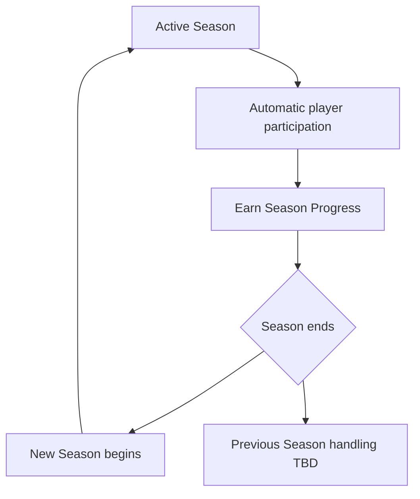

# P030 — Season System Specification

| Field | Value |
|-------|--------|
| Document ID | P030 |
| Title | Season System Specification |
| Version | **1.0** |
| Status | Approved (Seasonal System scope only) |
| Project | Project GulfRun |
| Authority | Official source of truth for **Seasons** as the operational period model, **season content containers**, **automatic participation**, **Season Progress existence**, **season transition**, **display fields**, and **no Pay-to-Win** rules stated herein |
| Depends on | [P001](P001-GAME-VISION-v1.0.md), [P019](P019-LEADERBOARD-SYSTEM-v1.0.md), [P023](P023-PLAYER-PROGRESSION-SYSTEM-v1.0.md), [P025](P025-RANK-SYSTEM-v1.0.md), [P029](P029-BATTLE-PASS-SYSTEM-v1.0.md) |
| Last updated | 2026-07-31 |

**Rules:** Documentation only. No implementation. Do not invent features beyond this brief. Missing detail → **TODO**.

**Next milestone:** Sprint 1 — do not start until explicitly instructed.

---

## 1. Purpose

Define the Seasonal System for Project GulfRun: fixed-period seasons with identity, optional seasonal content types, automatic player participation, Season Progress existence, end/begin transition, display information, and fairness rules — without duration, names, themes, rewards, or reset/archive details.

---

## 2. System Overview

| Field | Value |
|-------|--------|
| Model | Project GulfRun operates using **Seasons** |
| Period | Each Season represents a **fixed period** of game progression |
| Identity | Every **active Season** has its **own identity** |

### Alignment

- P001 Seasonal updates / Long-Term Progression — **aligned**.  
- P029 Battle Pass linked to current active Season — **consistent**.  
- P019 Season Leaderboard; P025 seasonal Competitive Rank — seasonal content / ladders under this model.  
- P023 Season Progress component — detailed here as existence; calculation **TODO**.

---

## 3. Season Structure (Season Content)

Each Season **may** contain:

| Content | Status |
|---------|--------|
| **Battle Pass** | Defined (container) — detail **[P029](P029-BATTLE-PASS-SYSTEM-v1.0.md)** |
| **Season Leaderboard** | Defined (container) — detail **[P019](P019-LEADERBOARD-SYSTEM-v1.0.md)** |
| **Season Challenges** | Defined (container) — objectives **not defined** |
| **Season Cosmetics** | Defined (container) — list **not defined**; cosmetics rules **[P022](P022-COSMETICS-SYSTEM-v1.0.md)** |
| **Season Events** | Defined (container) — Live Events SoT **[P031](P031-LIVE-EVENTS-SYSTEM-v1.0.md)** |
| **Future Seasonal Features** | Future |

### TODO — Season content (not provided)

- [ ] Which content is required vs optional each Season  
- [ ] Season Challenges objectives / relationship to P026 Daily / P027 Weekly  
- [ ] Season Cosmetics catalog  
- [ ] Season Events catalog  
- [ ] Season Names / Themes / identity presentation  

---

## 4. Season Flow

```
Active Season running
↓
Players automatically participate
↓
Players may earn Season Progress (calculation not defined)
↓
Season ends
↓
New Season begins (backend-synchronized transition)
↓
Previous Season handling (not defined)
```



### Season Transition

| Rule ID | Rule |
|---------|------|
| SEA-TR-001 | When one Season ends, a **new Season begins**. |
| SEA-TR-002 | Season transition rules are **synchronized with the backend**. |
| SEA-TR-003 | **Previous Season handling is not defined**. |

---

## 5. Player Participation

| Rule ID | Rule |
|---------|------|
| SEA-PART-001 | Every player **automatically participates** in the active Season. |
| SEA-PART-002 | Players **do not need to manually join** a Season. |

---

## 6. Season Progression

| Field | Value |
|-------|--------|
| Progress | Players may earn **Season Progress** |
| Progress calculation | **Not defined** |

### Alignment

- P023 Season Progress component — **confirmed**.  
- P029 Battle Pass Progress — relationship to Season Progress **TODO**.

### TODO — Season progression (not provided)

- [ ] Progress calculation / formula  
- [ ] Progress sources  
- [ ] Relationship to Battle Pass Progress (P029)  

---

## 7. Display Information

Display:

| Field | Status |
|-------|--------|
| **Current Season Name** | Defined |
| **Season Number** | Defined |
| **Season Remaining Time** | Defined |
| **Current Season Progress** | Defined |

### TODO — Display (not provided)

- [ ] Season Names / naming scheme (names not defined)  
- [ ] Season Duration (needed for Remaining Time presentation)  
- [ ] UI entry points  

---

## 8. Rules

| Rule ID | Rule |
|---------|------|
| SEA-001 | **Only one Season** can be active at a time. |
| SEA-002 | Season information is **synchronized with the backend**. |
| SEA-003 | Season progression must **never** create **Pay-to-Win** gameplay. |

### Alignment

- P029 BP-003 / P023 PROG-DP-003 / P013 no P2W — **reinforced**.

---

## 9. Dependencies

| Dependency | Note |
|------------|------|
| P001 | Seasonal live service cadence |
| P029 Battle Pass | May be contained in each Season |
| P019 Season Leaderboard | May be contained in each Season |
| P025 Competitive Rank | Seasonal ranks / ladders |
| P023 | Season Progress component |
| P022 | Season Cosmetics (catalog TBD) |
| P026 / P027 | Challenges — relationship to Season Challenges TBD |
| Backend | Active season; transition; sync |

---

## 10. Future Specifications

| Topic | Status |
|-------|--------|
| Future Seasonal Features | Future |
| Season Duration | Not defined |
| Season Names | Not defined |
| Season Themes | Not defined |
| Season Rewards | Not defined |
| Season Reset Rules | Not defined |
| Archive System | Not defined |
| Previous Season Access | Not defined |
| Season Intro | Not defined |
| Season Progress calculation | Not defined |
| Season Challenges detail | Not defined |

---

## 11. Explicitly Not Defined (P030)

- Season Duration  
- Season Names  
- Season Themes  
- Season Rewards  
- Season Reset Rules  
- Archive System  
- Previous Season Access  
- Season Intro  

---

## 12. Open Questions

| ID | Question |
|----|----------|
| Q-P030-001 | Season Duration and remaining-time clock? |
| Q-P030-002 | Season Names / Themes / identity assets? |
| Q-P030-003 | Season Progress calculation / sources? |
| Q-P030-004 | Previous Season handling / Archive / Access? |
| Q-P030-005 | Season Challenges vs Daily/Weekly Challenges? |
| Q-P030-006 | Season Rewards vs Battle Pass / Rank rewards? |
| Q-P030-007 | Season Reset Rules vs P025 Rank reset? |
| Q-P030-008 | Season Intro experience — future or never? |

---

## 13. Acceptance Criteria

P030 v1.0 is satisfied when all of the following are true:

1. Game operates using Seasons; each is a fixed progression period; active Season has its own identity.  
2. Season may contain: Battle Pass, Season Leaderboard, Season Challenges, Season Cosmetics, Season Events; Future Seasonal Features future.  
3. Every player automatically participates; no manual join.  
4. Players may earn Season Progress; calculation not defined (TODO present).  
5. When a Season ends, a new Season begins; transition backend-synced; previous Season handling not defined.  
6. Display: Current Season Name, Season Number, Season Remaining Time, Current Season Progress.  
7. Only one Season active at a time; season info backend-synced; never Pay-to-Win.  
8. Season Duration, Names, Themes, Rewards, Reset Rules, Archive, Previous Season Access, and Season Intro are not invented.  
9. Document version is **P030 v1.0**.

---

## 14. Document Queue

| Order | Document ID | Title | Status |
|-------|-------------|-------|--------|
| 1–29 | P001–P029 | (prior specs) | Approved as previously recorded |
| 30 | P030 | Season System Specification | **v1.0 Approved** |
| 31 | P031 | Live Events System Specification | **v1.0 Approved** |
| 32 | P032 | Notification System Specification | v1.0 Approved |
| 33 | P033 | Inbox (Mail) System Specification | **v1.0 Approved** — [P033](P033-INBOX-MAIL-SYSTEM-v1.0.md) |
| 34 | P034 | Settings System Specification | **v1.0 Approved** — [P034](P034-SETTINGS-SYSTEM-v1.0.md) |
| 35 | P035 | Audio System Specification | **v1.0 Approved** — [P035](P035-AUDIO-SYSTEM-v1.0.md) |
| 36 | P036 | Music System Specification | **v1.0 Approved** — [P036](P036-MUSIC-SYSTEM-v1.0.md) |
| 37 | P037 | Localization System Specification | **v1.0 Approved** — [P037](P037-LOCALIZATION-SYSTEM-v1.0.md) |
| 38 | P038 | Tutorial System Specification | **v1.0 Approved** — [P038](P038-TUTORIAL-SYSTEM-v1.0.md) |
| 39 | P039 | Backend Architecture Specification (engineering doc — docs/02-architecture/) | **v1.0 Approved** |
| 40 | P040 | Database Architecture Specification (engineering doc — docs/02-architecture/) | **v1.0 Approved** |
| 41 | P041 | Authentication System Specification (engineering doc — docs/02-architecture/) | **v1.0 Approved** |
| 42 | P042 | Player Profile System Specification [CONFLICT with P020] | **v1.0 Approved-per-brief** |
| 43 | P043 | Anti-Cheat System Specification (engineering doc — docs/05-security/) | **v1.0 Approved** |
| 44 | P044 | Analytics System Specification (engineering doc — docs/02-architecture/) | **v1.0 Approved** |
| 45 | P045 | Monetization System Specification | **v1.0 Approved** |
| 46 | P046 | Performance Optimization Specification | **v1.0 Approved** |
| 47 | P047 | UI / UX Design System Specification | **v1.0 Approved** |
| 48 | P048 | Art Direction & Visual Style Specification | **v1.0 Approved** |
| 49 | P049 | Technical Architecture Specification | **v1.0 Approved** |
| 50 | P050 | Master Design Bible Specification | **v1.0 Approved** |
| — | Sprint 1 | _(await instructions)_ | Not started |

---

## 15. Change Log

| Version | Date | Summary | Author |
|---------|------|---------|--------|
| **1.0** | 2026-07-31 | Initial Season System Specification | Documentation Engineer (from Design Owner brief) |

---

*End of document.*
