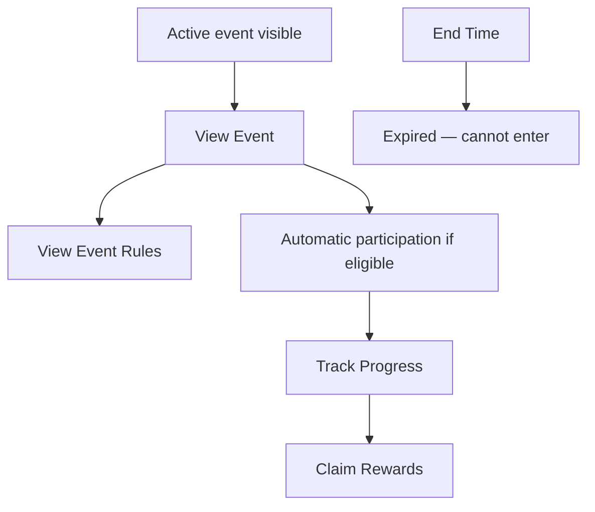

# P031 — Live Events System Specification

| Field | Value |
|-------|--------|
| Document ID | P031 |
| Title | Live Events System Specification |
| Version | **1.0** |
| Status | Approved (Live Events system scope only) |
| Project | Project GulfRun |
| Authority | Official source of truth for **Live Events** existence, **event types**, **automatic participation**, **event content containers**, **timers/status**, **player actions**, and **active-only** rules stated herein |
| Depends on | [P001](P001-GAME-VISION-v1.0.md), [P004](P004-MAIN-MENU-v1.0.md), [P030](P030-SEASON-SYSTEM-v1.0.md), [P019](P019-LEADERBOARD-SYSTEM-v1.0.md), [P022](P022-COSMETICS-SYSTEM-v1.0.md), [P026](P026-DAILY-CHALLENGES-SYSTEM-v1.0.md) |
| Last updated | 2026-07-31 |

**Rules:** Documentation only. No implementation. Do not invent features beyond this brief. Missing detail → **TODO**.

**Next milestone:** Sprint 1 — do not start until explicitly instructed.

---

## 1. Purpose

Define the Live Events System for Project GulfRun: limited-time events synchronized with the backend, supported event types, participation rules, content containers, timers, player actions, and active-only visibility — without rewards, missions, shops, or currencies.

---

## 2. System Overview

| Field | Value |
|-------|--------|
| Support | Project GulfRun supports **Live Events** |
| Nature | Live Events provide **limited-time content** |
| Sync | Events are **synchronized with the backend** |
| Visibility | **Only active events** are visible to players |

### Alignment

- P001 live service / seasonal content — **aligned**.  
- P030 Season Events as season content container — Live Events system **this document**; Season Events is an event type.  
- P004 Events listed among undefined Main Menu items — system defined here; entry UI **TODO**.  
- P019 Future Event Leaderboard — Event Leaderboards **not defined** (§10).

---

## 3. Event Types

| Event Type | Status |
|------------|--------|
| **Season Events** | Defined |
| **Holiday Events** | Defined |
| **National Day Events** | Defined |
| **Ramadan Events** | Defined |
| **Special Collaboration Events** | Defined |
| **Future Event Types** | Future |

### TODO — Event types (not provided)

- [ ] Catalog of specific events per type  
- [ ] Scheduling / calendar rules  

---

## 4. Player Flow

```
Active event available (backend)
↓
Event visible to players
↓
Player View Event / View Event Rules
↓
Automatic participation (if eligible)
↓
Track Progress
↓
Claim Rewards (if available)
↓
Event End Time reached → expired (cannot enter)
```



### Player Participation

| Rule ID | Rule |
|---------|------|
| EVT-PART-001 | Players **automatically participate** in available events. |
| EVT-PART-002 | Some events **may require minimum requirements**. |
| EVT-PART-003 | Requirements are **not defined**. |

### Player Actions

| Action | Status |
|--------|--------|
| **View Event** | Defined |
| **Track Progress** | Defined |
| **Claim Rewards** | Defined |
| **View Event Rules** | Defined |

### TODO — Participation (not provided)

- [ ] Minimum requirements catalog  
- [ ] Eligibility messaging when requirements not met  

---

## 5. Event Structure (Event Content)

Events may contain:

| Content | Status |
|---------|--------|
| **Challenges** | Defined (container) |
| **Cosmetics** | Defined (container) |
| **Limited Rewards** | Defined (container) — types **not defined** |
| **Special Missions** | Defined (container) — Event Missions **not defined** |
| **Event Progress** | Defined |
| **Future Event Features** | Future |

### Event Timer

Each Event contains:

| Field | Status |
|-------|--------|
| **Start Time** | Defined |
| **End Time** | Defined |
| **Remaining Time** | Defined |
| **Event Status** | Defined |

### TODO — Structure (not provided)

- [ ] Event Status value set (e.g. upcoming / active / expired — not stated)  
- [ ] Challenges vs Special Missions distinction  
- [ ] Limited Rewards catalog  

---

## 6. Display Information

From Event Timer and player-facing flow, events expose at minimum:

| Field | Status |
|-------|--------|
| **Start Time** | Defined |
| **End Time** | Defined |
| **Remaining Time** | Defined |
| **Event Status** | Defined |
| Event content / progress for Track Progress | Defined (structure) |

### TODO — Display (not provided)

- [ ] Event list / hub UI entry  
- [ ] Event Rules presentation format  

---

## 7. Rules

| Rule ID | Rule |
|---------|------|
| EVT-001 | **Only active events** may be joined. |
| EVT-002 | **Expired events cannot be entered**. |
| EVT-003 | Event data is **synchronized with the backend**. |
| EVT-004 | **Only active events** are visible to players. |

---

## 8. Dependencies

| Dependency | Note |
|------------|------|
| P030 Season System | Season Events type; season calendar |
| P001 | Live service |
| P004 | Events entry existence TBD |
| P022 | Event Cosmetics container |
| P026 / P027 | Challenges patterns — Event Challenges TBD |
| P019 | Future Event Leaderboard — not defined here |
| P012 / P013 | Possible rewards / shop — Event Shop / Currency not defined |
| Backend | Active set; timers; sync |

---

## 9. Future Specifications

| Topic | Status |
|-------|--------|
| Future Event Types | Future |
| Future Event Features | Future |
| Event Rewards | Not defined |
| Event Missions | Not defined |
| Event Shop | Not defined |
| Event Currency | Not defined |
| Event Difficulty | Not defined |
| Event Leaderboards | Not defined |
| Event Story | Not defined |
| Event Tickets | Not defined |
| Minimum requirements | Not defined |

---

## 10. Explicitly Not Defined (P031)

- Event Rewards  
- Event Missions  
- Event Shop  
- Event Currency  
- Event Difficulty  
- Event Leaderboards  
- Event Story  
- Event Tickets  
- Minimum requirements details  

---

## 11. Open Questions

| ID | Question |
|----|----------|
| Q-P031-001 | Minimum requirements for gated events? |
| Q-P031-002 | Event Rewards / Limited Rewards catalog? |
| Q-P031-003 | Event Missions vs Challenges vs Special Missions? |
| Q-P031-004 | Event Shop / Event Currency — future or never? |
| Q-P031-005 | Event Leaderboards vs P019 Future Event Leaderboard? |
| Q-P031-006 | Event Status enum values? |
| Q-P031-007 | Where is View Event opened from UI? |
| Q-P031-008 | Relationship of Season Events to P030 season calendar? |

---

## 12. Acceptance Criteria

P031 v1.0 is satisfied when all of the following are true:

1. Live Events supported; limited-time content; backend-synced; only active events visible.  
2. Event types: Season, Holiday, National Day, Ramadan, Special Collaboration; Future Event Types future.  
3. Automatic participation; some events may require minimum requirements (not defined).  
4. Events may contain: Challenges, Cosmetics, Limited Rewards, Special Missions, Event Progress; Future Event Features future.  
5. Each event has Start Time, End Time, Remaining Time, Event Status.  
6. Actions: View Event, Track Progress, Claim Rewards, View Event Rules.  
7. Only active events joinable; expired cannot be entered; data backend-synced.  
8. Event Rewards, Missions, Shop, Currency, Difficulty, Leaderboards, Story, and Tickets are not invented.  
9. Document version is **P031 v1.0**.

---

## 13. Document Queue

| Order | Document ID | Title | Status |
|-------|-------------|-------|--------|
| 1–30 | P001–P030 | (prior specs) | Approved as previously recorded |
| 31 | P031 | Live Events System Specification | **v1.0 Approved** |
| 32 | P032 | Notification System Specification | **v1.0 Approved** |
| 33 | P033 | Inbox (Mail) System Specification | **v1.0 Approved** — [P033](P033-INBOX-MAIL-SYSTEM-v1.0.md) |
| 34 | P034 | Settings System Specification | **v1.0 Approved** — [P034](P034-SETTINGS-SYSTEM-v1.0.md) |
| 35 | P035 | Audio System Specification | **v1.0 Approved** — [P035](P035-AUDIO-SYSTEM-v1.0.md) |
| 36 | P036 | Music System Specification | **v1.0 Approved** — [P036](P036-MUSIC-SYSTEM-v1.0.md) |
| 37 | P037 | Localization System Specification | **v1.0 Approved** — [P037](P037-LOCALIZATION-SYSTEM-v1.0.md) |
| 38 | P038 | Tutorial System Specification | **v1.0 Approved** — [P038](P038-TUTORIAL-SYSTEM-v1.0.md) |
| 39 | P039 | Backend Architecture Specification (engineering doc — docs/02-architecture/) | **v1.0 Approved** |
| 40 | P040 | Database Architecture Specification (engineering doc — docs/02-architecture/) | **v1.0 Approved** |
| 41 | P041 | Authentication System Specification (engineering doc — docs/02-architecture/) | **v1.0 Approved** |
| 42 | P042 | Player Profile System Specification [CONFLICT with P020] | **v1.0 Approved-per-brief** |
| 43 | P043 | Anti-Cheat System Specification (engineering doc — docs/05-security/) | **v1.0 Approved** |
| 44 | P044 | Analytics System Specification (engineering doc — docs/02-architecture/) | **v1.0 Approved** |
| 45 | P045 | Monetization System Specification | **v1.0 Approved** |
| 46 | P046 | Performance Optimization Specification | **v1.0 Approved** |
| 47 | P047 | UI / UX Design System Specification | **v1.0 Approved** |
| 48 | P048 | Art Direction & Visual Style Specification | **v1.0 Approved** |
| 49 | P049 | Technical Architecture Specification | **v1.0 Approved** |
| 50 | P050 | Master Design Bible Specification | **v1.0 Approved** |
| — | Sprint 1 | _(await instructions)_ | Not started |

---

## 14. Change Log

| Version | Date | Summary | Author |
|---------|------|---------|--------|
| **1.0** | 2026-07-31 | Initial Live Events System Specification | Documentation Engineer (from Design Owner brief) |

---

*End of document.*
