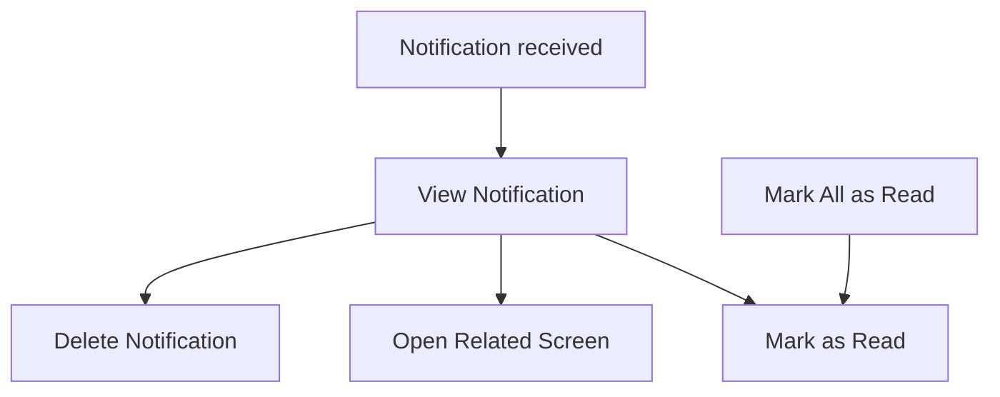

# P032 — Notification System Specification

| Field | Value |
|-------|--------|
| Document ID | P032 |
| Title | Notification System Specification |
| Version | **1.0** |
| Status | Approved (Notification system scope only) |
| Project | Project GulfRun |
| Authority | Official source of truth for **in-game and push notifications**, **notification types**, **player actions**, **notification fields**, **push enable/disable and configurable categories**, and **sync / read / delete rules** stated herein |
| Depends on | [P001](P001-GAME-VISION-v1.0.md), [P004](P004-MAIN-MENU-v1.0.md), [P014](P014-FRIENDS-SYSTEM-v1.0.md), [P015](P015-CLAN-SYSTEM-v1.0.md), [P030](P030-SEASON-SYSTEM-v1.0.md), [P031](P031-LIVE-EVENTS-SYSTEM-v1.0.md), [P026](P026-DAILY-CHALLENGES-SYSTEM-v1.0.md), [P013](P013-SHOP-SYSTEM-v1.0.md) |
| Last updated | 2026-07-31 |

**Rules:** Documentation only. No implementation. Do not invent features beyond this brief. Missing detail → **TODO**.

**Next milestone:** Sprint 1 — do not start until explicitly instructed.

---

## 1. Purpose

Define the Notification System for Project GulfRun: in-game and push notifications that inform players of important activities, typed categories, player actions, notification payload fields, push preferences, and sync/read/delete rules — without priority, expiration, grouping, scheduling, localization, rich media, deep-link behavior, or silent notifications.

---

## 2. System Overview

| Field | Value |
|-------|--------|
| Support | Project GulfRun supports an **in-game** and **push** Notification System |
| Intent | Notifications keep players informed about **important activities** |
| Sync | Notifications are **synchronized with the backend** |

### Alignment

- P004 Notifications listed among items not defined in Main Menu — **this document** defines the system.  
- Related systems may emit typed notifications (Friends, Clans, Season, Events, Challenges, Shop) — emission rules **TODO**.  
- Destination Screen / Open Related Screen exist; **Deep Linking Behavior is not defined** (§10).

---

## 3. Notification Types

| Type | Status |
|------|--------|
| **System Notifications** | Defined |
| **Friend Notifications** | Defined |
| **Clan Notifications** | Defined |
| **Season Notifications** | Defined |
| **Event Notifications** | Defined |
| **Challenge Notifications** | Defined |
| **Shop Notifications** | Defined |
| **Future Notification Types** | Future |

### TODO — Types (not provided)

- [ ] Which events within each system create notifications  
- [ ] Mapping of Challenge Notifications to Daily vs Weekly (P026 / P027)  

---

## 4. Player Flow

```
Notification created (backend)
↓
Synced to player devices
↓
Player View Notification
↓
Optional: Open Related Screen (Destination Screen)
↓
Mark as Read (or remains Unread until viewed)
↓
Optional: Delete Notification (cannot restore)
```



### Player Actions

| Action | Status |
|--------|--------|
| **View Notification** | Defined |
| **Mark Notification as Read** | Defined |
| **Mark All as Read** | Defined |
| **Delete Notification** | Defined |
| **Open Related Screen** | Defined |

### TODO — Player flow (not provided)

- [ ] In-game inbox / tray UI entry  
- [ ] When “viewed” auto-marks read vs explicit Mark as Read  

---

## 5. Notification Structure

Each notification contains:

| Field | Status |
|-------|--------|
| **Title** | Defined |
| **Description** | Defined |
| **Icon** | Defined |
| **Timestamp** | Defined |
| **Status (Read / Unread)** | Defined |
| **Destination Screen** | Defined |

### TODO — Structure (not provided)

- [ ] Destination Screen identifier format  
- [ ] Icon source / catalog  

---

## 6. Push Notification Flow

| Field | Value |
|-------|--------|
| Support | **Push Notifications are supported** |
| Control | Players may **enable or disable** Push Notifications |
| Categories | **Push Notification categories are configurable** |

```
Push preference enabled for category
↓
Backend sends push for that category
↓
OS delivers push (platform rules)
↓
Player may open app / related screen (deep linking behavior not defined)
```

### TODO — Push (not provided)

- [ ] List of configurable push categories vs in-game types  
- [ ] Settings UI for enable/disable — **[P034](P034-SETTINGS-SYSTEM-v1.0.md)** Notifications category lists Enable/Disable Notifications and Push Notification Categories; exact wiring to P032 types TBD  
- [ ] Platform permission flows (iOS / Android)  

---

## 7. Rules

| Rule ID | Rule |
|---------|------|
| NTF-001 | Notifications are **synchronized across supported devices**. |
| NTF-002 | **Unread** notifications remain unread **until viewed**. |
| NTF-003 | **Deleted** notifications **cannot be restored**. |

### Alignment

- P001 platforms iOS / Android — supported devices.  
- “Until viewed” — relationship to Mark as Read **TODO** (§4).

---

## 8. Dependencies

| Dependency | Note |
|------------|------|
| Backend | Create / sync / read / delete state |
| P014 Friends | Friend Notifications |
| P015 Clans | Clan Notifications |
| P030 Seasons | Season Notifications |
| P031 Live Events | Event Notifications |
| P026 / P027 Challenges | Challenge Notifications |
| P013 Shop | Shop Notifications |
| P004 | Notifications entry |
| P034 | Settings Notifications category for push prefs; wiring TBD |
| OS push services | Push delivery |

---

## 9. Future Specifications

| Topic | Status |
|-------|--------|
| Future Notification Types | Future |
| Notification Priority | Not defined |
| Expiration Rules | Not defined |
| Grouping | Not defined |
| Scheduling | Not defined |
| Localization Rules | Notification text localization scope confirmed in **[P037](P037-LOCALIZATION-SYSTEM-v1.0.md)** §4; rule-level detail beyond that remains not defined here |
| Rich Media | Not defined |
| Deep Linking Behavior | Not defined |
| Silent Notifications | Not defined |

---

## 10. Explicitly Not Defined (P032)

- Notification Priority  
- Expiration Rules  
- Grouping  
- Scheduling  
- Localization Rules  
- Rich Media  
- Deep Linking Behavior  
- Silent Notifications  

---

## 11. Open Questions

| ID | Question |
|----|----------|
| Q-P032-001 | In-game notification inbox UI entry point? |
| Q-P032-002 | Does View auto-mark Read, or only Mark as Read? |
| Q-P032-003 | Push category list vs notification types? |
| Q-P032-004 | Deep Linking Behavior for Destination Screen / Open Related Screen? |
| Q-P032-005 | Expiration / Priority — future or never? |
| Q-P032-006 | How does P034 Settings Notifications category map to P032 notification types? |
| Q-P032-007 | Which Friend/Clan/Season/Event/Challenge/Shop events emit notifications? |

---

## 12. Acceptance Criteria

P032 v1.0 is satisfied when all of the following are true:

1. In-game and push Notification System supported; informs about important activities; backend-synced.  
2. Types: System, Friend, Clan, Season, Event, Challenge, Shop; Future Notification Types future.  
3. Actions: View, Mark as Read, Mark All as Read, Delete, Open Related Screen.  
4. Each notification has Title, Description, Icon, Timestamp, Status (Read/Unread), Destination Screen.  
5. Push supported; players may enable/disable; push categories configurable.  
6. Synced across supported devices; unread until viewed; deleted cannot be restored.  
7. Priority, Expiration, Grouping, Scheduling, Localization Rules, Rich Media, Deep Linking Behavior, and Silent Notifications are not invented.  
8. Document version is **P032 v1.0**.

---

## 13. Document Queue

| Order | Document ID | Title | Status |
|-------|-------------|-------|--------|
| 1–32 | P001–P032 | (prior specs) | Approved as previously recorded |
| 33 | P033 | Inbox (Mail) System Specification | **v1.0 Approved** — [P033](P033-INBOX-MAIL-SYSTEM-v1.0.md) |
| 34 | P034 | Settings System Specification | **v1.0 Approved** — [P034](P034-SETTINGS-SYSTEM-v1.0.md) |
| 35 | P035 | Audio System Specification | **v1.0 Approved** — [P035](P035-AUDIO-SYSTEM-v1.0.md) |
| 36 | P036 | Music System Specification | **v1.0 Approved** — [P036](P036-MUSIC-SYSTEM-v1.0.md) |
| 37 | P037 | Localization System Specification | **v1.0 Approved** — [P037](P037-LOCALIZATION-SYSTEM-v1.0.md) |
| 38 | P038 | Tutorial System Specification | **v1.0 Approved** — [P038](P038-TUTORIAL-SYSTEM-v1.0.md) |
| 39 | P039 | Backend Architecture Specification (engineering doc — docs/02-architecture/) | **v1.0 Approved** |
| 40 | P040 | Database Architecture Specification (engineering doc — docs/02-architecture/) | **v1.0 Approved** |
| 41 | P041 | Authentication System Specification (engineering doc — docs/02-architecture/) | **v1.0 Approved** |
| 42 | P042 | Player Profile System Specification [CONFLICT with P020] | **v1.0 Approved-per-brief** |
| 43 | P043 | Anti-Cheat System Specification (engineering doc — docs/05-security/) | **v1.0 Approved** |
| 44 | P044 | Analytics System Specification (engineering doc — docs/02-architecture/) | **v1.0 Approved** |
| 45 | P045 | Monetization System Specification | **v1.0 Approved** |
| 46 | P046 | Performance Optimization Specification | **v1.0 Approved** |
| 47 | P047 | UI / UX Design System Specification | **v1.0 Approved** |
| 48 | P048 | Art Direction & Visual Style Specification | **v1.0 Approved** |
| 49 | P049 | Technical Architecture Specification | **v1.0 Approved** |
| 50 | P050 | Master Design Bible Specification | **v1.0 Approved** |
| — | Sprint 1 | _(await instructions)_ | Not started |

---

## 14. Change Log

| Version | Date | Summary | Author |
|---------|------|---------|--------|
| **1.0** | 2026-07-31 | Initial Notification System Specification | Documentation Engineer (from Design Owner brief) |

---

*End of document.*
