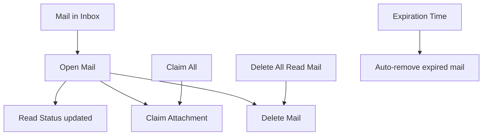

# P033 — Inbox (Mail) System Specification

| Field | Value |
|-------|--------|
| Document ID | P033 |
| Title | Inbox (Mail) System Specification |
| Version | **1.0** |
| Status | Approved (Inbox / Mail system scope only) |
| Project | Project GulfRun |
| Authority | Official source of truth for the **in-game Inbox**, **mail types**, **mail fields**, **attachments claim rules**, **player actions**, and **unread / expiry / sync rules** stated herein |
| Depends on | [P001](P001-GAME-VISION-v1.0.md), [P004](P004-MAIN-MENU-v1.0.md), [P012](P012-ECONOMY-SYSTEM-v1.0.md), [P031](P031-LIVE-EVENTS-SYSTEM-v1.0.md), [P030](P030-SEASON-SYSTEM-v1.0.md), [P032](P032-NOTIFICATION-SYSTEM-v1.0.md) |
| Last updated | 2026-07-31 |

**Rules:** Documentation only. No implementation. Do not invent features beyond this brief. Missing detail → **TODO**.

**Next milestone:** Sprint 1 — do not start until explicitly instructed.

---

## 1. Purpose

Define the Inbox (Mail) System for Project GulfRun: backend-synced system messages in an in-game Inbox, mail types, mail content fields, attachment claim flow, player actions, and unread/expiry/sync rules — without attachment types, expiration durations, search, filters, archive, favorites, or gift mail.

---

## 2. System Overview

| Field | Value |
|-------|--------|
| Support | Project GulfRun supports an **in-game Inbox** |
| Sync | The Inbox is **synchronized with the backend** |
| Purpose | Players receive **system messages** through the Inbox |

### Alignment

- P004 Mail listed among items not defined in Main Menu — **this document** defines the system.  
- P032 Notifications — separate system (alerts / push); Inbox is **mail messages** with optional attachments. Relationship / dual delivery **TODO**.

---

## 3. Mail Types

| Type | Status |
|------|--------|
| **System Mail** | Defined |
| **Reward Mail** | Defined |
| **Event Mail** | Defined |
| **Season Mail** | Defined |
| **Compensation Mail** | Defined |
| **Maintenance Mail** | Defined |
| **Future Mail Types** | Future |

### TODO — Mail types (not provided)

- [ ] When each type is sent  
- [ ] Mail Categories (not defined — distinct from types list above)  

---

## 4. Mail Structure

Each mail contains:

| Field | Status |
|-------|--------|
| **Title** | Defined |
| **Message** | Defined |
| **Sender** | Defined |
| **Date** | Defined |
| **Expiration Time** | Defined |
| **Attachment Indicator** | Defined |
| **Read Status** | Defined |

### TODO — Structure (not provided)

- [ ] Sender identity format (system vs named)  
- [ ] Expiration Duration (field exists; duration policy not defined)  

---

## 5. Player Flow

```
Mail delivered to Inbox (backend)
↓
Player Open Mail
↓
Read Status updates (unread until opened)
↓
Optional: Claim Attachment / Claim All
↓
Optional: Delete Mail / Delete All Read Mail
↓
At Expiration Time: Expired Mail automatically removed
```



### Player Actions

| Action | Status |
|--------|--------|
| **Open Mail** | Defined |
| **Claim Attachment** | Defined |
| **Claim All** | Defined |
| **Delete Mail** | Defined |
| **Delete All Read Mail** | Defined |

### TODO — Player flow (not provided)

- [ ] Inbox UI entry point  
- [ ] Claim All scope (all attachments vs current mail)  

---

## 6. Attachment Flow

| Field | Value |
|-------|--------|
| Presence | Mail **may contain attachments** |
| Types | Attachment types are **not defined** |
| Claim | Players may **claim attachments** |
| Re-claim | Claimed attachments **cannot be claimed again** |

```
Mail with Attachment Indicator
↓
Player Claim Attachment (or Claim All)
↓
Attachment granted (types not defined)
↓
Cannot claim same attachment again
```

### TODO — Attachments (not provided)

- [ ] Attachment Types  
- [ ] Relationship to P012 currencies / P021 Inventory / P022 cosmetics  

---

## 7. Rules

| Rule ID | Rule |
|---------|------|
| MAIL-001 | **Unread Mail** remains until **opened**. |
| MAIL-002 | **Expired Mail** is **automatically removed**. |
| MAIL-003 | Mail synchronization is handled by the **backend**. |
| MAIL-004 | Claimed attachments **cannot be claimed again**. |

### TODO — Rules (not provided)

- [ ] Expiration Duration / default TTL  
- [ ] Behavior if unclaimed attachments expire with mail  

---

## 8. Dependencies

| Dependency | Note |
|------------|------|
| Backend | Delivery, sync, expiry removal, claim state |
| P031 Live Events | Event Mail |
| P030 Seasons | Season Mail |
| P012 / P021 / P022 | Possible attachment grants — types TBD |
| P032 Notifications | May alert about new mail — wiring TBD |
| P004 | Mail entry existence TBD |

---

## 9. Future Specifications

| Topic | Status |
|-------|--------|
| Future Mail Types | Future |
| Attachment Types | Not defined |
| Expiration Duration | Not defined |
| Mail Categories | Not defined |
| Mail Search | Not defined |
| Mail Filters | Not defined |
| Mail Archive | Not defined |
| Favorite Mail | Not defined |
| Gift Mail | Not defined |

---

## 10. Explicitly Not Defined (P033)

- Attachment Types  
- Expiration Duration  
- Mail Categories  
- Mail Search  
- Mail Filters  
- Mail Archive  
- Favorite Mail  
- Gift Mail  

---

## 11. Open Questions

| ID | Question |
|----|----------|
| Q-P033-001 | Attachment Types catalog? |
| Q-P033-002 | Expiration Duration / TTL policy? |
| Q-P033-003 | Unclaimed attachments when mail expires? |
| Q-P033-004 | Inbox UI entry point? |
| Q-P033-005 | Relationship to P032 Notifications for new mail? |
| Q-P033-006 | Claim All scope? |
| Q-P033-007 | Mail Search / Filters / Archive — future or never? |
| Q-P033-008 | Gift Mail — future or never? |

---

## 12. Acceptance Criteria

P033 v1.0 is satisfied when all of the following are true:

1. In-game Inbox supported; backend-synced; system messages delivered via Inbox.  
2. Mail types: System, Reward, Event, Season, Compensation, Maintenance; Future Mail Types future.  
3. Each mail has Title, Message, Sender, Date, Expiration Time, Attachment Indicator, Read Status.  
4. Mail may have attachments; types not defined; claimable once.  
5. Actions: Open Mail, Claim Attachment, Claim All, Delete Mail, Delete All Read Mail.  
6. Unread until opened; expired auto-removed; sync via backend.  
7. Attachment Types, Expiration Duration, Categories, Search, Filters, Archive, Favorite Mail, and Gift Mail are not invented.  
8. Document version is **P033 v1.0**.

---

## 13. Document Queue

| Order | Document ID | Title | Status |
|-------|-------------|-------|--------|
| 1–32 | P001–P032 | (prior specs) | Approved as previously recorded |
| 33 | P033 | Inbox (Mail) System Specification | **v1.0 Approved** |
| 34 | P034 | Settings System Specification | **v1.0 Approved** — [P034](P034-SETTINGS-SYSTEM-v1.0.md) |
| 35 | P035 | Audio System Specification | **v1.0 Approved** — [P035](P035-AUDIO-SYSTEM-v1.0.md) |
| 36 | P036 | Music System Specification | **v1.0 Approved** — [P036](P036-MUSIC-SYSTEM-v1.0.md) |
| 37 | P037 | Localization System Specification | **v1.0 Approved** — [P037](P037-LOCALIZATION-SYSTEM-v1.0.md) |
| 38 | P038 | Tutorial System Specification | **v1.0 Approved** — [P038](P038-TUTORIAL-SYSTEM-v1.0.md) |
| 39 | P039 | Backend Architecture Specification (engineering doc — docs/02-architecture/) | **v1.0 Approved** |
| 40 | P040 | Database Architecture Specification (engineering doc — docs/02-architecture/) | **v1.0 Approved** |
| 41 | P041 | Authentication System Specification (engineering doc — docs/02-architecture/) | **v1.0 Approved** |
| 42 | P042 | Player Profile System Specification [CONFLICT with P020] | **v1.0 Approved-per-brief** |
| 43 | P043 | Anti-Cheat System Specification (engineering doc — docs/05-security/) | **v1.0 Approved** |
| 44 | P044 | Analytics System Specification (engineering doc — docs/02-architecture/) | **v1.0 Approved** |
| 45 | P045 | Monetization System Specification | **v1.0 Approved** |
| 46 | P046 | Performance Optimization Specification | **v1.0 Approved** |
| 47 | P047 | UI / UX Design System Specification | **v1.0 Approved** |
| 48 | P048 | Art Direction & Visual Style Specification | **v1.0 Approved** |
| 49 | P049 | Technical Architecture Specification | **v1.0 Approved** |
| 50 | P050 | Master Design Bible Specification | **v1.0 Approved** |
| — | Sprint 1 | _(await instructions)_ | Not started |

---

## 14. Change Log

| Version | Date | Summary | Author |
|---------|------|---------|--------|
| **1.0** | 2026-07-31 | Initial Inbox (Mail) System Specification | Documentation Engineer (from Design Owner brief) |

---

*End of document.*
