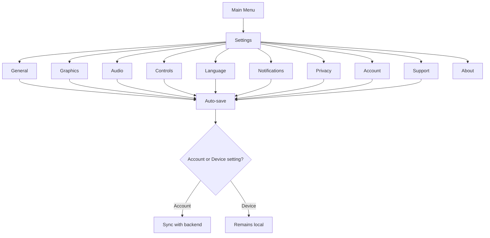

# P034 — Settings System Specification

| Field | Value |
|-------|--------|
| Document ID | P034 |
| Title | Settings System Specification |
| Version | **1.0** |
| Status | Approved (Settings system scope only) |
| Project | Project GulfRun |
| Authority | Official source of truth for the **centralized Settings menu**, **Settings categories**, **listed options per category**, and **save / sync rules** stated herein |
| Depends on | [P001](P001-GAME-VISION-v1.0.md), [P004](P004-MAIN-MENU-v1.0.md), [P014](P014-FRIENDS-SYSTEM-v1.0.md), [P016](P016-VOICE-CHAT-SYSTEM-v1.0.md), [P020](P020-PLAYER-PROFILE-SYSTEM-v1.0.md), [P032](P032-NOTIFICATION-SYSTEM-v1.0.md) |
| Last updated | 2026-07-31 |

**Rules:** Documentation only. No implementation. Do not invent features beyond this brief. Missing detail → **TODO**.

**Next milestone:** Sprint 1 — do not start until explicitly instructed.

---

## 1. Purpose

Define the Settings System for Project GulfRun: a centralized Settings menu with ten categories (General, Graphics, Audio, Controls, Language, Notifications, Privacy, Account, Support, About), the options listed per category, and account-link / device-local save-and-sync rules — without inventing specific option values, presets, supported languages, advanced audio, accessibility, parental controls, or developer options.

---

## 2. System Overview

| Field | Value |
|-------|--------|
| Menu | Project GulfRun provides a **centralized Settings menu** |
| Account link | Settings are **linked to the player's account where applicable** |
| Device scope | **Some settings are device-specific** |

### Alignment

- P004 Main Menu lists a **Settings** button as a **future specification** — **this document** is that specification.
- P016 Voice Chat Settings (Voice Chat On/Off, Mic On/Off, Input/Output Volume) noted as likely hosted under Settings — wiring to this document's Audio/Controls categories is **TODO**.
- P032 Notification push enable/disable and configurable categories noted as needing a Settings UI — wiring to this document's Notifications category is **TODO**.
- P014 Block Player is **future** in Friends; this document's Privacy category lists **Block List** — relationship **TODO**.

---

## 3. Settings Categories

| Category | Status |
|----------|--------|
| **General** | Defined (options not specified) |
| **Graphics** | Defined |
| **Audio** | Defined |
| **Controls** | Defined |
| **Language** | Defined (languages not specified) |
| **Notifications** | Defined |
| **Privacy** | Defined |
| **Account** | Defined |
| **Support** | Defined |
| **About** | Listed (contents not specified) |

### 3.1 General

| Field | Value |
|-------|--------|
| Scope | Display **basic game preferences** |
| Specific options | **Not defined** |

### 3.2 Graphics

| Option | Status |
|--------|--------|
| **Graphics Quality** | Defined |
| **Frame Rate** | Defined |
| **Visual Effects** | Defined |
| **Battery Saver Mode** | Defined |
| **Future Graphics Options** | Future |

### 3.3 Audio

| Option | Status |
|--------|--------|
| **Master Volume** | Defined |
| **Music Volume** | Defined |
| **Sound Effects Volume** | Defined |
| **Voice Chat Volume** | Defined |
| **Mute All** | Defined |

Audio System SoT (categories, sound existence, mobile playback rules): **[P035](P035-AUDIO-SYSTEM-v1.0.md)** — Audio System Specification.  
Music System SoT (categories, flow, controls, rules) for the Music Volume control: **[P036](P036-MUSIC-SYSTEM-v1.0.md)** — Music System Specification.

### 3.4 Controls

| Option | Status |
|--------|--------|
| **Control Sensitivity** | Defined |
| **Button Layout** | Future |
| **Vibration On / Off** | Defined |
| **Tutorial Reset** | Defined — enables Replay Tutorial; see **[P038](P038-TUTORIAL-SYSTEM-v1.0.md)** Tutorial System Specification |

### 3.5 Language

| Field | Value |
|-------|--------|
| Support | **Multiple languages are supported** |
| Available languages | Official Launch Languages: **Arabic, English** — see **[P037](P037-LOCALIZATION-SYSTEM-v1.0.md)** Localization System Specification |

### 3.6 Notifications

| Option | Status |
|--------|--------|
| **Enable Notifications** | Defined |
| **Disable Notifications** | Defined |
| **Push Notification Categories** | Defined |

### 3.7 Privacy

| Option | Status |
|--------|--------|
| **Block List** | Defined |
| **Privacy Options** | Defined (contents not specified) |
| **Future Privacy Settings** | Future |

### 3.8 Account

| Option | Status |
|--------|--------|
| **View Account** | Defined |
| **Linked Accounts** | Defined — see **[docs/02-architecture/AUTHENTICATION_SYSTEM.md](../../docs/02-architecture/AUTHENTICATION_SYSTEM.md)** (P041) Account Linking |
| **Logout** | Defined |
| **Delete Account** | Future |

### 3.9 Support

| Option | Status |
|--------|--------|
| **Help Center** | Defined |
| **Contact Support** | Defined |
| **Report Bug** | Defined |
| **Terms of Service** | Defined |
| **Privacy Policy** | Defined |

### 3.10 About

| Field | Value |
|-------|-------|
| Contents | **Not defined** in this brief |

### TODO — Categories (not provided)

- [ ] General category specific options
- [ ] ~~Supported Languages list~~ — resolved by **[P037](P037-LOCALIZATION-SYSTEM-v1.0.md)**: Arabic, English (future languages TBD)
- [ ] About category contents
- [ ] Privacy Options contents

---

## 4. Player Flow

```
Player opens Settings (from Main Menu — P004)
↓
Select Category (General / Graphics / Audio / Controls / Language /
                  Notifications / Privacy / Account / Support / About)
↓
Adjust option(s) within category
↓
Setting automatically saved
↓
If account setting: synchronized with backend
If device setting: may remain local
```



### TODO — Player flow (not provided)

- [ ] Settings entry point details beyond "opens from Main Menu" (P004 marks Settings as future)
- [ ] Per-category navigation / UI layout

---

## 5. Synchronization Rules

| Rule ID | Rule |
|---------|------|
| SET-001 | Settings are **automatically saved**. |
| SET-002 | **Account settings** synchronize with the **backend**. |
| SET-003 | **Device settings** may remain **local**. |

### Category-to-scope mapping

Which categories/options are "account" vs "device" settings is **not defined** in this brief.

### TODO — Synchronization (not provided)

- [ ] Explicit list of which options are account-scoped vs device-scoped
- [ ] Conflict resolution when device settings differ across a player's devices
- [ ] Offline behavior for auto-save

---

## 6. Dependencies

| Dependency | Note |
|------------|------|
| Backend | Account setting sync |
| Device / OS | Local storage for device-specific settings |
| P004 Main Menu | Settings entry point (previously future spec; now this document) |
| P016 Voice Chat | Voice Chat Volume; Voice Chat Settings wiring TBD |
| P035 Audio | Audio System SoT for the five Audio settings listed here |
| P036 Music | Music System SoT for the Music Volume control |
| P037 Localization | Localization System SoT for the Language category (Change/Preview Language) |
| P038 Tutorial | Tutorial System SoT for the Tutorial Reset control |
| P041 Authentication | Authentication System SoT for Account Linking (`docs/02-architecture/AUTHENTICATION_SYSTEM.md`) |
| P032 Notifications | Enable/Disable, Push Notification Categories wiring TBD |
| P014 Friends | Block List relationship to future Block Player TBD |
| P020 Player Profile | Account link; Privacy Settings referenced as not defined there — resolved partially here |

---

## 7. Future Specifications

| Topic | Status |
|-------|--------|
| Future Graphics Options | Future |
| Button Layout | Future |
| Future Privacy Settings | Future |
| Delete Account | Future |
| Graphics Presets | Not defined |
| Supported Languages | Not defined |
| Advanced Audio Options | Not defined |
| Accessibility Settings | Not defined |
| Parental Controls | Not defined |
| Developer Options | Not defined |

---

## 8. Explicitly Not Defined (P034)

- Graphics Presets
- Supported Languages
- Advanced Audio Options
- Accessibility Settings
- Parental Controls
- Developer Options

---

## 9. Open Questions

| ID | Question |
|----|----------|
| Q-P034-001 | General category specific options? |
| Q-P034-002 | Supported Languages list? |
| Q-P034-003 | About category contents? |
| Q-P034-004 | Which settings are account-scoped vs device-scoped? |
| Q-P034-005 | Privacy Options contents? |
| Q-P034-006 | Relationship between Privacy Block List and P014 future Block Player? |
| Q-P034-007 | Voice Chat Settings (P016) wiring into Audio/Controls categories? |
| Q-P034-008 | Notification enable/disable/categories (P032) wiring into Notifications category? |
| Q-P034-009 | Graphics Presets, Accessibility, Parental Controls, Developer Options — future or never? |

---

## 10. Acceptance Criteria

P034 v1.0 is satisfied when all of the following are true:

1. Centralized Settings menu supported; account-linked where applicable; some settings device-specific.
2. Ten categories: General, Graphics, Audio, Controls, Language, Notifications, Privacy, Account, Support, About.
3. Graphics: Graphics Quality, Frame Rate, Visual Effects, Battery Saver Mode; Future Graphics Options future.
4. Audio: Master Volume, Music Volume, Sound Effects Volume, Voice Chat Volume, Mute All.
5. Controls: Control Sensitivity, Vibration On/Off, Tutorial Reset; Button Layout future.
6. Language: multiple languages supported; list not defined.
7. Notifications: Enable/Disable Notifications, Push Notification Categories.
8. Privacy: Block List, Privacy Options; Future Privacy Settings future.
9. Account: View Account, Linked Accounts, Logout; Delete Account future.
10. Support: Help Center, Contact Support, Report Bug, Terms of Service, Privacy Policy.
11. Settings auto-saved; account settings sync with backend; device settings may remain local.
12. Graphics Presets, Supported Languages, Advanced Audio Options, Accessibility Settings, Parental Controls, and Developer Options are not invented.
13. Document version is **P034 v1.0**.

---

## 11. Document Queue

| Order | Document ID | Title | Status |
|-------|-------------|-------|--------|
| 1–33 | P001–P033 | (prior specs) | Approved as previously recorded |
| 34 | P034 | Settings System Specification | **v1.0 Approved** |
| 35 | P035 | Audio System Specification | **v1.0 Approved** — [P035](P035-AUDIO-SYSTEM-v1.0.md) |
| 36 | P036 | Music System Specification | **v1.0 Approved** — [P036](P036-MUSIC-SYSTEM-v1.0.md) |
| 37 | P037 | Localization System Specification | **v1.0 Approved** — [P037](P037-LOCALIZATION-SYSTEM-v1.0.md) |
| 38 | P038 | Tutorial System Specification | **v1.0 Approved** — [P038](P038-TUTORIAL-SYSTEM-v1.0.md) |
| 39 | P039 | Backend Architecture Specification (engineering doc — docs/02-architecture/) | **v1.0 Approved** |
| 40 | P040 | Database Architecture Specification (engineering doc — docs/02-architecture/) | **v1.0 Approved** |
| 41 | P041 | Authentication System Specification (engineering doc — docs/02-architecture/) | **v1.0 Approved** |
| 42 | P042 | Player Profile System Specification [CONFLICT with P020] | **v1.0 Approved-per-brief** |
| 43 | P043 | Anti-Cheat System Specification (engineering doc — docs/05-security/) | **v1.0 Approved** |
| 44 | P044 | Analytics System Specification (engineering doc — docs/02-architecture/) | **v1.0 Approved** |
| 45 | P045 | Monetization System Specification | **v1.0 Approved** |
| 46 | P046 | Performance Optimization Specification | **v1.0 Approved** |
| 47 | P047 | UI / UX Design System Specification | **v1.0 Approved** |
| 48 | P048 | Art Direction & Visual Style Specification | **v1.0 Approved** |
| 49 | P049 | Technical Architecture Specification | **v1.0 Approved** |
| 50 | P050 | Master Design Bible Specification | **v1.0 Approved** |
| — | Sprint 1 | _(await instructions)_ | Not started |

---

## 12. Change Log

| Version | Date | Summary | Author |
|---------|------|---------|--------|
| **1.0** | 2026-07-31 | Initial Settings System Specification | Documentation Engineer (from Design Owner brief) |

---

*End of document.*
