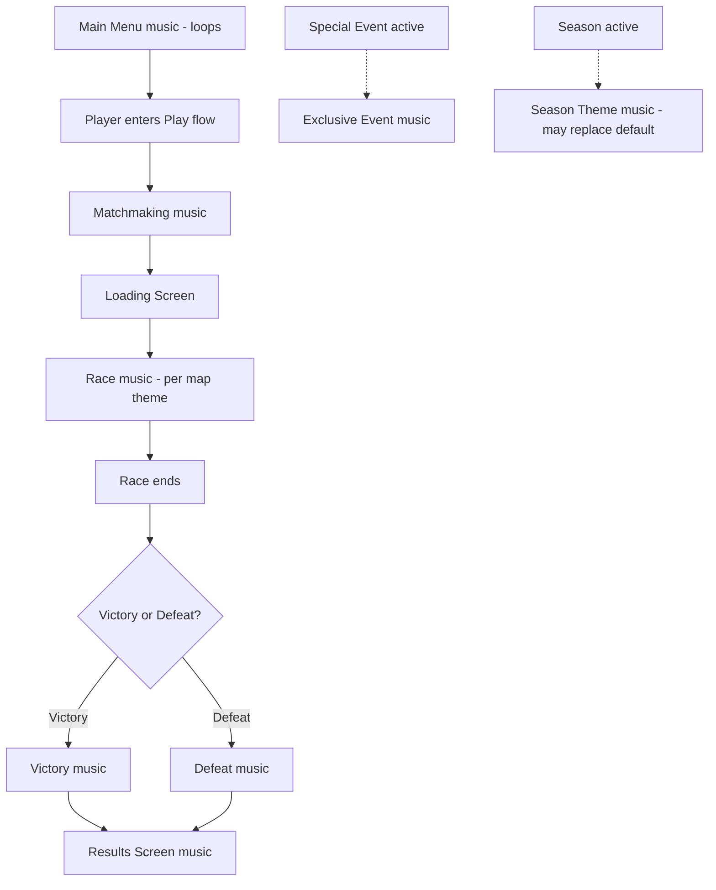

# P036 — Music System Specification

| Field | Value |
|-------|--------|
| Document ID | P036 |
| Title | Music System Specification |
| Version | **1.0** |
| Status | Approved (Music system scope only) |
| Project | Project GulfRun |
| Authority | Official source of truth for **music categories**, **per-category music behavior**, **player music controls**, and **music playback rules** stated herein |
| Depends on | [P001](P001-GAME-VISION-v1.0.md), [P004](P004-MAIN-MENU-v1.0.md), [P006](P006-MAP-SYSTEM-v1.0.md), [P010](P010-RACE-RULES-v1.0.md), [P011](P011-POST-RACE-RESULTS-v1.0.md), [P013](P013-SHOP-SYSTEM-v1.0.md), [P017](P017-MATCHMAKING-SYSTEM-v1.0.md), [P030](P030-SEASON-SYSTEM-v1.0.md), [P031](P031-LIVE-EVENTS-SYSTEM-v1.0.md), [P034](P034-SETTINGS-SYSTEM-v1.0.md), [P035](P035-AUDIO-SYSTEM-v1.0.md) |
| Last updated | 2026-07-31 |

**Rules:** Documentation only. No implementation. Do not invent features beyond this brief. Missing detail → **TODO**.

**Next milestone:** Sprint 1 — do not start until explicitly instructed.

---

## 1. Purpose

Define the Music System for Project GulfRun: a dynamic, Gulf-identity-reinforcing music system with twelve categories, category-specific behavior for Main Menu / Matchmaking / Race / Results / Events, player music controls, and looping/mobile/volume rules — without inventing specific tracks, durations, adaptive music, dynamic layering, regional variations, licensed music, or streaming rules.

---

## 2. System Overview

| Field | Value |
|-------|--------|
| Support | Project GulfRun includes a **dynamic music system** |
| Design intent | Music **supports gameplay without distracting the player** |
| Identity | Music **must reinforce the Gulf identity of the game** |

### Alignment

- P001 Gulf Identity pillar names **music** as a vehicle for respectfully representing Gulf culture (§3.4) — this document is that music system's specification.
- P035 Audio System lists **Music** as an audio category with contents "not specified" and **Music Volume** as a shared Audio Setting — **this document** is the Music System detail source that P035 deferred.
- P034 Settings Audio category lists **Music Volume** — this document's Player Controls (Music Volume, Mute Music) map to that same control surface.

---

## 3. Music Categories

| Category | Status |
|----------|--------|
| **Main Menu** | Defined |
| **Lobby** | Defined (existence only) |
| **Matchmaking** | Defined |
| **Loading Screen** | Defined (existence only) |
| **Race** | Defined |
| **Victory** | Defined |
| **Defeat** | Defined |
| **Results Screen** | Defined |
| **Shop** | Defined (existence only) |
| **Events** | Defined |
| **Season Theme** | Defined |
| **Future Music Categories** | Future |

### TODO — Categories (not provided)

- [ ] Lobby music behavior details
- [ ] Loading Screen music behavior details
- [ ] Shop music behavior details
- [ ] Actual music tracks per category

---

## 4. Music Flow

### 4.1 Main Menu

| Field | Value |
|-------|-------|
| Existence | **Main Menu has its own background music** |
| Playback | **Music loops continuously** |

Relates to **[P004](P004-MAIN-MENU-v1.0.md)** Main Menu Specification.

### 4.2 Matchmaking

| Field | Value |
|-------|-------|
| Purpose | **Matchmaking music keeps players engaged while waiting** |

Relates to **[P017](P017-MATCHMAKING-SYSTEM-v1.0.md)** Matchmaking System Specification.

### 4.3 Race

| Field | Value |
|-------|-------|
| Existence | **Every race plays gameplay music** |
| Variation | **Maps may have different music themes** |
| Interference | **Music should not interfere with gameplay sound effects** |

Relates to **[P006](P006-MAP-SYSTEM-v1.0.md)** Map System (per-map music theme) and **[P010](P010-RACE-RULES-v1.0.md)** Race Rules and **[P035](P035-AUDIO-SYSTEM-v1.0.md)** Gameplay Audio.

### 4.4 Results

| Field | Value |
|-------|-------|
| Existence | **Results screen contains separate music** |
| Variation | **Victory and Defeat music may differ** |

Relates to **[P011](P011-POST-RACE-RESULTS-v1.0.md)** Post Race Results Specification.

### 4.5 Events

| Field | Value |
|-------|-------|
| Special events | **May include exclusive music** |
| Seasonal | **Seasonal music may temporarily replace default music** |

Relates to **[P031](P031-LIVE-EVENTS-SYSTEM-v1.0.md)** Live Events and **[P030](P030-SEASON-SYSTEM-v1.0.md)** Season System (Season Theme).

### TODO — Music Flow (not provided)

- [ ] Transition behavior between categories (fade, cut, crossfade)
- [ ] Lobby / Loading Screen / Shop music flow details
- [ ] Exact map-to-theme mapping (P006 six maps)

---

## 5. Player Controls

Players may control:

| Control | Status |
|---------|--------|
| **Music Volume** | Defined |
| **Mute Music** | Defined |

These map to the **Music Volume** setting listed under the Audio category of **[P034](P034-SETTINGS-SYSTEM-v1.0.md)** Settings and referenced in **[P035](P035-AUDIO-SYSTEM-v1.0.md)** Audio Settings.

### TODO — Player Controls (not provided)

- [ ] Whether Mute Music is a distinct control from setting Music Volume to zero, or the same action

---

## 6. Rules

| Rule ID | Rule |
|---------|------|
| MUS-001 | Music **must loop seamlessly**. |
| MUS-002 | Music **must be optimized for mobile**. |
| MUS-003 | Music volume **must respect Audio Settings**. |

### TODO — Rules (not provided)

- [ ] Definition of "loop seamlessly" (loop point requirements)
- [ ] Definition of "optimized for mobile" (format, size, memory)
- [ ] Exact relationship/precedence between Music Volume and Master Volume (P034/P035)

---

## 7. Dependencies

| Dependency | Note |
|------------|------|
| P001 | Gulf Identity pillar — music must reinforce it |
| P004 Main Menu | Main Menu music context |
| P006 Maps | Per-map music theme variation |
| P010 Race Rules | Race music context; must not interfere with gameplay SFX |
| P011 Post Race Results | Results Screen / Victory / Defeat music context |
| P013 Shop | Shop music existence (not detailed) |
| P017 Matchmaking | Matchmaking music context |
| P030 Season | Season Theme music |
| P031 Live Events | Special event exclusive music |
| P034 Settings | Music Volume / Mute Music control surface |
| P035 Audio System | Parent Audio category; Music Volume shared setting |
| Device / OS | Mobile playback optimization |

---

## 8. Future Specifications

| Topic | Status |
|-------|--------|
| Future Music Categories | Future |
| Music Tracks | Not defined |
| Music Duration | Not defined |
| Adaptive Music | Not defined |
| Dynamic Layering | Not defined |
| Regional Variations | Not defined |
| Licensed Music | Not defined |
| Streaming Rules | Not defined |

---

## 9. Explicitly Not Defined (P036)

- Music Tracks
- Music Duration
- Adaptive Music
- Dynamic Layering
- Regional Variations
- Licensed Music
- Streaming Rules

---

## 10. Open Questions

| ID | Question |
|----|----------|
| Q-P036-001 | Actual music tracks per category? |
| Q-P036-002 | Lobby / Loading Screen / Shop music behavior details? |
| Q-P036-003 | Transition behavior between music categories (fade/cut/crossfade)? |
| Q-P036-004 | Map-to-music-theme mapping (P006 six maps)? |
| Q-P036-005 | Is Mute Music distinct from Music Volume = 0? |
| Q-P036-006 | "Loop seamlessly" — technical loop-point requirements? |
| Q-P036-007 | "Optimized for mobile" — concrete targets? |
| Q-P036-008 | Music Volume vs Master Volume precedence? |
| Q-P036-009 | Adaptive Music, Dynamic Layering, Regional Variations, Licensed Music, Streaming Rules — future or never? |

---

## 11. Acceptance Criteria

P036 v1.0 is satisfied when all of the following are true:

1. Dynamic music system supported; supports gameplay without distracting; reinforces Gulf identity.
2. Categories: Main Menu, Lobby, Matchmaking, Loading Screen, Race, Victory, Defeat, Results Screen, Shop, Events, Season Theme; Future Music Categories future.
3. Main Menu: own background music; loops continuously.
4. Matchmaking: music keeps players engaged while waiting.
5. Race: gameplay music every race; maps may have different themes; must not interfere with gameplay SFX.
6. Results: separate music; Victory and Defeat music may differ.
7. Events: special events may include exclusive music; seasonal music may temporarily replace default.
8. Player Controls: Music Volume, Mute Music.
9. Rules: seamless looping; mobile-optimized; music volume respects Audio Settings.
10. Music Tracks, Music Duration, Adaptive Music, Dynamic Layering, Regional Variations, Licensed Music, and Streaming Rules are not invented.
11. Document version is **P036 v1.0**.

---

## 12. Document Queue

| Order | Document ID | Title | Status |
|-------|-------------|-------|--------|
| 1–35 | P001–P035 | (prior specs) | Approved as previously recorded |
| 36 | P036 | Music System Specification | **v1.0 Approved** |
| 37 | P037 | Localization System Specification | **v1.0 Approved** — [P037](P037-LOCALIZATION-SYSTEM-v1.0.md) |
| 38 | P038 | Tutorial System Specification | **v1.0 Approved** — [P038](P038-TUTORIAL-SYSTEM-v1.0.md) |
| 39 | P039 | Backend Architecture Specification (engineering doc — docs/02-architecture/) | **v1.0 Approved** |
| 40 | P040 | Database Architecture Specification (engineering doc — docs/02-architecture/) | **v1.0 Approved** |
| 41 | P041 | Authentication System Specification (engineering doc — docs/02-architecture/) | **v1.0 Approved** |
| 42 | P042 | Player Profile System Specification [CONFLICT with P020] | **v1.0 Approved-per-brief** |
| 43 | P043 | Anti-Cheat System Specification (engineering doc — docs/05-security/) | **v1.0 Approved** |
| 44 | P044 | Analytics System Specification (engineering doc — docs/02-architecture/) | **v1.0 Approved** |
| 45 | P045 | Monetization System Specification | **v1.0 Approved** |
| 46 | P046 | Performance Optimization Specification | **v1.0 Approved** |
| 47 | P047 | UI / UX Design System Specification | **v1.0 Approved** |
| 48 | P048 | Art Direction & Visual Style Specification | **v1.0 Approved** |
| 49 | P049 | Technical Architecture Specification | **v1.0 Approved** |
| 50 | P050 | Master Design Bible Specification | **v1.0 Approved** |
| — | Sprint 1 | _(await instructions)_ | Not started |

---

## 13. Change Log

| Version | Date | Summary | Author |
|---------|------|---------|--------|
| **1.0** | 2026-07-31 | Initial Music System Specification | Documentation Engineer (from Design Owner brief) |

---

*End of document.*
