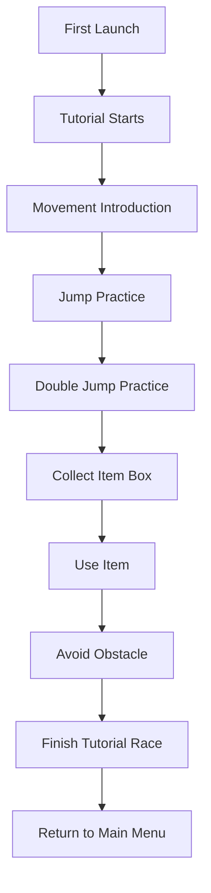

# P038 — Tutorial System Specification

| Field | Value |
|-------|--------|
| Document ID | P038 |
| Title | Tutorial System Specification |
| Version | **1.0** |
| Status | Approved (Tutorial system scope only) |
| Project | Project GulfRun |
| Authority | Official source of truth for the **First-Time User Tutorial**, **tutorial goals**, **player flow**, **player actions**, and **skip/replay/save rules** stated herein |
| Depends on | [P001](P001-GAME-VISION-v1.0.md), [P003](P003-CORE-GAMEPLAY-DESIGN-v1.0.md), [P004](P004-MAIN-MENU-v1.0.md), [P007](P007-OBSTACLE-SYSTEM-v1.0.md), [P008](P008-ITEM-BOX-SYSTEM-v1.0.md), [P009](P009-ITEM-WEAPON-SYSTEM-v1.0.md), [P010](P010-RACE-RULES-v1.0.md), [P034](P034-SETTINGS-SYSTEM-v1.0.md) |
| Last updated | 2026-07-31 |

**Rules:** Documentation only. No implementation. Do not invent features beyond this brief. Missing detail → **TODO**.

**Next milestone:** Sprint 1 — do not start until explicitly instructed.

---

## 1. Purpose

Define the Tutorial System for Project GulfRun: a short, simple, interactive First-Time User Tutorial that teaches core mechanics, its linear player flow, player actions (Continue / Skip / Replay / Exit), automatic-run/skip/replay/save rules, and mobile-optimized design principles — without inventing tutorial rewards, an advanced tutorial, character voices, interactive tips, practice mode, performance evaluation, or adaptive tutorial behavior.

---

## 2. System Overview

| Field | Value |
|-------|--------|
| Support | Project GulfRun includes a **First-Time User Tutorial** |
| Purpose | Introduces **new players to the game's core mechanics** |
| Design intent | **Short, simple, and interactive** |

### Alignment

- P034 Settings Controls category lists **Tutorial Reset** — this document's **Replay Tutorial** rule/action is the player-facing behavior that Tutorial Reset in P034 enables.
- P007 Obstacles defines Jump / Double Jump as allowed obstacle interactions; this document's Jump Practice / Double Jump Practice teach those same actions.
- P008 Item Boxes defines collection-by-touch and later use; this document's Collect Item Box / Use Item steps teach those same actions.
- P010 Race Rules defines the finish line and race format; this document's Finish Tutorial Race step uses that same concept in a tutorial context.

---

## 3. Tutorial Goals

Teach the player:

| Goal | Status |
|------|--------|
| **Basic Movement** | Defined |
| **Jump** | Defined |
| **Double Jump** | Defined |
| **Collect Item Boxes** | Defined |
| **Use an Item** | Defined |
| **Avoid Obstacles** | Defined |
| **Reach the Finish Line** | Defined |

### TODO — Tutorial Goals (not provided)

- [ ] Whether all core mechanics are covered (e.g., weapon selection, HUD elements not explicitly listed)

---

## 4. Player Flow

```
First Launch
↓
Tutorial Starts
↓
Movement Introduction
↓
Jump Practice
↓
Double Jump Practice
↓
Collect Item Box
↓
Use Item
↓
Avoid Obstacle
↓
Finish Tutorial Race
↓
Return to Main Menu
```



### TODO — Player Flow (not provided)

- [ ] Exact tutorial map / environment (dedicated tutorial track vs a standard map)
- [ ] Step-level pass/fail conditions or retry behavior within each step

---

## 5. Player Actions

| Action | Status |
|--------|--------|
| **Continue** | Defined |
| **Skip Tutorial** | Defined |
| **Replay Tutorial** | Defined |
| **Exit Tutorial** | Defined |

### TODO — Player Actions (not provided)

- [ ] Skip Tutorial granularity (skip entire tutorial only, or skip individual steps)
- [ ] Difference between Skip Tutorial and Exit Tutorial (if any)

---

## 6. Rules

| Rule ID | Rule |
|---------|------|
| TUT-001 | The Tutorial **runs automatically for new players**. |
| TUT-002 | Players **may skip the Tutorial**. |
| TUT-003 | Players **may replay the Tutorial later from Settings**. |
| TUT-004 | Tutorial progress is **saved automatically**. |

### Alignment with P034

Replay Tutorial (TUT-003) is exposed via the **Tutorial Reset** option in **[P034](P034-SETTINGS-SYSTEM-v1.0.md)** Settings → Controls category.

### TODO — Rules (not provided)

- [ ] "New players" definition (first launch only vs first N sessions)
- [ ] Whether progress save is account-linked or device-local (see P034 §5, unresolved there too)

---

## 7. Design Principles

Tutorial must be:

| Principle | Status |
|-----------|--------|
| **Simple** | Defined |
| **Fast** | Defined |
| **Interactive** | Defined |
| **Easy to understand** | Defined |
| **Optimized for mobile** | Defined |

### TODO — Design Principles (not provided)

- [ ] Concrete targets for "fast" (duration) and "optimized for mobile" (performance targets)

---

## 8. Dependencies

| Dependency | Note |
|------------|------|
| P001 | Vision / mobile platform context |
| P003 | Core gameplay design; movement/jump controls |
| P004 Main Menu | Return-to-Main-Menu destination; first-launch entry context |
| P007 Obstacles | Jump / Double Jump / Avoid Obstacle mechanics taught |
| P008 Item Boxes | Collect Item Box mechanic taught |
| P009 Weapons | Use an Item mechanic taught |
| P010 Race Rules | Finish Line / race-format concept used in Finish Tutorial Race |
| P034 Settings | Tutorial Reset option enabling Replay Tutorial |

---

## 9. Future Specifications

| Topic | Status |
|-------|--------|
| Tutorial Rewards | Not defined |
| Advanced Tutorial | Not defined |
| Character Voices | Not defined |
| Interactive Tips | Not defined |
| Practice Mode | Not defined |
| Performance Evaluation | Not defined |
| Adaptive Tutorial | Not defined |

---

## 10. Explicitly Not Defined (P038)

- Tutorial Rewards
- Advanced Tutorial
- Character Voices
- Interactive Tips
- Practice Mode
- Performance Evaluation
- Adaptive Tutorial

---

## 11. Open Questions

| ID | Question |
|----|----------|
| Q-P038-001 | Exact tutorial map / environment? |
| Q-P038-002 | Step-level pass/fail or retry conditions? |
| Q-P038-003 | Skip Tutorial granularity (whole tutorial vs per-step)? |
| Q-P038-004 | Difference between Skip Tutorial and Exit Tutorial? |
| Q-P038-005 | "New players" definition — first launch only? |
| Q-P038-006 | Tutorial progress save — account-linked or device-local? |
| Q-P038-007 | Concrete "fast" duration / mobile performance targets? |
| Q-P038-008 | Tutorial Rewards, Advanced Tutorial, Character Voices, Interactive Tips, Practice Mode, Performance Evaluation, Adaptive Tutorial — future or never? |

---

## 12. Acceptance Criteria

P038 v1.0 is satisfied when all of the following are true:

1. First-Time User Tutorial supported; introduces new players to core mechanics; short, simple, interactive.
2. Goals: Basic Movement, Jump, Double Jump, Collect Item Boxes, Use an Item, Avoid Obstacles, Reach the Finish Line.
3. Flow: First Launch → Tutorial Starts → Movement Introduction → Jump Practice → Double Jump Practice → Collect Item Box → Use Item → Avoid Obstacle → Finish Tutorial Race → Return to Main Menu.
4. Actions: Continue, Skip Tutorial, Replay Tutorial, Exit Tutorial.
5. Rules: runs automatically for new players; skippable; replayable from Settings; progress auto-saved.
6. Design principles: simple, fast, interactive, easy to understand, optimized for mobile.
7. Tutorial Rewards, Advanced Tutorial, Character Voices, Interactive Tips, Practice Mode, Performance Evaluation, and Adaptive Tutorial are not invented.
8. Document version is **P038 v1.0**.

---

## 13. Document Queue

| Order | Document ID | Title | Status |
|-------|-------------|-------|--------|
| 1–37 | P001–P037 | (prior specs) | Approved as previously recorded |
| 38 | P038 | Tutorial System Specification | **v1.0 Approved** |
| 39 | P039 | Backend Architecture Specification (engineering doc — docs/02-architecture/) | **v1.0 Approved** |
| 40 | P040 | Database Architecture Specification (engineering doc — docs/02-architecture/) | **v1.0 Approved** |
| 41 | P041 | Authentication System Specification (engineering doc — docs/02-architecture/) | **v1.0 Approved** |
| 42 | P042 | Player Profile System Specification [CONFLICT with P020] | **v1.0 Approved-per-brief** |
| 43 | P043 | Anti-Cheat System Specification (engineering doc — docs/05-security/) | **v1.0 Approved** |
| 44 | P044 | Analytics System Specification (engineering doc — docs/02-architecture/) | **v1.0 Approved** |
| 45 | P045 | Monetization System Specification | **v1.0 Approved** |
| 46 | P046 | Performance Optimization Specification | **v1.0 Approved** |
| 47 | P047 | UI / UX Design System Specification | **v1.0 Approved** |
| 48 | P048 | Art Direction & Visual Style Specification | **v1.0 Approved** |
| 49 | P049 | Technical Architecture Specification | **v1.0 Approved** |
| 50 | P050 | Master Design Bible Specification | **v1.0 Approved** |
| — | Sprint 1 | _(await instructions)_ | Not started |

---

## 14. Change Log

| Version | Date | Summary | Author |
|---------|------|---------|--------|
| **1.0** | 2026-07-31 | Initial Tutorial System Specification | Documentation Engineer (from Design Owner brief) |

---

*End of document.*
