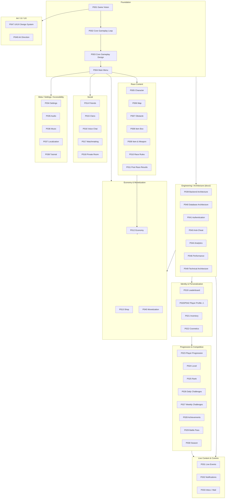

# P050 — Master Design Bible Specification

| Field | Value |
|-------|--------|
| Document ID | P050 |
| Title | Master Design Bible Specification |
| Version | **1.0** |
| Status | Approved (consolidation of P001–P049 only) |
| Project | Project GulfRun |
| Role | **Lead Documentation Engineer** consolidation — organizes and cross-references every approved specification; introduces no new content |
| Authority | This document is the **single navigational source of truth** for the entire approved specification set (P001–P049). It does **not** override or restate authority — each referenced document remains the sole source of truth for its own scope. |
| Scope | References P001 through P049 only. Does not include Sprint 1 or any post-P050 work. |
| Last updated | 2026-07-31 |

**Rules:** Documentation only. No implementation. Do not invent gameplay. Do not change previous decisions. Do not add new features. Only organize and consolidate the approved specifications.

**Next milestone:** Sprint 1 — do not start until explicitly instructed.

---

## 0. How to Use This Document

This is a **navigational and organizational index**, not a replacement for any individual specification. In case of any apparent discrepancy between this document and a referenced Pxxx specification, **the Pxxx specification is authoritative**. This document must be kept consistent with every approved specification (Rule MDB-004, §8).

Two open conflicts exist in the underlying specification set and are **not resolved** by this document (per Rules — do not modify previous specifications):

- **P020 vs P042** — both titled "Player Profile System Specification" with differing content. Unresolved, escalated to Design Owner. See P020 §0 and P042 §0.
- All other specifications are internally consistent as of P049.

---

## 1. Project Overview

Project GulfRun is a **real-time multiplayer mobile racing game** for iOS and Android ([P001](P001-GAME-VISION-v1.0.md)), built around a **unique Gulf-inspired visual and cultural identity** that must be original and must represent Gulf culture respectfully ([P001](P001-GAME-VISION-v1.0.md) §3.4, [P048](P048-ART-DIRECTION-VISUAL-STYLE-v1.0.md)).

| Fact | Value | Source |
|------|-------|--------|
| Project Type | Real-time Multiplayer Mobile Racing Game | P001 |
| Platforms | iOS, Android | P001 |
| Graphics Style | Stylized Low Poly Cartoon | P001 |
| Camera | Side Scrolling | P001 |
| Screen Orientation | Landscape only | P001 |
| Players per Match | 4 | P001 |
| Primary audience | Casual players, families, Gulf culture enthusiasts | P001 |

**Vision:** An original multiplayer racing game with a strong Gulf identity, celebrating Gulf culture respectfully through original characters, maps, music, environments, and cosmetics (P001 §3, §3.4).

**Design philosophy (cross-cutting, summarized from approved specs):**

- **Fair competition** — skill-based gameplay; no Pay-to-Win anywhere in the game (P001, P009, P013, P029, P045, P046).
- **Mobile-first, long-term scalable** — every system designed for a wide range of Android/iOS devices, built to grow over multiple years (P001, P046, P049).
- **Server-authoritative** — the backend is the single source of truth for all persistent player data; clients are never trusted for gameplay-critical decisions (P039, P040, P043).
- **Long-term progression & live service** — levels, ranks, cosmetics, seasons, Battle Pass, live events sustain engagement over time (P001, P023–P031, P045).

---

## 2. Master Specification Index (P001–P049)

Each entry: **Number | Title | Short Description | Dependencies**. Descriptions are condensed from each document's own Authority statement; consult the linked document for full scope.

### 2.1 Foundation & Core Loop

| # | Title | Short Description | Dependencies |
|---|-------|--------------------|---------------|
| [P001](P001-GAME-VISION-v1.0.md) | Game Vision Document | Project vision, pillars, platforms, target audience, Gulf identity | — (root) |
| [P002](P002-CORE-GAMEPLAY-LOOP-v1.0.md) | Core Gameplay Loop Specification | Core player journey from launch through return to Main Menu after a race | P001 |
| [P003](P003-CORE-GAMEPLAY-DESIGN-v1.0.md) | Core Gameplay Design Specification (+P003A) | How the player controls the character during a race; race/item-box rules | P001, P002 |
| [P004](P004-MAIN-MENU-v1.0.md) | Main Menu Specification | Main Menu screen, buttons, Play sub-screen options, Profile fields | P001, P002 |

### 2.2 Race Content

| # | Title | Short Description | Dependencies |
|---|-------|--------------------|---------------|
| [P005](P005-CHARACTER-SYSTEM-v1.0.md) | Character System Specification | Character selection, default characters, cosmetic-only rules, customization categories | P001, P002, P003, P004 |
| [P006](P006-MAP-SYSTEM-v1.0.md) | Map System Specification | Map list, map design rules, random selection behavior | P001, P002, P003(+P003A), P007 |
| [P007](P007-OBSTACLE-SYSTEM-v1.0.md) | Obstacle System Specification | Obstacle existence, fairness rules, player interaction, collision existence | P001, P002, P003(+P003A), P006 |
| [P008](P008-ITEM-BOX-SYSTEM-v1.0.md) | Item Box System Specification | Item box presence, collection, hold limit, random grant fairness, visual rules | P001, P002, P003, P006, P007 |
| [P009](P009-ITEM-WEAPON-SYSTEM-v1.0.md) | Item & Weapon System Specification | How items are obtained/used; weapons as an item category; balancing principles | P001, P003, P007, P008 |
| [P010](P010-RACE-RULES-v1.0.md) | Race Rules Specification | Race format, start, in-race allowed actions, finish ranking | P001, P002, P003, P007, P008, P009 |
| [P011](P011-POST-RACE-RESULTS-v1.0.md) | Post Race Results Specification | Results Screen contents, player actions, result authority rules | P002, P004, P005, P010 |

### 2.3 Economy & Monetization

| # | Title | Short Description | Dependencies |
|---|-------|--------------------|---------------|
| [P012](P012-ECONOMY-SYSTEM-v1.0.md) | Economy System Specification | Two official currencies (Coins, Gems), wallet structure, economy rules | P001, P011 |
| [P013](P013-SHOP-SYSTEM-v1.0.md) | Shop System Specification | Shop access, categories, purchase currency rules, cosmetic ownership, no-P2W | P001, P004, P005, P012 |
| [P045](P045-MONETIZATION-SYSTEM-v1.0.md) | Monetization System Specification | Monetization sources, design principles, fairness/no-P2W rules | P001, P012, P013, P022, P029 |

### 2.4 Social

| # | Title | Short Description | Dependencies |
|---|-------|--------------------|---------------|
| [P014](P014-FRIENDS-SYSTEM-v1.0.md) | Friends System Specification | Friends List, friend requests, add methods, status types, mutual-acceptance security | P001, P004, P002 |
| [P015](P015-CLAN-SYSTEM-v1.0.md) | Clan System Specification | Clans, info fields, roles, actions, clan chat existence, invitations | P001, P004, P014 |
| [P016](P016-VOICE-CHAT-SYSTEM-v1.0.md) | Voice Chat System Specification | Voice chat availability, channels, controls, quality priorities, safety actions | P001, P004, P014, P015, P010 |
| [P017](P017-MATCHMAKING-SYSTEM-v1.0.md) | Matchmaking System Specification | Match types, matchmaking flow, search status, cancellation, fair-race priority | P001, P002, P004, P010, P014 |
| [P018](P018-PRIVATE-ROOM-SYSTEM-v1.0.md) | Private Room System Specification | Private Room creation, join, host permissions, actions, room status | P001, P002, P004, P014, P017 |

### 2.5 Identity & Personalization

| # | Title | Short Description | Dependencies |
|---|-------|--------------------|---------------|
| [P019](P019-LEADERBOARD-SYSTEM-v1.0.md) | Leaderboard System Specification | Leaderboard types, displayed fields, sync, seasonal existence, backend authority | P001, P004, P014, P015 |
| [P020](P020-PLAYER-PROFILE-SYSTEM-v1.0.md) | Player Profile System Specification ⚠ **[CONFLICT with P042]** | Player Profile identity, displayed info, stats, customization, privacy default | P001, P004, P005, P014, P015, P019 |
| [P021](P021-INVENTORY-SYSTEM-v1.0.md) | Inventory System Specification | Personal Inventory, cosmetic categories stored, ownership, equipping, no-advantage | P001, P005, P012, P013, P020 |
| [P022](P022-COSMETICS-SYSTEM-v1.0.md) | Cosmetics System Specification | Cosmetic personalization, categories, default cosmetics, ownership, no gameplay impact | P001, P005, P013, P020, P021 |
| [P042](P042-PLAYER-PROFILE-SYSTEM-v1.0.md) | Player Profile System Specification ⚠ **[CONFLICT with P020]** | Documents the P042 brief only; not yet sole SoT pending conflict resolution | P001, P004, P005, P014, P015, P019, P020, P028 |

### 2.6 Progression & Competitive

| # | Title | Short Description | Dependencies |
|---|-------|--------------------|---------------|
| [P023](P023-PLAYER-PROGRESSION-SYSTEM-v1.0.md) | Player Progression System Specification | Progression profile, components, rules, stored fields, sync, design principles | P001, P002, P012, P019, P020 |
| [P024](P024-LEVEL-SYSTEM-v1.0.md) | Level System Specification | Player Level, XP accumulation/carry-over, display fields, level-up notification | P001, P023, P020 |
| [P025](P025-RANK-SYSTEM-v1.0.md) | Rank System Specification | Competitive Rank, progression existence, display fields, seasonal ranks | P001, P023, P024, P019, P020 |
| [P026](P026-DAILY-CHALLENGES-SYSTEM-v1.0.md) | Daily Challenges System Specification | Daily Challenges existence, 24-hour reset, actions, progress fields | P001, P004, P012, P023 |
| [P027](P027-WEEKLY-CHALLENGES-SYSTEM-v1.0.md) | Weekly Challenges System Specification | Weekly Challenges existence, 7-day reset, actions, progress fields | P001, P004, P012, P023, P026 |
| [P028](P028-ACHIEVEMENT-SYSTEM-v1.0.md) | Achievement System Specification | Achievements existence, permanent account link, one-time completion, backend sync | P001, P020, P023, P012 |
| [P029](P029-BATTLE-PASS-SYSTEM-v1.0.md) | Battle Pass System Specification | Seasonal Battle Pass (Free/Premium tracks), progress existence, no-P2W | P001, P012, P013, P023, P022 |
| [P030](P030-SEASON-SYSTEM-v1.0.md) | Season System Specification | Seasons as operational period model, content containers, no-P2W | P001, P019, P023, P025, P029 |

### 2.7 Live Content & Communications

| # | Title | Short Description | Dependencies |
|---|-------|--------------------|---------------|
| [P031](P031-LIVE-EVENTS-SYSTEM-v1.0.md) | Live Events System Specification | Live Events existence, event types, automatic participation, active-only rules | P001, P004, P030, P019, P022, P026 |
| [P032](P032-NOTIFICATION-SYSTEM-v1.0.md) | Notification System Specification | In-game/push notifications, types, actions, sync/read/delete rules | P001, P004, P014, P015, P030, P031, P026, P013 |
| [P033](P033-INBOX-MAIL-SYSTEM-v1.0.md) | Inbox (Mail) System Specification | In-game Inbox, mail types, fields, attachment claim rules | P001, P004, P012, P031, P030, P032 |

### 2.8 Meta / Settings / Accessibility

| # | Title | Short Description | Dependencies |
|---|-------|--------------------|---------------|
| [P034](P034-SETTINGS-SYSTEM-v1.0.md) | Settings System Specification | Centralized Settings menu, categories, listed options, save/sync rules | P001, P004, P014, P016, P020, P032 |
| [P035](P035-AUDIO-SYSTEM-v1.0.md) | Audio System Specification | Audio categories, audio settings, mobile playback rules | P001, P005, P006, P007, P009, P010, P016, P034 |
| [P036](P036-MUSIC-SYSTEM-v1.0.md) | Music System Specification | Music categories, per-category behavior, player controls, playback rules | P001, P004, P006, P010, P011, P013, P017, P030, P031, P034, P035 |
| [P037](P037-LOCALIZATION-SYSTEM-v1.0.md) | Localization System Specification | Supported languages, localized content scope, text rules, RTL/font support | P001, P004, P026, P027, P028, P029, P031, P032, P033, P034 |
| [P038](P038-TUTORIAL-SYSTEM-v1.0.md) | Tutorial System Specification | First-Time User Tutorial, goals, player flow, skip/replay/save rules | P001, P003, P004, P007, P008, P009, P010, P034 |

### 2.9 Art / UI / UX

| # | Title | Short Description | Dependencies |
|---|-------|--------------------|---------------|
| [P047](P047-UI-UX-DESIGN-SYSTEM-v1.0.md) | UI / UX Design System Specification | UI/UX design principles, visual style, navigation/button/popup rules, accessibility | P001, P004, 19-ui-ux chapter |
| [P048](P048-ART-DIRECTION-VISUAL-STYLE-v1.0.md) | Art Direction & Visual Style Specification | Art style pillars, graphics approach, character/environment/animation style rules | P001, P005, P006, P047 |

### 2.10 Engineering / Architecture (filed under `docs/`)

| # | Title | Short Description | Dependencies |
|---|-------|--------------------|---------------|
| [P039](../../docs/02-architecture/BACKEND_ARCHITECTURE.md) | Backend Architecture Specification | Backend responsibilities, architecture design principles, client/backend split, security principles | Relates to MULTIPLAYER_ARCHITECTURE.md, TECHNICAL_STACK.md, SCALABILITY_PLAN.md, SECURITY_STRATEGY.md |
| [P040](../../docs/02-architecture/DATABASE_ARCHITECTURE.md) | Database Architecture Specification | Data categories, database design principles, ownership rules, sync/security/backup statements | P039 |
| [P041](../../docs/02-architecture/AUTHENTICATION_SYSTEM.md) | Authentication System Specification | Account types, authentication flow, account linking, session management, security | P039, P040 |
| [P043](../../docs/05-security/ANTI_CHEAT_SPECIFICATION.md) | Anti-Cheat System Specification | Anti-Cheat design principles, protected systems, backend validation scope | Relates to Backend/Database Architecture, SECURITY_STRATEGY.md, ANTI_CHEAT.md |
| [P044](../../docs/02-architecture/ANALYTICS_SYSTEM.md) | Analytics System Specification | Analytics categories, tracked data per category, technical analytics, privacy rules | Relates to P039, P040 |
| [P046](../../docs/04-engineering/PERFORMANCE_OPTIMIZATION_SPECIFICATION.md) | Performance Optimization Specification | Target/minimum frame rate, optimization principles, performance rules | Relates to P001, MOBILE_OPTIMIZATION.md |
| [P049](../../docs/02-architecture/TECHNICAL_ARCHITECTURE.md) | Technical Architecture Specification | Architecture principles, project layers, named core system managers, dependency rules, code quality | Relates to FOLDER_ARCHITECTURE.md, CODING_STANDARDS.md, P039, P040 |

---

## 3. System Map (References Only)

High-level system relationships. Arrows indicate "depends on / informs" — no implementation is implied.

### 3.1 Grouped reference map

| Group | Members | Central hub |
|-------|---------|-------------|
| Foundation | P001–P004 | P001 |
| Race Content | P005–P011 | P010 |
| Economy & Monetization | P012, P013, P045 | P012 |
| Social | P014–P018 | P014 |
| Identity & Personalization | P019–P022, P042 | P020 (⚠ conflict with P042) |
| Progression & Competitive | P023–P030 | P023 |
| Live Content & Comms | P031–P033 | P030 |
| Meta / Settings / Accessibility | P034–P038 | P034 |
| Art / UI / UX | P047, P048 | P001 (Graphics Style, Gulf Identity) |
| Engineering / Architecture | P039–P041, P043, P044, P046, P049 | P039 |

---

## 4. Design Principles Summary

| Category | Principles | Source |
|----------|-----------|--------|
| **Gameplay** | Fair competition; skill-based; casual + competitive balance; original Gulf-inspired content | P001 |
| **Art** | Stylized, Cartoon, Colorful, Readable, Expressive, High Visibility, Mobile Optimized; 3D Low Poly; original, non-imitative; respectful Gulf culture representation; readability over realism | P048, P001 |
| **Audio** | Mobile-optimized playback; must not interrupt gameplay; settings auto-saved | P035, P036 |
| **UI** | Simple, Fast, Modern, Readable, Consistent, Accessible, Mobile First, Landscape First | P047 |
| **Backend** | Server Authoritative, Scalable, Modular, Secure, Fault Tolerant, Cloud Hosted, Cross Platform | P039 |
| **Networking** | Client/backend data synchronization must support reconnects; conflict resolution handled by backend; never trust client values | P039 |
| **Performance** | Mobile First, Efficient Rendering, Efficient Memory Usage, Minimal Battery Consumption, Stable Network Performance; Target 60 FPS / Minimum 30 FPS | P046 |
| **Security** | Never trust client, validate every backend request, protect all player progression, prevent cheating; Server Authoritative, Fair Competition, Low False Positives, Continuous Monitoring | P039, P043 |
| **Economy** | Two official currencies (Coins, Gems); permanently account-stored; backend-synchronized; no negative balances | P012 |
| **Monetization** | Fair, Transparent, Optional, Player Friendly, Long-Term Sustainability, No Gameplay Advantage; never Pay-to-Win | P045 |

Cross-cutting rule observed in every applicable system: **no Pay-to-Win / no purchasable gameplay advantage** (P009 balancing, P013 FAIR-002, P029 BP-003, P045 MON-001/002, P046 PERF-001).

---

## 5. Architecture Summary

| Layer (P049) | Summary | Primary sources |
|---------------|---------|------------------|
| **Presentation** | Rendering, input, audio, animations, visual effects, UI (client responsibility); UI/UX design language and visual style applied here | P039 (Client Responsibilities), P047, P048 |
| **Client / Game Logic / Gameplay Systems** | Independent, modular gameplay systems; core race loop and content systems (characters, maps, obstacles, items, race rules) | P002, P003, P006–P011, P049 |
| **Networking** | Client↔backend data synchronization; supports reconnects; conflict resolution is backend-side | P039, MULTIPLAYER_ARCHITECTURE.md, P049 |
| **Backend** | Single source of truth for all persistent player data; owns Authentication, Player Profiles, Cloud Save, Inventory, Currencies, Matchmaking, Leaderboards, Friends, Clans, Rank, Battle Pass, Challenges, Achievements, Live Events, Inbox, Notifications, Analytics | P039, P040, P041, P044, P049 |
| **Data / Persistence** | Centralized database; all writes require backend validation; no direct client DB access | P040, P049 |

Named core system managers (existence only, per P049): Game Manager, Scene Manager, Player Manager, UI Manager, Audio Manager, Input Manager, Network Manager, Backend Manager, Economy Manager, Analytics Manager (+ Future Managers).

Architecture principles (P049): Modular, Maintainable, Scalable, Reusable, Testable, Readable, Secure, Performance Oriented. Dependency rules: loose coupling, no circular dependencies, core systems independent of UI, gameplay systems independent of rendering.

---

## 6. Open TODO List (Collected from P001–P049, Not Resolved)

Every "Explicitly Not Defined" / TODO item from every approved specification, grouped by category. **These are not resolved by this document** (Rule MDB-002, §8).

### 6.1 Core Gameplay & Race

- **P003:** Weapons, Maps, Characters, Power Ups, Obstacle types/damage/physics detail, Damage, Respawn, Physics, Animations, Economy, XP, Store
- **P006:** Obstacle Types, Obstacle Positions, Background Art, Weather, Day/Night, Interactive Objects, Secrets, Events, Music, Sound Effects
- **P007:** Obstacle Types, Obstacle Damage, Obstacle Animations, Obstacle Physics, Moving Obstacles, Environmental Hazards, Weather, Map Events, Collision effects, Damage, Recovery/Respawn behavior
- **P008:** Item Types, Weapons, Power Ups, Item Probabilities, Item Icons/Effects/Sounds/Animations, Cooldowns, race hold-slot Inventory rules, Activation method, Collect-while-holding behavior
- **P009:** Weapon List, Power Ups, Defensive/Offensive/Trap Items, Cooldowns, Damage, Effects, Visual Effects, Audio, Probability, Balancing Values
- **P010:** Race Timer, Sudden Death, Reconnect Rules, Match Cancellation, Penalty System, Spectator Mode, Rematch, Bots, Disconnection rules, AFK rules
- **P011:** Coin/Gem Reward amounts, XP amounts, Rank Points, Battle Pass Progress amounts, Challenge Progress grant amounts, Daily Missions relationship, Season Rewards, Achievement grants/catalog, Statistics, Reward formulas, Continue destination

### 6.2 Economy, Shop & Monetization

- **P012:** Coin/Gem Rewards, Prices, Bundles, Offers, Discounts, Store detail, Battle Pass, Daily Rewards, Events, Achievements, Refund Rules
- **P013:** Prices, Bundles, Discounts, Limited Time Offers, Daily Shop Rotation, Featured Items, Refund Rules, Gift System, Promo Codes, Taxes
- **P021:** Inventory Capacity, Favorite Items, Item Locking, Duplicate Handling, Trading, Selling, Gifting, Loadouts, Collection Progress, Sort/Filter criteria, equip slot list
- **P022:** Rarity Levels, Limited Editions, Seasonal Cosmetics, Exclusive Cosmetics, Trading, Selling, Gifting, Bundles, Collection Rewards, slot list, Sort/Filter criteria
- **P045:** Prices, Bundles, Discounts, Subscription, Starter Packs, Welcome Offers, Regional Pricing, Taxes, Refund Policy

### 6.3 Social & Communication

- **P014:** Friend Limit, Search Algorithm, Recommendations, Social Feed, Messaging, Gift System, Voice Calls (as Friends feature), Cross Platform Rules, backend sync details
- **P015:** Clan Wars, Clan Missions, Clan Rewards, Clan XP, Clan Ranking, Clan Store, Clan Donations, Clan Events, Clan Achievements, max member count, leadership permission details
- **P016:** Voice Moderation, Voice Recording, Voice Translation, Voice Effects, Spatial Audio, Regional Servers, Age Restrictions
- **P017:** Skill Rating, MMR, Ping Matching, Bot Filling, Regional Servers, Cross Platform Matching, Reconnect Rules, Rank Restrictions, Estimated Queue Time, balancing algorithm, post-confirmation cancellation
- **P018:** Room Password, Spectators, Bots, Custom Rules, Custom Maps, Kick Vote, Room Chat, Voice Chat Behavior, min players to start, Room Code format

### 6.4 Identity, Personalization & Progression

- **P019:** Ranking Formula, MMR, Reward Distribution, Season Reset Rules, Cheater Removal, Country/Region Filters, Statistics, refresh frequency, Historical Seasons
- **P020:** Profile Biography, Social Links, Followers, Following, Likes, Comments, on-Profile Achievements display, Profile Themes, Privacy Settings, Verification Badges, Win/Loss/Win Rate formulas, Avatar catalog rules
- **P023:** XP Formula, Level Formula, Rank Formula, Season Progress Formula, Daily XP Bonus, XP Multipliers, Prestige System, Catch-up Mechanics, Achievement list/rewards, season-reset interaction
- **P024:** Maximum Level, XP Formula, XP Sources, Level Rewards, Prestige, Level Milestones, Bonus XP, Catch-up System, level-up notification UI
- **P025:** Rank Names, Rank Icons, Rank Formula, MMR, Promotion/Demotion Rules, Placement Matches, Season Reset, Rank Rewards, Leaderboard Integration
- **P028:** Achievement List, Achievement Categories, Reward Types, Hidden/Secret Achievements, Achievement Points, Collection Rewards, Achievement Rarity
- **P042 (conflict):** Avatar Sources, Nickname Rules, Profile Privacy, Profile History, Favorite Statistics, Badges, Titles, Customization Unlock Rules; **plus unresolved conflict with P020**

### 6.5 Live Content & Messaging

- **P026:** Challenge List, Reward Types, Difficulty, Premium/Bonus Challenges, Refresh Rules, Skip Challenge, Challenge Categories, specific objectives, unclaimed reward behavior
- **P027:** Challenge List, Reward Types, Difficulty Levels, Premium/Bonus Challenges, Refresh Rules, Challenge Categories, Challenge Chains, specific objectives, unclaimed reward behavior
- **P029:** Tier Count, Reward List, Progress Formula, Premium Price, Premium Plus, Instant Tier Unlocks, Season Duration, Catch-up Mechanics, Expired Rewards
- **P030:** Season Duration, Season Names, Season Themes, Season Rewards, Season Reset Rules, Archive System, Previous Season Access, Season Intro
- **P031:** Event Rewards, Event Missions, Event Shop, Event Currency, Event Difficulty, Event Leaderboards, Event Story, Event Tickets, minimum requirements detail
- **P032:** Notification Priority, Expiration Rules, Grouping, Scheduling, Localization Rules, Rich Media, Deep Linking Behavior, Silent Notifications
- **P033:** Attachment Types, Expiration Duration, Mail Categories, Mail Search/Filters/Archive, Favorite Mail, Gift Mail

### 6.6 Meta, Settings, Audio, Localization & Tutorial

- **P004:** Login screen UI/UX (backend flow specified separately in P041), visual art direction/exact layout, button arrangement, logo/title placement, invite UI details, sub-4-player join behavior, character select/roster
- **P034:** Graphics Presets, Supported Languages list, Advanced Audio Options, Accessibility Settings, Parental Controls, Developer Options
- **P035:** Audio Compression, 3D Audio, Audio Priorities, Audio Streaming, Localization Voices, Dynamic Music, Accessibility Audio
- **P036:** Music Tracks, Music Duration, Adaptive Music, Dynamic Layering, Regional Variations, Licensed Music, Streaming Rules
- **P037:** Additional Languages, Regional Dialects, Voice Languages, Localized Images/Audio/Videos, Machine Translation, Community Translation
- **P038:** Tutorial Rewards, Advanced Tutorial, Character Voices, Interactive Tips, Practice Mode, Performance Evaluation, Adaptive Tutorial

### 6.7 Art & UI/UX

- **P047:** Color Palette, Typography, Icon Library, Spacing Rules, Animation Timing, UI Grid, Design Tokens, Dark Mode
- **P048:** Character Concepts, Map Concepts, Color Palette, Material Library, Animation Library, Visual Effect Library, Lighting Rules, Shader Library

### 6.8 Backend, Data, Security & Engineering

- **P039:** Cloud Provider, Database Type, Programming Language, Hosting Region, Microservices, Caching, Message Queue, Monitoring, Disaster Recovery
- **P040:** Database Engine, Sharding, Replication, Backup Schedule, Retention Policy, Encryption, Indexes, Migration Strategy
- **P041:** Authentication Provider, Token Lifetime, Session Recovery, Multi-device Rules, Account Recovery, Two-Factor Authentication, Parental Accounts
- **P043:** Detection Algorithms, Penalty Types, Ban System, Appeal Process, Hardware Detection, Machine Learning Detection, Replay Review, Automatic Moderation
- **P044:** Analytics Provider, Retention Period, Sampling Strategy, Heatmaps, Custom Dashboards, A/B Testing, Funnels, Predictive Analytics
- **P046:** Device Support Matrix, Graphics Presets, Memory Budget, Texture Compression, LOD Strategy, Asset Streaming, Shader Variants, Network Compression
- **P049:** Dependency Injection Framework, Folder Structure *(already tracked separately in FOLDER_ARCHITECTURE.md)*, Code Generation, Build Pipeline, Testing Framework, Continuous Integration, Continuous Deployment, Plugin Strategy

### 6.9 Unresolved Conflicts (Blocking)

- **P020 vs P042** — Player Profile System Specification: two documents, same title, differing content. Escalated to Design Owner. Neither document is authoritative pending resolution.

---

## 7. Future Development Phases

| Phase | Focus |
|-------|-------|
| **Phase 2** | Unity Development |
| **Phase 3** | Backend Integration |
| **Phase 4** | Online Multiplayer |
| **Phase 5** | Content Production |
| **Phase 6** | Testing |
| **Phase 7** | Launch |

No further detail is provided in the brief for these phases; sequencing and scope beyond the phase names are **not defined** here.

---

## 8. Rules

| Rule ID | Rule |
|---------|------|
| MDB-001 | **Do not modify previous specifications.** |
| MDB-002 | **Do not introduce new systems.** |
| MDB-003 | **Do not remove existing systems.** |
| MDB-004 | The Master Design Bible **must remain consistent with every approved specification**. |

---

## 9. Dependencies

This document depends on and references **every** specification in §2 (P001–P049). It introduces no dependency of its own beyond that full set.

---

## 10. Acceptance Criteria

P050 v1.0 is satisfied when all of the following are true:

1. Project Overview summarizes vision, goals, and design philosophy using only previously approved specifications.
2. Master Specification Index contains every specification P001 through P049, each with Number, Title, Short Description, and Dependencies.
3. System Map shows high-level system relationships by reference only; no implementation is invented.
4. Design Principles Summary covers Gameplay, Art, Audio, UI, Backend, Networking, Performance, Security, Economy, and Monetization.
5. Architecture Summary references Client, Backend, Networking, Data, Gameplay, and Presentation.
6. Open TODO List collects every "Explicitly Not Defined" / TODO item from all approved specifications, grouped by category, and does not resolve any of them.
7. Future Development Phases lists Phase 2 through Phase 7 exactly as provided.
8. No previous specification is modified; no new system is introduced; no existing system is removed.
9. The document is internally consistent with every approved specification, including flagging (not resolving) the P020/P042 conflict.
10. Document version is **P050 v1.0**.

---

## 11. Document Queue

| Order | Document ID | Title | Status |
|-------|-------------|-------|--------|
| 1–49 | P001–P049 | (all prior specs) | Approved as previously recorded |
| 50 | P050 | Master Design Bible Specification | **v1.0 Approved** |
| — | Sprint 1 | _(await instructions)_ | Not started |

---

## 12. Change Log

| Version | Date | Summary | Author |
|---------|------|---------|--------|
| **1.0** | 2026-07-31 | Initial Master Design Bible — consolidates P001 through P049 | Lead Documentation Engineer (from brief) |

---

*End of document.*
