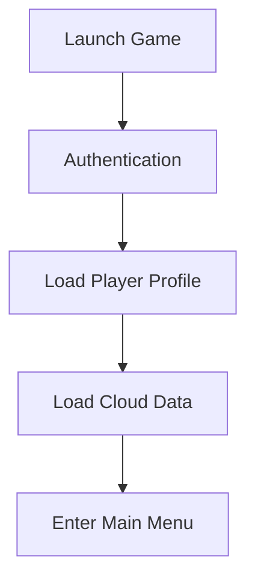

# Authentication System Specification

| Field | Value |
|-------|--------|
| Document ID | P041 |
| Title | Authentication System Specification |
| Version | **1.0** |
| Status | Approved (Authentication system scope only) |
| Project | Project GulfRun |
| Location rationale | Authentication is an **engineering/backend** concern → lives under `docs/` per [DOCUMENTATION_STRUCTURE.md](../00-governance/DOCUMENTATION_STRUCTURE.md) §2, not `Design/GDD/`. Numbered **P041** for continuity with the ongoing specification brief sequence (see [P039](BACKEND_ARCHITECTURE.md), [P040](DATABASE_ARCHITECTURE.md)). |
| Authority | Official source of truth for **account types**, **authentication flow**, **account linking**, **session management**, **authentication security principles**, and **error handling categories** stated herein |
| Relates to (engineering) | [BACKEND_ARCHITECTURE.md](BACKEND_ARCHITECTURE.md) (P039 — Authentication listed as backend responsibility), [DATABASE_ARCHITECTURE.md](DATABASE_ARCHITECTURE.md) (P040 — Player Accounts data category), [SECURITY_STRATEGY.md](../05-security/SECURITY_STRATEGY.md), [TECHNICAL_STACK.md](TECHNICAL_STACK.md) §3 (Auth: JWT/opaque tokens) |
| Relates to (gameplay) | [P004](../../Design/GDD/P004-MAIN-MENU-v1.0.md) Main Menu (Login screen previously TODO — resolved as the Authentication step here), [P020](../../Design/GDD/P020-PLAYER-PROFILE-SYSTEM-v1.0.md) Player Profile (account link), [P034](../../Design/GDD/P034-SETTINGS-SYSTEM-v1.0.md) Settings (Account category: View Account, Linked Accounts, Logout, Delete Account) |
| Last updated | 2026-07-31 |

**Rules:** Documentation only. No implementation. Do not invent gameplay. Do not add implementation details beyond this brief. Missing detail → **TODO**.

**Next milestone:** Sprint 1 — do not start until explicitly instructed.

---

## 1. Purpose

Define the Authentication System for Project GulfRun: required backend-validated player authentication with one unique account per player, the supported account types, the authentication flow from launch to Main Menu, account linking rules, single-session management, authentication security principles, and error-handling categories — without specifying the authentication provider, token lifetime, session recovery, multi-device rules, account recovery, two-factor authentication, or parental accounts.

---

## 2. System Overview

| Field | Value |
|-------|--------|
| Requirement | Project GulfRun **requires player authentication** |
| Authority | Authentication **is handled by the backend** |
| Account model | **Every player has one unique account** |

### Alignment with existing docs

- [P039](BACKEND_ARCHITECTURE.md) Backend Architecture lists **Authentication** as a backend responsibility — this document is that system's detail specification.
- [P040](DATABASE_ARCHITECTURE.md) Database Architecture lists **Player Accounts** as a data category — this document defines the account types and flow that populate that category, without redefining storage details.
- [P004](../../Design/GDD/P004-MAIN-MENU-v1.0.md) Main Menu previously flagged the Login screen as **TODO / future** — this document resolves the authentication step preceding Main Menu (see §3 Authentication Flow); exact Login **screen** UI/UX remains **TODO**.

---

## 3. Authentication Flow

```
Launch Game
↓
Authentication
↓
Load Player Profile
↓
Load Cloud Data
↓
Enter Main Menu
```



### Alignment

Relates to [P004](../../Design/GDD/P004-MAIN-MENU-v1.0.md) §8 Navigation Flow ("Login → Main Menu") and [P020](../../Design/GDD/P020-PLAYER-PROFILE-SYSTEM-v1.0.md) (Load Player Profile step).

### TODO — Authentication Flow (not provided)

- [ ] Login screen UI/UX (still a separate concern from this backend flow — see [P004](../../Design/GDD/P004-MAIN-MENU-v1.0.md) Q-P004-001)
- [ ] Behavior when Load Player Profile / Load Cloud Data fails

---

## 4. Account Types

| Account Type | Status |
|---------------|--------|
| **Guest Account** | Defined |
| **Email Account** | Defined |
| **Apple Account** | Defined |
| **Google Account** | Defined |
| **Future Authentication Providers** | Future |

### TODO — Account Types (not provided)

- [ ] Guest-to-permanent-account upgrade path
- [ ] Provider-specific requirements (e.g., platform-mandated Apple/Google sign-in rules)

---

## 5. Account Linking

| Rule ID | Rule |
|---------|------|
| AUTH-LINK-001 | Players **may link multiple login methods**. |
| AUTH-LINK-002 | **Only one primary player account exists.** |
| AUTH-LINK-003 | Linked accounts **access the same player data**. |

### Alignment

Relates to [P034](../../Design/GDD/P034-SETTINGS-SYSTEM-v1.0.md) Settings → Account category: **Linked Accounts** is the player-facing surface for this rule set.

### TODO — Account Linking (not provided)

- [ ] Linking flow/UX
- [ ] Unlinking rules
- [ ] Conflict handling if a login method is already linked to a different account

---

## 6. Session Management

| Field | Value |
|-------|-------|
| Concurrency | **Only one active authenticated session per player is supported** |
| Session expiration rules | **Not defined** |

### TODO — Session Management (not provided)

- [ ] Session expiration rules (explicitly not defined in this brief)
- [ ] Behavior when a second login occurs (force-logout of first session vs. reject second)
- [ ] Multi-device Rules (explicitly not defined — see §11)

---

## 7. Security Principles

| Rule ID | Rule |
|---------|------|
| AUTH-SEC-001 | Authentication **is validated by the backend**. |
| AUTH-SEC-002 | Credentials **are never stored locally in plain text**. |
| AUTH-SEC-003 | Authentication tokens **must be protected**. |

These align with [SECURITY_STRATEGY.md](../05-security/SECURITY_STRATEGY.md) (short-lived access tokens, secure token storage) and [BACKEND_ARCHITECTURE.md](BACKEND_ARCHITECTURE.md) (P039) §7; this document does not add new security implementation detail beyond restating the brief.

### TODO — Security (not provided)

- [ ] Token lifetime (explicitly not defined — see §11)
- [ ] Two-Factor Authentication (explicitly not defined — see §11)

---

## 8. Error Handling

The following authentication error categories exist:

| Error | Status |
|-------|--------|
| **Authentication Failure** | Defined |
| **Connection Failure** | Defined |
| **Expired Session** | Defined |
| **Unsupported Login Provider** | Defined |
| **Future Authentication Errors** | Future |

### TODO — Error Handling (not provided)

- [ ] Specific error messages / player-facing copy
- [ ] Retry / recovery behavior per error category

---

## 9. Dependencies

| Dependency | Note |
|------------|------|
| P039 Backend Architecture | Authentication as backend responsibility; server-authoritative validation |
| P040 Database Architecture | Player Accounts data category |
| P004 Main Menu | Login screen precedes Main Menu entry (UI/UX still TODO) |
| P020 Player Profile | Load Player Profile step; permanent account link |
| P034 Settings | Account category (View Account, Linked Accounts, Logout, Delete Account) |
| SECURITY_STRATEGY.md | Token security, credential handling |
| TECHNICAL_STACK.md §3 | Auth token approach (JWT/opaque + refresh) — implementation detail, pending ADR |

---

## 10. Future Specifications

| Topic | Status |
|-------|--------|
| Future Authentication Providers | Future |
| Future Authentication Errors | Future |
| Authentication Provider | Not defined (ADR) |
| Token Lifetime | Not defined |
| Session Recovery | Not defined |
| Multi-device Rules | Not defined |
| Account Recovery | Not defined |
| Two-Factor Authentication | Not defined |
| Parental Accounts | Not defined |

---

## 11. Explicitly Not Defined (P041)

- Authentication Provider
- Token Lifetime
- Session Recovery
- Multi-device Rules
- Account Recovery
- Two-Factor Authentication
- Parental Accounts

---

## 12. Open Questions

| ID | Question |
|----|----------|
| Q-P041-001 | Login screen UI/UX (see [P004](../../Design/GDD/P004-MAIN-MENU-v1.0.md) Q-P004-001)? |
| Q-P041-002 | Behavior on Load Player Profile / Load Cloud Data failure? |
| Q-P041-003 | Guest-to-permanent-account upgrade path? |
| Q-P041-004 | Linking / unlinking flow and conflict handling? |
| Q-P041-005 | Behavior on concurrent second login (force-logout vs. reject)? |
| Q-P041-006 | Specific error messages / recovery behavior per error category? |
| Q-P041-007 | Authentication Provider, Token Lifetime, Session Recovery, Multi-device Rules, Account Recovery, Two-Factor Authentication, Parental Accounts — ADR / future timeline? |

---

## 13. Acceptance Criteria

P041 v1.0 is satisfied when all of the following are true:

1. Player authentication required; backend-validated; one unique account per player.
2. Account types: Guest, Email, Apple, Google; Future Authentication Providers future.
3. Flow: Launch Game → Authentication → Load Player Profile → Load Cloud Data → Enter Main Menu.
4. Account linking: multiple login methods linkable; one primary account; linked accounts share the same player data.
5. Session management: single active session per player; expiration rules not defined.
6. Security: backend-validated authentication; no plain-text local credential storage; tokens protected.
7. Error categories: Authentication Failure, Connection Failure, Expired Session, Unsupported Login Provider; Future Authentication Errors future.
8. Authentication Provider, Token Lifetime, Session Recovery, Multi-device Rules, Account Recovery, Two-Factor Authentication, and Parental Accounts are not invented.
9. No gameplay mechanics invented.
10. Document version is **P041 v1.0**.

---

## 14. Document Queue (cross-reference to GDD specification sequence)

| Order | Document ID | Title | Status |
|-------|-------------|-------|--------|
| 1–38 | P001–P038 | (prior gameplay specs, `Design/GDD/`) | Approved as previously recorded |
| 39 | P039 | Backend Architecture Specification (`docs/02-architecture/`) | v1.0 Approved |
| 40 | P040 | Database Architecture Specification (`docs/02-architecture/`) | v1.0 Approved |
| 41 | P041 | Authentication System Specification (`docs/02-architecture/`) | **v1.0 Approved** |
| 42 | P042 | Player Profile System Specification (`Design/GDD/`) | v1.0 Approved-per-brief — [CONFLICT] with P020, unresolved |
| 43 | P043 | Anti-Cheat System Specification (`docs/05-security/`) | v1.0 Approved |
| 44 | P044 | Analytics System Specification (`docs/02-architecture/`) | v1.0 Approved |
| 45 | P045 | Monetization System Specification (`Design/GDD/`) | v1.0 Approved |
| 46 | P046 | Performance Optimization Specification (`docs/04-engineering/`) | v1.0 Approved |
| 47 | P047 | UI / UX Design System Specification (`Design/GDD/`) | v1.0 Approved |
| 48 | P048 | Art Direction & Visual Style Specification (`Design/GDD/`) | v1.0 Approved |
| 49 | P049 | Technical Architecture Specification (`docs/02-architecture/`) | v1.0 Approved |
| 50 | P050 | Master Design Bible Specification (`Design/GDD/`) | v1.0 Approved |
| — | Sprint 1 | _(await instructions)_ | Not started |

---

## 15. Change Log

| Version | Date | Summary | Author |
|---------|------|---------|--------|
| **1.0** | 2026-07-31 | Initial Authentication System Specification | Documentation Engineer (from brief) |

---

*End of document.*
